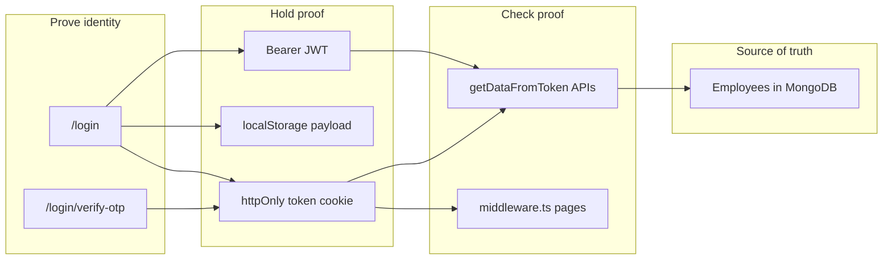
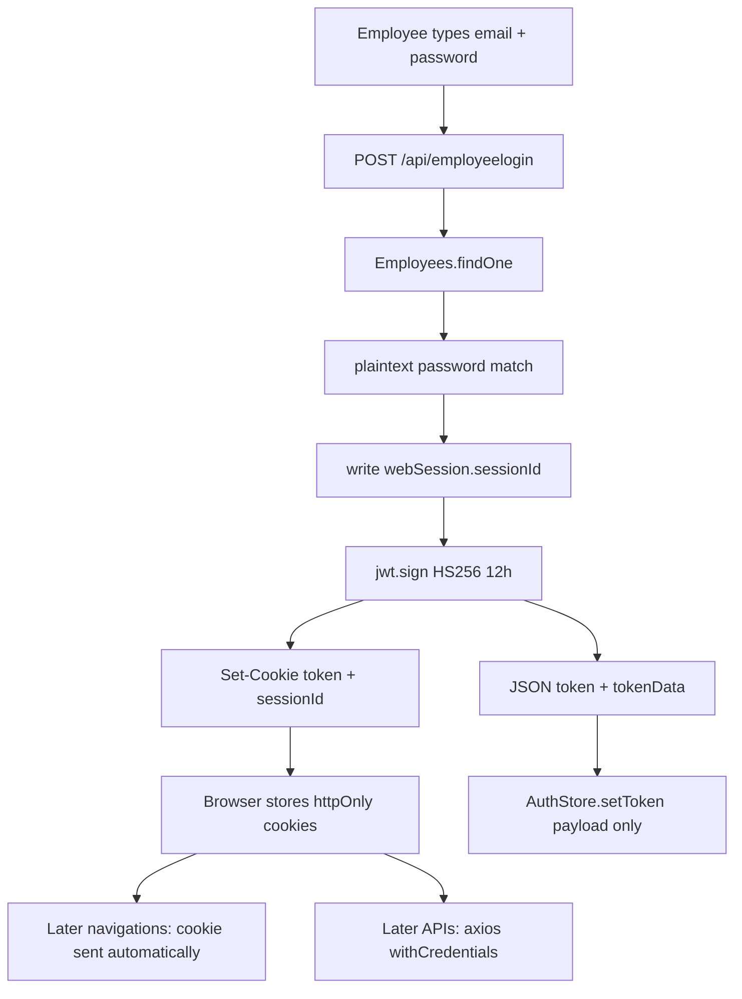
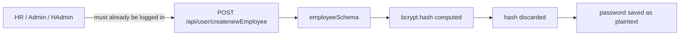
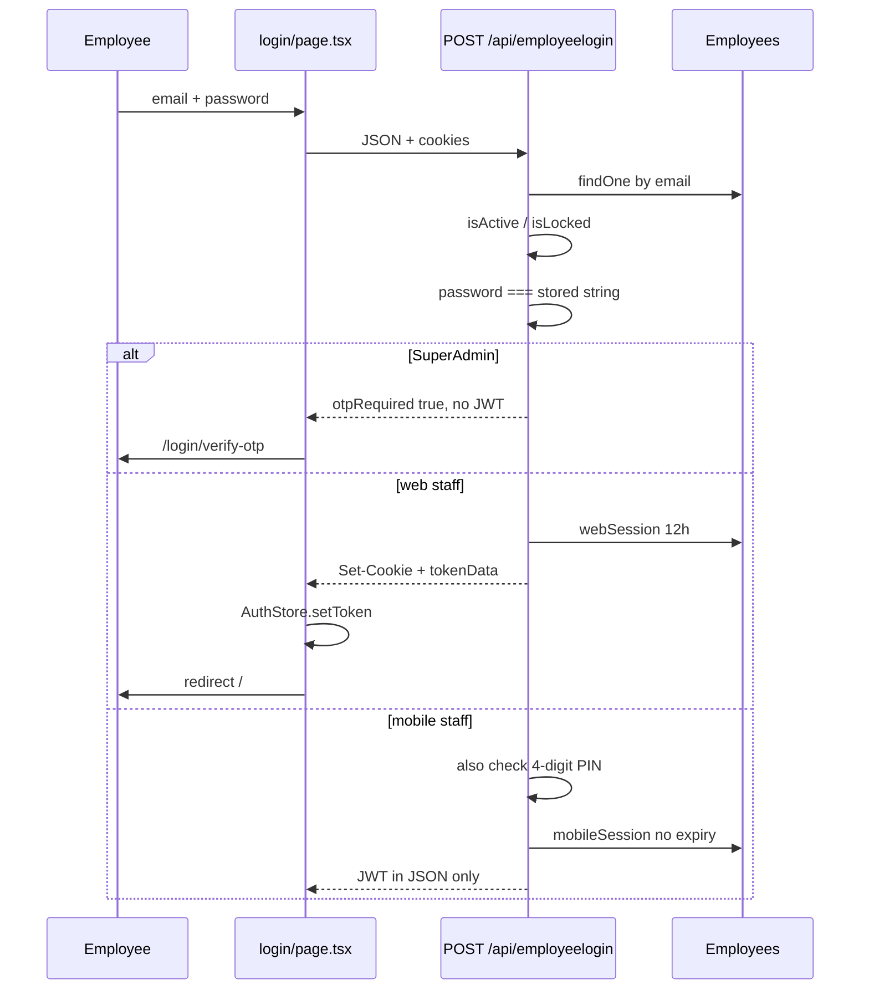
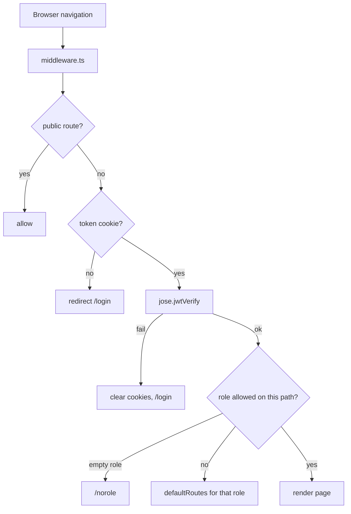
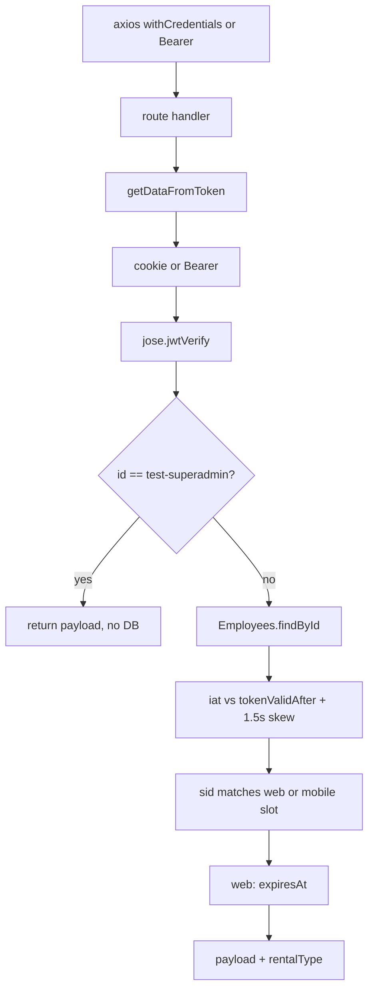
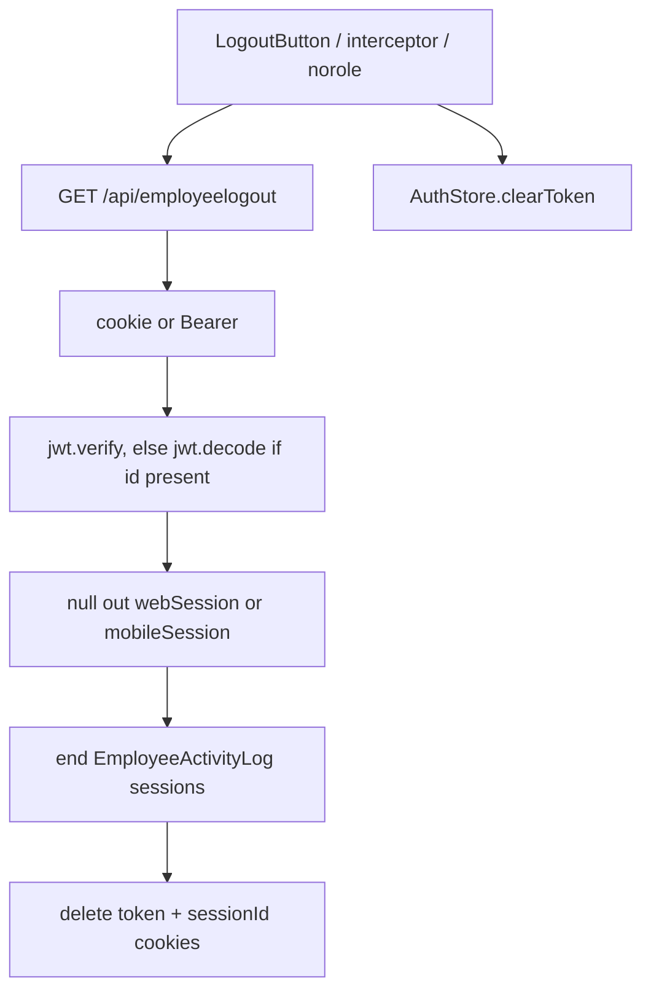
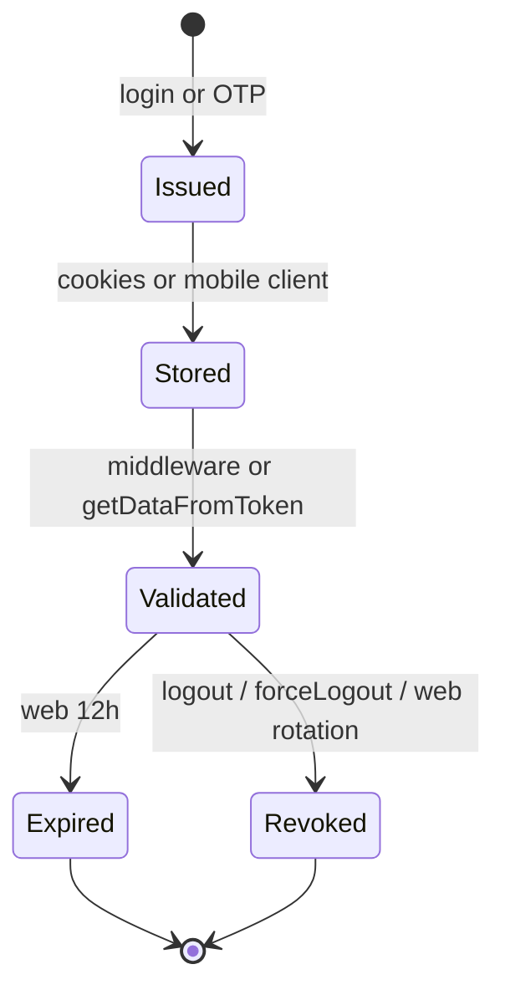
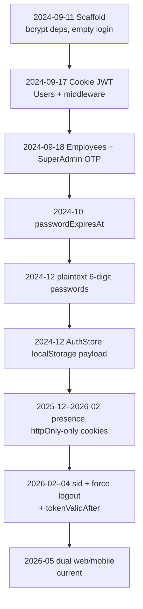

# Authentication Architecture & Evolution

**A complete guide to understanding authentication — using Adminstro as the case study.**

**Repository:** Adminstro  
**Analysis date:** 2026-09-05  
**HEAD at analysis:** `b8c9616` (`main`)  
**Git corpus:** 1035 commits, first commit `0219492` (2024-09-11)

This document has two jobs. It teaches how authentication works in general, and it explains exactly how this repository implements it — including how that implementation evolved through Git history.

Project-specific claims come from current code and Git diffs. Historical motives are labeled:

| Label | Meaning |
|---|---|
| **General principle** | How authentication usually works, independent of this repo |
| **Project implementation** | What this codebase actually does |
| **Confirmed historical reason** | The commit message, comment, or diff states why |
| **Likely / inferred reason** | Reasonable from the code, but not written down |
| **Unknown** | Not enough evidence |

Inferences are never presented as facts.

---

## 0. How to Read This Report

Read it top to bottom the first time. After that, jump by section.

```text

1. Authentication    ← concepts (intern starting point)
          ↓
2. Authentication in this project   ← the map of Adminstro
          ↓
3. How a user authenticates         ← signup, login, next request, logout
          ↓
4. Deep dive                        ← files, cookies, JWT, database
          ↓
5. Why it works this way            ← decisions and trade-offs
          ↓
6–8. How it evolved                 ← Git history as a story
          ↓
9–12. Security, tests, debt, fixes
          ↓
13–15. Five-minute recap, glossary, commit index
```

You do **not** need to know JWT, cookies, or bcrypt already. Section 1 explains those ideas, then every later section reconnects them to this repo.


---

## 1. Authentication

### 1.1 What problem are we solving?

Imagine the dashboard calls:

```http
GET /api/user/getloggedinuser
```

The server receives a URL and some headers. That is all HTTP gives it. The request does not magically include “this is Priya from Sales.”

**In simple words:** the server needs a way to recognize that the person making this request is the same person who logged in earlier.

Without that, anyone who can hit an API could read or change anyone else’s data.

```text
Identity          who the person is (an Employee document)
   ↓
Credentials       how they prove it (email + password, maybe OTP / PIN)
   ↓
Authentication    the server checks those credentials
   ↓
Session / token   a reusable proof issued after a successful login
   ↓
Later requests    the client sends that proof instead of the password
   ↓
Authorization     the server decides what that identity may do
   ↓
Resource          the page or API response
```

### 1.2 Authentication vs authorization

**Authentication** answers: *Who are you?*  
**Authorization** answers: *What are you allowed to do?*

A useful analogy:

> Authentication is showing your ID at the building entrance.  
> Authorization is which rooms that ID can open.

You can be authenticated and still forbidden. A Sales intern who is logged in is a known employee; they still must not open SuperAdmin finance tools.

**In this project**

| Question | Where it is answered |
|---|---|
| Who are you? | Login (`/api/employeelogin`), then JWT + Mongo session via `getDataFromToken` |
| May you open this **page**? | `src/middleware.ts` `roleAccess` map |
| May you call this **API**? | Each route, if it remembers to check — there is no global API gate |
| May you see this widget? | Dashboard config / `AuthStore` role — UI only, not a security boundary |

### 1.3 Why HTTP is stateless

HTTP treats every request as new.

```text
Request 1  POST /api/employeelogin     “here is my password”
Request 2  GET  /dashboard             the server does not remember Request 1
Request 3  GET  /api/leads/getLeads    still does not remember Request 1
```

**The key idea:** the server does not automatically remember that Request 2 came from the same person as Request 1. Something extra must travel with later requests: a **session id**, a **cookie**, or a **token**.

### 1.4 Sessions vs tokens vs cookies vs JWT

These words get mixed together. They are different tools that can be combined.

| Mechanism | General principle | Used here? |
|---|---|---|
| **Server session** | Server stores “this id is logged in”; client only holds an id | **Yes** — `webSession` / `mobileSession` on the Employee document |
| **Cookie** | Browser storage the browser attaches automatically | **Yes (web)** — `token` and `sessionId` cookies |
| **Token** | A string that proves a prior login | **Yes** — a JWT |
| **JWT** | A signed token the server can verify without looking up a session *if* it is used statelessly | **Yes, but not stateless** — APIs also check Mongo |
| **Bearer token** | Send `Authorization: Bearer <jwt>` instead of a cookie | **Yes (mobile)** |
| **Refresh token** | Long-lived token used only to mint new short-lived access tokens | **No** |
| **OAuth / NextAuth / Clerk** | Delegate login to Google, etc. | **No** |

**Why this mix exists (general principle):** a JWT alone is convenient (the server can verify a signature without a database). A database session is convenient for *logout* (delete the row and the token stops working). Adminstro uses **both**: a signed JWT *and* a Mongo slot the JWT’s `sid` must match.

### 1.5 Cookies

**General principle.** A cookie is a small name/value pair the server asks the browser to store. On later requests to the same site, the browser sends it. That is how a website “stays logged in” without putting the password on every click.

Important flags:

| Flag | Meaning |
|---|---|
| `HttpOnly` | JavaScript cannot read the cookie via `document.cookie` |
| `Secure` | Only sent over HTTPS |
| `SameSite` | Controls sending the cookie on requests that start on *another* site (`Strict` / `Lax` / `None`) |
| `Path` | Which URL prefixes include the cookie |
| `Domain` | Which hostnames include it |
| `Max-Age` / `Expires` | When the browser should drop it |

**Why not localStorage for the real credential?**

```text
localStorage
    ↓
Any JavaScript on the page can read it
    ↓
If an XSS bug runs attacker script
    ↓
The token can be stolen and replayed from another machine
```

```text
HttpOnly cookie
    ↓
Page JavaScript cannot read it
    ↓
XSS cannot as easily exfiltrate the credential
    ↓
Trade-off: the browser still attaches the cookie automatically
    ↓
Cross-site requests become a CSRF concern
```

**Project implementation (web):** after login, the JWT is set as cookie `token` with `httpOnly: true`, `sameSite: "lax"`, `path: "/"`, `secure` in production, `maxAge` 12 hours. A second cookie `sessionId` is also httpOnly / lax / secure, but has **no maxAge**. See `src/app/api/employeelogin/route.ts` around lines 564–585.

**Project implementation (client identity for UI):** Zustand `AuthStore` saves the JWT *payload* (name, role, id…) in `localStorage` under the key `"token"`. That is **not** the JWT. React needs a readable copy of the role because it cannot decode an httpOnly cookie.

### 1.6 JWT

**General principle.** A token is temporary proof: “this client already authenticated.” A **JWT** (JSON Web Token) is a token with three Base64url parts:

```text
header.payload.signature
```

- **Header** — typically `{ "alg": "HS256", "typ": "JWT" }`
- **Payload** — claims: who (`id`), role, issued-at (`iat`), expiry (`exp`), session id (`sid`)
- **Signature** — HMAC of header+payload using a secret. Anyone can *read* the payload. Only someone with `TOKEN_SECRET` can *forge* a valid signature.

```text
Login
  ↓
Credentials verified
  ↓
Server creates JWT (sign)
  ↓
Client stores / receives it (cookie or Bearer)
  ↓
Later request includes it
  ↓
Server verifies signature (and, here, the DB session)
  ↓
Server knows who you are
```

**Encoding ≠ encryption ≠ signing**

| Word | Meaning |
|---|---|
| Encoding | Changing format (Base64). Reversible. **Not secret.** JWT payloads are encoded, not hidden. |
| Encryption | Scrambling so only a key holder can read. JWTs in this project are **not** encrypted. |
| Signing | Proving the bytes were not altered and came from someone with the secret. |

**The key idea:** a JWT is not a password. It is a signed note the server can check.

**Access vs refresh (general principle):** short-lived access tokens limit the window if stolen; a refresh token mints new ones. **This project has no refresh tokens.** Web JWTs last 12 hours. Mobile JWTs are signed with **no `exp`**.

### 1.7 Password hashing

**General principle.** The database should not store the password you type. It should store a **hash**: a one-way fingerprint.

```text
User password  →  slow hash + unique salt  →  store hash
Login password →  same hash algorithm      →  compare to stored hash
```

- **Hashing vs encryption:** encryption can be reversed with a key. A password hash is designed *not* to be reversed.
- **Salt:** extra random bytes so two people with `123456` do not get the same stored value, and so precomputed “rainbow tables” fail.
- **Slow hashes (bcrypt, argon2):** login happens rarely; attackers guessing millions of passwords per second should be slowed down.

```text
Should happen                          Must not happen
password  →  bcrypt  →  DB             password  →  DB as "482193"
```

**Project implementation:** owner accounts in `Users` **are** bcrypt-hashed. **Employees are not.** Login does `temp.password === trimmedPassword` (`src/app/api/employeelogin/route.ts:263`). Create-employee still *computes* a bcrypt hash and then stores the plaintext anyway (`createnewEmployee/route.ts:100–138`). That is a historical regression from commit `a5c9a78` (2024-12-13), not an industry default.

### 1.8 Middleware

**General principle.** Middleware is a checkpoint that runs *before* the page or handler. If the checkpoint fails, the controller never runs.

```text
Request
   ↓
Authentication checkpoint   “do we know who this is?”
   ↓
Authorization checkpoint    “is this role allowed here?”
   ↓
Page / API handler
   ↓
Response
```

**Project implementation:** Next.js `src/middleware.ts` is that checkpoint **for pages only**. Its matcher **excludes** `/api`. API routes are unprotected unless they call `getDataFromToken` themselves.

### 1.9 CSRF vs XSS

Two different attacks, two different cookie/token implications.

| Attack | In plain language | Cookie relevance |
|---|---|---|
| **XSS** | Attacker script runs *on your site* | HttpOnly cookies are harder to steal; the script can still *use* cookies by calling your APIs |
| **CSRF** | Attacker’s *other* site causes the victim’s browser to hit *your* site while logged in | Cookies are sent automatically; `SameSite=lax` blocks most cross-site POSTs, but **top-level GET navigations still send Lax cookies** |

**CORS** is a browser rule about which frontends may read responses from your API. It is not authentication. Adminstro’s Socket.IO server has a CORS allowlist in `socket.ts`; that does not replace JWT checks.

---

## 2. Authentication in This Project

### 2.1 High-level architecture

Adminstro is an internal staff portal (VacationSaga / Holidaysera). The person who logs in at `/login` is an **Employee**, not a website owner and not a job candidate.



**Libraries (`package.json`):** `jsonwebtoken` (sign), `jose` (verify), `bcryptjs` (owners + leftover employee comments). No NextAuth, no Clerk, no Passport, no OAuth.

**Secrets (names only):** `TOKEN_SECRET`, `GMAIL_APP_PASSWORD`, optional `PASSWORD_ROTATION_CRON`. `NEXTAUTH_URL` appears only as a leftover URL fallback in `src/lib/email/signature.ts`.

### 2.2 Who logs in, and who does not

| Identity | Collection | Logs into `/login`? | Password storage |
|---|---|---|---|
| Staff | `Employees` | **Yes** | **Plaintext** |
| SuperAdmin | `Employees.role = "SuperAdmin"` | Yes, plus email OTP | Same plaintext path |
| Owner / website user | `Users` | **No** | bcrypt |
| Candidate | `Candidate` | **No** — public application form | Not a login principal |

There is **no employee self-signup**. HR (or Admin / SuperAdmin / HAdmin) creates staff via `POST /api/user/createnewEmployee`.

### 2.3 Where authentication lives

Think of three layers that look similar but are **not** equivalent:

```text
Browser page navigation
        → middleware.ts          verifies cookie JWT, checks URL vs role
                                 does NOT talk to MongoDB

Browser / mobile API call
        → route handler
        → getDataFromToken()     verifies JWT AND Mongo session slot

React UI (sidebar, widgets)
        → AuthStore.token.role   convenience copy of the payload
                                 must not be trusted as a security check
```

### 2.4 Components (map of the code)

| Piece | Path | Job |
|---|---|---|
| Login UI | `src/app/login/page.tsx` | Email/password; writes payload to AuthStore |
| OTP UI | `src/app/login/verify-otp/[...email]/page.tsx` | SuperAdmin second factor |
| No-role page | `src/app/norole/page.tsx` | JWT with empty role |
| Page gate | `src/middleware.ts` | JWT + role URL allowlists |
| Login API | `src/app/api/employeelogin/route.ts` | Credentials, session, sign JWT |
| OTP APIs | `verify-otp`, `resend-otp` | Complete or resend SuperAdmin OTP |
| Logout API | `src/app/api/employeelogout/route.ts` | Clear device slot + cookies |
| Session probe | `src/app/api/employee/check-session/route.tsx` | “Am I still valid?” |
| Force logout | `src/app/api/employee/forceLogout/route.ts` | Admin kills sessions + rotates password |
| API helper | `src/util/getDataFromToken.ts` | The real API authenticator (~286 call sites) |
| Error helper | `src/util/authErrorResponse.ts` | Terminal 401 clears cookies |
| Device helper | `src/util/deviceSession.ts` | `web` vs `mobile`, 12h constant |
| Client store | `src/AuthStore.ts` + `AuthHydrator.tsx` | Payload in memory + localStorage |
| Axios wrapper | `src/util/axios.ts` | Auto-logout on 401 / auth codes |
| Sockets | `socket.ts`, `SocketGlobalListener.tsx` | Presence + force-logout events |
| Mailer | `src/util/mailer.ts` | OTP email |
| Rotation cron | `src/util/dailyPasswordRotation.ts` | Started from `socket.ts` |
| Employee schema | `src/models/employee.ts` | Passwords + session slots |

### 2.5 Data flow after a successful web login



---

## 3. How a User Authenticates

### 3.1 Signup (staff provisioning)

**Concept.** Public products let anyone create an account. Internal tools often do not: an admin creates the user, then tells them the password.

**In this project.** Employees cannot register themselves.



**Code path**

1. `src/app/api/user/createnewEmployee/route.ts` `POST`
2. `getDataFromToken` — unauthenticated callers get 401
3. Role must be SuperAdmin, Admin, HR, or HAdmin
4. Zod `employeeSchema` — role enum **omits SuperAdmin**, so SuperAdmins are not created through this form
5. bcrypt hash computed, then `password` field set to the original string (`:100–138`)
6. `passwordExpiresAt` default 24 hours (`src/util/passwordExpiry.ts`)

A separate endpoint, `POST /api/user/createnewuser`, creates **owners** in `Users` with a **real** bcrypt hash. Auth is attempted and **ignored on failure** (`:31–36`), so the endpoint is effectively public. The generated password is returned in JSON (`:161`). That is owner provisioning, not staff signup.

`/application-form` is a public hiring form (`publicRoutes` in middleware). Candidates are not employees until HR converts them.

### 3.2 Login

**Concept — what should happen**

```text
User provides credentials
  → server finds the account
  → verifies the secret
  → creates authentication state
  → sends that state to the client
  → client uses it on later requests
```

**Now, how this project does it**

**UI:** `src/app/login/page.tsx` posts `{ email, password }` to `/api/employeelogin` with `withCredentials: true`. On mount it also GETs `/api/employee/check-session`; if that succeeds, it redirects away from login.

**Device:** `getDeviceTypeFromHeaders` (`src/util/deviceSession.ts`). Header `x-device-type: mobile` means mobile. A Bearer header with no device header is treated as mobile. Otherwise web.



**Server steps** (`src/app/api/employeelogin/route.ts` `POST`, from line 85)

1. Fail if `TOKEN_SECRET` is missing (`:87–94`)
2. Normalize email; require password; mobile also requires a 4-digit PIN
3. `Employees.findOne({ email })` (`:205`)
4. Reject inactive (`isActive === false`) or locked accounts
5. Compare plaintext password; mobile also compares `mobilePin`
6. Concurrent session: web returns **409** if `webSession` is still unexpired **and** this request still has a token cookie. If the DB says logged in but there is **no** cookie, the slot is treated as stale and wiped (`ea89895`) so the user is not trapped
7. `passwordExpiresAt` gate — skipped for SuperAdmin, HR, HAdmin, and one hardcoded email (`:334–355`)
8. SuperAdmin: email OTP unless leftover test-email bypass; otherwise mint JWT
9. Other roles: roll `passwordExpiresAt` (+96h for HR/Sales, else +24h), write session slot, `jwt.sign`
10. UI calls `setToken(response.data.tokenData)` — **not** `response.data.token`

**JWT claims on password login** (`:507–517`): `id`, `sid`, `name`, `email`, `role`, `allotedArea`, `rentalType`, `uiFlags`, `whatsappPhoneMask`.  
**OTP login omits** `uiFlags` and phone mask (`verify-otp/route.ts:189–197`).

**SuperAdmin OTP**

1. `sendEmail` in `src/util/mailer.ts:50–57` stores a 6-digit `otpToken`, 5-minute expiry
2. UI posts to `/api/verify-otp`
3. Compare with loose `!=` (`verify-otp/route.ts:83`), then `$unset` OTP fields and issue JWT
4. Hard redirect `window.location.href = "/"` so the new cookie is present before middleware runs (comment in the OTP page, `:98–102`)
5. `POST /api/resend-otp` has **no authentication and no rate limit**

### 3.3 What happens after login

You now have (web):

1. An httpOnly `token` cookie (the JWT)
2. An httpOnly `sessionId` cookie (same UUID as JWT `sid`, not used by `getDataFromToken`)
3. localStorage `"token"` = JSON payload for React
4. A `webSession` row on the Employee: `sessionId`, `expiresAt`, `isLoggedIn: true`

The password is not sent again. The cookie is.

### 3.4 Authenticated request

**Concept**

```text
Browser
  → GET /dashboard/rolebaseLead   (or GET /api/leads/getLeads)
  → authentication info attached
  → server extracts it
  → verifies it
  → learns who you are
  → checks whether you may do this
  → handler runs
```

**Pages — `middleware.ts`**



Middleware does **not** open MongoDB. A force-logout that cleared `webSession` can still render pages until the JWT expires or an API call fails. The file notes this at `middleware.ts:464–465`. Matcher at `:482–486` skips `/api`.

**APIs — `getDataFromToken`**



Then **authorization**, if the route implements it: `requireSuperAdmin`, `requireFinanceAccess`, an `allowedRoles` array, location helpers, etc.

### 3.5 Authorization

Four overlapping systems, **not** generated from one config:

1. **Page allowlists** — `roleAccess` / `defaultRoutes` in `src/middleware.ts` (SuperAdmin, Admin, Advert, LeadGen, LeadGen-TeamLead, Content, Sales, Sales-TeamLead, HR, Developer, Agent, Guest, Intern, Subscription-Sales, Sales(New), sales-intern, hSale, HAdmin)
2. **Per-route API checks** — `src/lib/admin/requireSuperAdmin.ts`, `src/lib/finance/auth.ts`, `src/lib/officeAddress/auth.ts`, `src/app/api/personal-reminders/_auth.ts`, `src/lib/visits/visitAuth.ts`, `src/util/apiSecurity.ts`
3. **Dashboard widgets** — `src/config/dashboardConfig.ts`, documented in `src/docs/DASHBOARD_RBAC_DOCUMENTATION.md` (hides UI; does not protect APIs)
4. **Per-person extras** — `uiFlags`, `allotedArea`, `rentalType`, WhatsApp `canAccessConversation`

A page can be blocked while its API is open, or a page can be public while some APIs are HR-gated. Candidate list/detail APIs currently skip `getDataFromToken` entirely.

### 3.6 Logout

**Concept.** If login *issued* a token, logout must answer: *what does “this session is over” mean?*

| Model | What logout does |
|---|---|
| Delete a client cookie | Browser stops sending the JWT. Server still would accept it if stolen and replayed before `exp`. |
| Expire / delete a server session | Server rejects the JWT even if the client still has it. |
| Stateless JWT only | You cannot truly revoke until `exp` unless you keep a denylist. |
| Refresh-token invalidation | N/A here — no refresh tokens |

**Project implementation:** **cookie delete + server slot clear** (and on force-logout, password rotation + `tokenValidAfter`).



`src/components/logoutAlertBox.tsx` → `GET /api/employeelogout`. Missing/expired tokens still return success after cookie delete. There is no separate JWT denylist.

**Force logout** (`POST /api/employee/forceLogout`): privileged roles clear **both** device slots, bump all cutoffs, generate a new 6-digit password and PIN, emit socket `force-logout`. `SocketGlobalListener.tsx` listens. The same handler in `dashboard/layout.tsx` is commented out.

### 3.7 Token / session refresh

**General principle.** Short access tokens + refresh tokens balance “stolen token dies soon” vs “user is not asked to log in every hour.”

**Project implementation:** **there is no refresh endpoint.** Web JWT `exp`, cookie `maxAge`, and `WEB_SESSION_DURATION_MS` are all 12 hours. After that, `getDataFromToken` throws `AUTH_EXPIRED`; the axios interceptor logs the user out. Mobile JWTs have no `exp`; they live until logout, force-logout, or slot mismatch. Mobile APIs update `lastActiveAt` as a heartbeat (`getDataFromToken.ts:111–115`). That is not a refresh token.

---

## 4. Deep Dive into the Implementation

### 4.1 Frontend

**Login page** (`src/app/login/page.tsx`) imports **raw** `axios`, not `@/util/axios`, so the auto-logout interceptor does **not** run there (intentional enough that `check-session` 401 must not bounce the login form).

**AuthStore** (`src/AuthStore.ts`): Zustand. `setToken` writes `localStorage["token"]`. `AuthHydrator` in `src/app/layout.tsx:55` reloads it after mount so SSR HTML and the first client paint match (`93a562c`).

**Axios wrapper** (`src/util/axios.ts`): `withCredentials: true`. On 401, or on 403 **only when** an auth-failure code is present (`AUTH_EXPIRED`, `SESSION_INVALID`, …), it `fetch`es logout, `localStorage.clear()`, redirects to `/login`. Plain 403 “insufficient permissions” must not log the user out — that lesson is in the interceptor comments after `a19a70a` was too aggressive.

**Dashboard layout** tries `document.cookie` for `sessionId` to emit `register-user`. That cookie is httpOnly, so JavaScript reads `null`. Socket auto-join from the **server** cookie parse in `socket.ts` is the path that actually works.

### 4.2 Backend

Next.js App Router route handlers, not a separate controller/service layer. Login, logout, and OTP **are** the business logic. Shared verification is `getDataFromToken`, not a dedicated AuthService.

Signing uses `jsonwebtoken` (`jwt.sign` without `algorithm` → default **HS256**). Verification in middleware and `getDataFromToken` uses `jose.jwtVerify` with the same `TOKEN_SECRET`.

### 4.3 Middleware

`src/middleware.ts` `middleware()`:

- Public routes: `/`, `/login`, OTP, `/norole`, `/application-form`, some candidate onboarding URLs, etc.
- Else require cookie JWT
- Apply `uiFlags` and `rentalType` spreadsheet redirects
- Compare path to `roleAccess[role]`
- On JWT error: redirect `/login` and expire both cookies

It never writes to the database (comment at `:464`).

### 4.4 Database

Session and credentials live on the **same** Employee document (`src/models/employee.ts`):

```70:88:src/models/employee.ts
const webSessionSchema = new Schema(
  {
    sessionId: { type: String, default: null },
    sessionStartedAt: { type: Number, default: null },
    expiresAt: { type: Number, default: null },
    isLoggedIn: { type: Boolean, default: false },
  },
  { _id: false },
);
```

`mobileSession` uses `lastActiveAt` instead of `expiresAt`. Cutoffs: `tokenValidAfter`, `webTokenValidAfter`, `mobileTokenValidAfter`.

**Role paradox (Confirmed):** Mongoose/Zod/`employeeRoles` omit `"SuperAdmin"`, but login, middleware, and APIs treat that string as the highest privilege. SuperAdmin rows exist outside the create-employee Zod path.

`EmployeeActivityLog` is an audit trail (`employeeActivitySession.ts`). It is **not** the slot `getDataFromToken` checks.

`GET /api/user/getloggedinuser` returns the **JWT payload**, not a fresh Employee document.

### 4.5 Token and session management

| Stage | What happens |
|---|---|
| Create | `jwt.sign` in login/OTP; `sid = randomUUID()` |
| Store | Web: cookies + JSON body + localStorage payload. Mobile: JSON body for the client to keep |
| Send | Web: cookie. Mobile: `Authorization: Bearer`. Pages: cookie only |
| Validate | Pages: jose. APIs: jose + DB slot + cutoff + web `expiresAt` |
| Refresh | None |
| Expire | Web 12h. Mobile: no JWT exp |
| Revoke | Clear slot; force-logout / web rotation also bump `*TokenValidAfter` |



### 4.6 Error handling

`getDataFromToken` throws `{ status, code }` (`NO_TOKEN`, `SESSION_INVALID`, `AUTH_EXPIRED`, `DB_UNAVAILABLE`, …). `buildAuthErrorResponse` clears cookies only for terminal 401 codes. Expired JWT also best-effort-clears the matching DB slot.

### 4.7 Sockets

On connect, `socket.ts` parses cookies, `jwt.verify`s `token`, joins `user-{id}`. The `register-user` event **trusts** the client-supplied `employeeId` with no second JWT check (`:108–118`). Cookie auto-join is the verified path.

### 4.8 If you must change authentication tomorrow

| Goal | Open these first |
|---|---|
| Login / cookies / JWT claims | `src/app/api/employeelogin/route.ts`, `verify-otp/route.ts` |
| “Is this API caller valid?” | `src/util/getDataFromToken.ts` |
| “May this role open this page?” | `src/middleware.ts` `roleAccess` |
| Client role in React | `src/AuthStore.ts` |
| Logout / force logout | `employeelogout/route.ts`, `forceLogout/route.ts` |
| Password policy | `dailyPasswordRotation.ts`, `generateNewpassword/route.ts`, employee `password` field |
| Mobile vs web | `src/util/deviceSession.ts` |

---

## 5. Why the Architecture Works This Way

Use this pattern: **what → why teams do it → threat → trade-off → what Adminstro actually did.**

### HttpOnly JWT cookie (web)

| | |
|---|---|
| **What** | JWT in `token` cookie, `httpOnly`, `SameSite=lax`, `Secure` in production |
| **Why** | Browsers send it automatically; JS cannot read it |
| **Threat reduced** | XSS stealing the JWT via `localStorage` |
| **Trade-off** | CSRF; cookies go on same-site GETs |
| **In this project** | Adopted fully in `c1776f6` after earlier **dual** storage (httpOnly **and** js-cookie). JWT is **still** returned in login JSON, so XSS on `/login` can still copy it |

### Binding JWT `sid` to Mongo

| | |
|---|---|
| **What** | APIs reject JWTs whose `sid` is not the live slot |
| **Why** | Stateless JWT cannot be revoked until `exp` |
| **Threat reduced** | Stolen or leftover JWT after logout / force-logout |
| **Trade-off** | Every API hits Mongo; middleware still stateless |
| **In this project** | Added `a19a70a` (2026-03), split into web/mobile in `41c1f02` |

### Dual web / mobile slots

| | |
|---|---|
| **What** | One employee, two sessions; daily rotation invalidates **web only** |
| **Why** | Phone app should survive nightly password rotation |
| **Confirmed vs inferred** | Comments in `dailyPasswordRotation.ts` **confirm** the web-only intent. Dual-device product need is a **strong inference** from PIN + Bearer + 409 copy |
| **Trade-off** | Stolen mobile JWT has no `exp` |

### Plaintext 6-digit employee passwords

| | |
|---|---|
| **What** | `password ===` string compare; generators emit digits |
| **Why teams hash** | DB leaks should not reveal passwords |
| **In this project** | Hashing was **removed** in `a5c9a78`. **Inferred** (not documented): admins display current passwords in the UI/JSON, which hashing would break |
| **Trade-off** | Any Employee dump is an immediate staff takeover; 6 digits are brute-forceable |

### SuperAdmin email OTP

| | |
|---|---|
| **What** | Password is not enough for SuperAdmin |
| **Why** | Highest privilege deserves a second factor |
| **Trade-off** | OTP is emailed, stored in plaintext, resend is unauthenticated |
| **History** | Introduced `2be4857`; a named-email bypass (`680baba`) was later **removed** (`c1776f6`) |

### No refresh tokens

| | |
|---|---|
| **What** | 12h web JWT; re-login after expiry |
| **Why (inferred)** | Internal tool, daily password rotation already interrupts web users |
| **Unknown** | No commit says “we rejected refresh tokens because …” |
| **Trade-off** | Mobile tokens never expire on their own |

### Page middleware vs API helper

| | |
|---|---|
| **What** | Matcher skips `/api` |
| **Why (general)** | Next middleware cannot cheaply do DB I/O on every API; the codebase even comments not to write DB in middleware |
| **Trade-off** | Every new API must opt in to `getDataFromToken`. Forgotten routes are public |
| **Learning takeaway** | A page lock is not a data lock |

---

## 6. How Authentication Evolved



For each stage: **before → problem → change → why it matters → after → learning takeaway.**

### 6.1 Initial architecture — scaffold (2024-09-11)

**Commit:** `0219492` *Initialized Adminstro*

**Before:** nothing. **Change:** `bcryptjs` + `jsonwebtoken` dependencies; hashed **User** create; empty login page; signup UI for owners. **After:** no staff login yet. **Learning takeaway:** libraries in `package.json` are not an architecture.

### 6.2 Major change #1 — cookie JWT + role middleware (2024-09-17)

**Commit:** `e186bda` *login and dynamic user rout done* (Aman)

**Problem:** no way to log into the dashboard. **Change:** `employeelogin`, `employeelogout`, `middleware.ts`, `getDataFromToken`; bcrypt against **Users**; JWT 1 day; httpOnly cookie **and** client `Cookies.set`. **Confirmed reason:** the commit message. Deeper motive **unknown**.

**After:** first real staff auth. Identity was still the Users collection. `getDataFromToken` only verified the signature — no session row.

**Learning takeaway:** once many pages need “who is this?”, verification moves into middleware so every page does not copy the same check. Adminstro did that on day one of login — but only for **pages**.

### 6.3 Major change #2 — Employees + SuperAdmin OTP (2024-09-18)

**Commits:** `2be4857`, then `6f7816b`

**Problem:** staff are not website owners; SuperAdmin is too powerful for password-only. **Change:** OTP APIs; then login/OTP/mailer switch Users → Employees. **Confirmed:** commit `6f7816b` states the collection switch. **After:** two identity worlds (Employees vs Users) that still exist.

**Learning takeaway:** the “user” table in a marketplace app is often the wrong principal for an internal admin portal.

### 6.4 Major change #3 — password expiry as operational control (2024-10-18)

**Commit:** `01f814c` (message says “employee logout”; the diff is **expiry**)

**Problem (inferred):** shared or long-lived staff passwords. **Change:** `passwordExpiresAt`; login rejected if more than 24 hours past it. **This is not JWT TTL.** Exemptions grew (SuperAdmin, then a hardcoded email `ff373e8` whose message incorrectly said “content writer”, later HR/HAdmin).

**Learning takeaway:** “session length” and “password rotation policy” are different knobs. This repo used the password clock as a daily attendance mechanism.

### 6.5 Major change #4 — plaintext 6-digit passwords (2024-12-13)

**Commit:** `a5c9a78`; create/reset aligned in `36dc899`

**Before:** bcrypt compare. **Change:** `temp.password === password`; 6-digit numeric passwords. **Why:** **unknown** in writing; **inferred** from admin “show current password” workflows. **After:** largest security regression in the history. Owner `Users` hashing was kept.

**Learning takeaway:** operational convenience (readable rotating PINs) can silently undo cryptography if login is changed to match the UI.

### 6.6 Major change #5 — AuthStore (2024-12-25)

**Commit:** `1643de1` *fixed screen freeze after logout*

**Problem:** **Confirmed** logout freeze; **strong inference** that React needed role/name without reading an httpOnly cookie. **Change:** Zustand + localStorage payload; `tokenData` in the login JSON; `UserRoleContext` removed. **After:** two client identities — cookie JWT (real) vs payload (UI).

**Learning takeaway:** if the credential is httpOnly, the UI still needs a **non-secret** profile copy. Naming that copy `"token"` invites people to treat it as the JWT.

### 6.7 Major change #6 — presence and httpOnly-only cookies (2025-12 → 2026-02)

| Commit | Change |
|---|---|
| `98c151f` | `isLoggedIn` / lastLogin / lastLogout |
| `ee16318` | inactive accounts 403 at login |
| `2bba3c8` | test SuperAdmin dummy (`TEST_*`, formerly `GHOST_*`) |
| `c1776f6` | server cookies only; client `Cookies.set` removed; Ankita OTP bypass removed |

**Problem:** live “who is at their desk” UI, and login bugs from two cookie writers. **After:** browsers no longer store a JS-readable JWT copy **except** the login JSON response. JWT still not bound to a server `sid`.

### 6.8 Major change #7 — sessions, force logout, auto-logout (2026-02 → 2026-04)

| Commit | Change |
|---|---|
| `ba89034` | force logout + sockets |
| `a19a70a` | `sid`, `tokenValidAfter`, DB check, `check-session`, axios interceptor |
| `4660691` | force logout rotates password |
| `dd8ded3` | `authErrorResponse` |
| `2618413` | Bearer fallback |
| `e3af810` | cannot force-logout self / SuperAdmin / test-superadmin |

**Problem:** you cannot kick a stolen JWT if verification is signature-only. **After:** APIs are sessionful. Middleware is still not. The first interceptor logged out on **any** 403; later commits narrowed that (`02f46ed` and later `axios.ts`).

**Learning takeaway:** “log the user out on 403” confuses **failed permission** with **failed identity**. Those must be different codes.

### 6.9 Major change #8 — dual device sessions (2026-05) — current

**Commits:** `41c1f02`, `ea89895`, `ad6bb4c`, plus `57deb57` activity helper

**Before:** one `sessionId` / `isLoggedIn` on the employee. **Change:** `webSession` / `mobileSession`, `mobilePin`, 12h web expiry, device-scoped cutoffs, stale-cookie 409 fix. **After:** HEAD `b8c9616` is this model, plus later RBAC path adds and `AuthHydrator`.

**Learning takeaway:** “one user, one session” breaks when a phone app and a laptop must coexist with different lifetimes.

---

## 7. Git History

**47 commits** change login, tokens, sessions, passwords, OTP, or cookies. **132 commits** touch `src/middleware.ts` (mostly “open this URL for role X”). Commit messages are often wrong — every core item was checked against the diff.

`origin/master` last touched `employeelogin` in `5306e08` (2025-03-01) and lacks force-logout / `deviceSession`. **Confirmed:** `main` is the auth source of truth.

### Complete commit timeline (mechanism)

| Date | Commit | Change | Architectural impact | Reason | Confidence |
| ---- | ------ | ------ | -------------------- | ------ | ---------- |
| 2024-09-11 | `0219492` | bcrypt + jwt deps; hashed user create; empty login | Scaffold | Bootstrap | Confirmed |
| 2024-09-17 | `e186bda` | employeelogin/logout, middleware, getDataFromToken; Users + bcrypt; dual cookie | First auth architecture | “login and dynamic user rout done” | Confirmed |
| 2024-09-18 | `be9eef3` | Content middleware paths | RBAC tweak | Route rename | Confirmed |
| 2024-09-18 | `2be4857` | verify-otp + resend-otp on Users | SuperAdmin 2FA | “added superadmin acess” | Confirmed |
| 2024-09-18 | `6f7816b` | OTP/login/mailer → Employees | Principal change | Commit states it | Confirmed |
| 2024-09-18 | `fa888b9` | Logout always → `/login` | UX | Message overclaims localStorage clear | Confirmed (partial) |
| 2024-09-18 | `980bf64` | Cookie delete flags + no-store | Cookie clearing | Logout bugs | Confirmed |
| 2024-09-18 | `4f957a9` | InputOTP UI | OTP UX | UI | Confirmed |
| 2024-09-19 | `0ee6024` | UserRoleContext | Client role cache | Dynamic role | Confirmed |
| 2024-09-19 | `59f1ae1` | refreshUserRole after cookie set | Client role sync | Render errors | Confirmed |
| 2024-10-18 | `01f814c` | passwordExpiresAt; hashed generateNewpassword | Password TTL as login gate | Message says logout | Confirmed |
| 2024-10-21 | `4c07db6` | Email send in regen commented | No email of new password | Unknown | Confirmed change |
| 2024-10-24 | `ff373e8` | Hardcoded email skips expiry | Per-person exemption | Message vs code mismatch | Confirmed |
| 2024-12-13 | `a5c9a78` | bcrypt compare → `===`; 6-digit passwords | Hashing abandoned | “6 characters” | Confirmed |
| 2024-12-16 | `36dc899` | create/reset store plaintext | Aligned with login | HR tooling | Confirmed |
| 2024-12-24 | `e3400aa` | JWT 1d → 3d | Longer tokens | Commit | Confirmed |
| 2024-12-25 | `1643de1` | AuthStore; tokenData; JWT 2d | Payload vs JWT split | Logout freeze | Confirmed |
| 2024-12-26 | `418d17c` | OTP page polish | UX | Commit | Confirmed |
| 2025-05-26 | `427db06` | Expiry → `/login` + delete cookie | Fixes redirect loop | “token expire problem” | Confirmed |
| 2025-05-29 | `108f14b` | isActive field | Field only | LeadGen | Confirmed field-only |
| 2025-06-23 | `1f7f56b` | UI generateNewpassword | HR regen | Commit | Confirmed |
| 2025-07-11 | `13f8fe8` | HR employee paths in middleware | RBAC for regen | Commit | Confirmed |
| 2025-11-10 | `680baba` | Named SuperAdmin OTP bypass | Per-person 2FA skip | Commit names the person | Confirmed |
| 2025-11-11 | `c4a896b` | `otpRequired: true` in JSON | Frontend OTP branch | “finer changes in login” | Confirmed |
| 2025-12-06 | `98c151f` | isLoggedIn / lastLogin | Presence UI | HR dashboard | Confirmed |
| 2026-01-07 | `aa6d5a1` | Public training-agreement | Candidate pages | “fixes of middleware” | Confirmed |
| 2026-01-08 | `6de640f` | Revert `aa6d5a1` | Undoes public-route experiment | Explicit revert | Confirmed |
| 2026-01-24 | `ee16318` | isActive false → 403 | Deactivated accounts | Buried in WhatsApp commit | Confirmed |
| 2026-01-29 | `2bba3c8` | Test SuperAdmin dummy | QA principal | “dummy account” | Confirmed |
| 2026-02-11 | `c1776f6` | httpOnly-only; Ankita bypass removed | Server owns cookies | “fixing login” | Confirmed |
| 2026-02-19 | `21b1578` | Block HAdmin password regen | Role freeze | Commit | Confirmed |
| 2026-02-24 | `ba89034` | forceLogout API | Remote kill | Commit | Confirmed |
| 2026-03-05 | `a19a70a` | sid, tokenValidAfter, interceptor | Sessionful APIs | “auth settings” | Confirmed |
| 2026-03-06 | `d4d7405` | test-superadmin skips DB | Bypass keep-alive | “login problem from last night” | Confirmed |
| 2026-03-06 | `02f46ed` | TOKEN_SECRET required; check-session NO_TOKEN ignored | Stops login-page logout loop | Commit | Confirmed |
| 2026-03-06 | `88f4aa4` | Uploads vs interceptor | Client coupling | Commit | Confirmed adjacent |
| 2026-03-07 | `4660691` | Force logout rotates password | Revocation + new secret | Commit | Confirmed |
| 2026-03-09 | `dd8ded3` | authErrorResponse | Structured 401s | “login fixes” | Confirmed |
| 2026-03-11 | `644ffae` | Password length 8→6; auth on regen APIs | Message ≠ main diff | Unknown vs message | Confirmed change |
| 2026-04-15 | `2618413` | Bearer in getDataFromToken | Mobile clients | Buried in notifications | Confirmed |
| 2026-04-16 | `e3af810` | Force-logout target guards | Privilege | Commit | Confirmed |
| 2026-05-11 | `41c1f02` | webSession/mobileSession | Dual device | “authentication changes” | Confirmed |
| 2026-05-18 | `ea89895` | Stale session wipe; clear both cookies on JWT error | 409 after cookie loss | “authentication changes” | Confirmed |
| 2026-05-23 | `57deb57` | employeeActivitySession helper | Logout logging | Buried in WhatsApp | Confirmed |
| 2026-05-28 | `ad6bb4c` | web/mobile TokenValidAfter; rotation web-only | Device-scoped revoke | “auth changes” | Confirmed |
| 2026-07-01 | `dae4ea4` | getDataFromToken rentalType | Claim enrichment | Lead-page commit | Confirmed adjacent |
| 2026-07-03 | `93a562c` | AuthHydrator | SSR/client payload | Leads-page commit | Confirmed |

### Important commits (turning points)

`e186bda` first login · `6f7816b` Employees · `01f814c` password clock · `a5c9a78` plaintext · `1643de1` AuthStore · `c1776f6` httpOnly-only · `a19a70a` session binding · `41c1f02` dual device.

### Reverts and abandoned approaches

| Approach | Fate |
|---|---|
| bcrypt employee hashing | Abandoned `a5c9a78`; comments remain |
| Client js-cookie JWT | Removed `c1776f6` |
| UserRoleContext | `0ee6024` → deleted `1643de1` |
| Ankita OTP bypass | `680baba` → removed `c1776f6` |
| Middleware public-route short-circuit | `aa6d5a1` → reverted `6de640f` |
| Flat isLoggedIn/sessionId | Migrated `41c1f02` |
| Dummy SuperAdmin full login block | Commented in employeelogin; JWT id bypass remains |
| `origin/master` auth | Stale (~710 commits behind) |

### False positives

`fd46571` “signup page” was bank-details UI. `5d5b452` “otp generation for superadmin” was addons UI. Several WhatsApp commits match the word “auth” without touching employee login.

---

## 8. Architecture Before vs After

| Concern | v1 Scaffold | v2 Cookie JWT | v3 Employee+OTP | v4 Expiry | v5 Plaintext | v6 AuthStore | v7 Sessions | v8 Dual device (now) |
|---|---|---|---|---|---|---|---|---|
| Principal | Users create | Users | Employees | Employees | Employees | Employees | Employees | Employees |
| Password | bcrypt create | bcrypt compare | bcrypt | bcrypt regen | **plaintext** | plaintext | plaintext | plaintext + PIN |
| Token | none | JWT 1d | + OTP for SA | same | 1d→3d→2d | 2d + payload LS | + `sid` | web 12h / mobile no exp |
| Storage | n/a | httpOnly + js-cookie | same | same | same | + localStorage | httpOnly only | cookies web; Bearer mobile |
| Session DB | none | none | none | passwordExpiresAt | same | + isLoggedIn | sessionId + cutoff | webSession / mobileSession |
| API auth | n/a | jose cookie | same | same | same | same | jose **+ DB** | + device slot |
| Refresh | n/a | none | none | none | none | none | none | **still none** |

**v2 vs v1:** login started. **v3 vs v2:** staff vs owners. **v4 vs v3:** ops policy, not crypto. **v5 vs v4:** hashing removed. **v6 vs v5:** UI identity store. **v7 vs v6:** revocation. **v8 vs v7:** two device lifetimes.

The current architecture is **better at kicking sessions** and **worse at storing secrets** than September 2024.

---

## 9. Security Analysis

Findings describe what the code allows. They are not exploit walkthroughs.

### Credential security

| Topic | Actual behavior |
|---|---|
| Employee hashing | None. `employeelogin/route.ts:263` |
| Owner hashing | bcrypt `genSalt(10)` |
| PINs | 4-digit plaintext |
| Generation | Digits only, often length 6 (`generatePassword.ts`) |
| Exposure | JSON (`generateNewpassword`, `createnewuser`, `resetPassword`); `console.log` in forceLogout `:146` and rotation `:133–134` |

### Token security

HS256 with `TOKEN_SECRET`; algorithm not pinned in `jwt.sign`. Web httpOnly cookie helps XSS; login JSON still contains the JWT. Mobile: no `exp`. Middleware ignores `tokenValidAfter` (jose only, `middleware.ts:368–371`). Replay: web until 12h or slot change; mobile until slot/cutoff change.

### Cookie flags (project, not theory)

| Flag | `token` | `sessionId` |
|---|---|---|
| HttpOnly | true | true |
| Secure | production only | same |
| SameSite | lax | lax |
| Path | `/` | `/` |
| Domain | unset | unset |
| Max-Age | 12h | **unset** |

### CSRF

Lax cookies are omitted on cross-site **POST**. They **are** sent on top-level **GET**. **High (Confirmed):** `GET /api/resetAllPasswords` and `GET /api/employeelogout` mutate state. No CSRF token, no Origin check.

### XSS

localStorage holds the payload, not the JWT. XSS can still call APIs with the cookie (`credentials: include`). That is enough to act as the user.

### Session fixation

New `sid` at login/OTP (`randomUUID`). Caller cannot supply the session id. **Confirmed.**

### Brute force

No rate limit on login, OTP, or resend-otp. 6-digit passwords and 6-digit OTPs. `isLocked` is manual, not failed-attempt lockout.

### Authorization gaps (IDOR-class)

- `GET`/`PATCH /api/candidates/[id]` — no `getDataFromToken`
- `GET /api/public/[model]` — unauthenticated Employee list (password projected out) or full Candidate documents
- `POST /api/user/createnewuser` — auth optional
- `POST /api/generateNewpassword` — any logged-in employee, no role check
- Socket `register-user` trusts client `employeeId`

### Secrets

`TOKEN_SECRET` not in committed `.env` files. Gmail user hardcoded in `mailer.ts:68`. Test password **constant** in `src/util/employeeConstants.ts:8` (value omitted here). `TEST_SUPERADMIN_EMAIL` is `""` (OTP skip is a no-op unless changed), but `getDataFromToken` still accepts JWT `id === "test-superadmin"` without a DB row (`:42–44`).

### Cron footgun

```144:144:src/util/dailyPasswordRotation.ts
const DEFAULT_CRON_IST_10PM = "* 22 * * *";
```

Name says 10pm. Expression means **every minute during hour 22**. **Unknown** whether production sets `PASSWORD_ROTATION_CRON`.

---

## 10. Testing

| File | What it tests | Employee auth? |
|---|---|---|
| `__tests__/access.test.ts` | WhatsApp `canAccessConversation` | No — mocked user objects |
| `__tests__/upload-media.test.ts` | Upload | Mocks `getDataFromToken` |
| Finance tests | Invoices | No |
| Login / OTP / middleware / sessions | **Missing** | |

**Highest-value missing tests:** `getDataFromToken` slot/cutoff/Bearer; login failure modes and 409; middleware `/dashboard` vs `/api` exclusion; candidate/`public` routes must not return PII without auth (they currently would fail that test); `generateNewpassword` should 403 for non-privileged roles.

---

## 11. Technical Debt & Risks

| Severity | Finding | Evidence | Why it matters | Fix |
|---|---|---|---|---|
| Critical | Plaintext employee passwords | `employeelogin/route.ts:263`; create employee `:137–138` | DB leak = all staff | Hash; stop returning passwords; rotate |
| Critical | Unauthenticated candidate R/W | `candidates/[id]/route.ts` | PII / hiring pipeline | Auth + HR; tokenized self-service |
| Critical | `/api/public/[model]` dumps | `public/[model]/route.ts:32–68` | Enumeration / PII | Remove or SuperAdmin-gate |
| High | `createnewuser` auth optional | `:31–36` | Fake owners | Require privileged auth |
| High | `generateNewpassword` any employee | `:23` | Peer password reset | HR/Admin/SuperAdmin only |
| High | No login/OTP rate limit | login + `resend-otp` | Brute force | Rate limit + lockout |
| High | Mutating GET + Lax cookies | `resetAllPasswords`, logout | CSRF | POST + Origin check |
| High | APIs excluded from middleware | `middleware.ts:482–486` | Forgotten routes are public | Default-deny helper |
| High | Mobile JWT no exp | `employeelogin/route.ts:519` | Long-lived theft | Expiry or idle TTL |
| High | Hardcoded test password | `employeeConstants.ts:8` | Backdoor in git | Env-only ephemeral user |
| High | `test-superadmin` skips DB | `getDataFromToken.ts:42–44` | Forged SuperAdmin if secret leaks | Delete bypass |
| Medium | Passwords in stdout | forceLogout, rotation | Log aggregation | Log ids only |
| Medium | OTP plaintext + loose `!=` | `verify-otp/route.ts:83` | Weak 2FA | Hash OTP; strict compare |
| Medium | SuperAdmin omitted from schema | `employee.ts:192–210` | Drift | Add role or separate flag |
| Medium | Raw axios on login page | `login/page.tsx:6` | Inconsistent errors | One client |
| Medium | Duplicate force-logout listeners | layout commented; SocketGlobalListener live | Confusion | One listener |
| Medium | JS cannot read httpOnly sessionId | `layout.tsx:43–73` | Dead client code | Rely on server auto-join |
| Medium | jsonwebtoken + jose | sign vs verify | Alg mismatch risk | One lib; pin HS256 |
| Medium | Cron `* 22 * * *` | rotation `:144` | 60 runs/hour | `0 22 * * *` |
| Medium | OTP JWT missing uiFlags | verify-otp vs login | Inconsistent claims | Shared payload builder |
| Low | Unused IP helper | employeelogin `:601–605` | Noise | Delete |
| Low | Mailer VERIFY/RESET | `mailer.ts:34–47` | Unclear if live | Remove or wire |
| Low | `NEXTAUTH_URL` leftover | email signature | Implies NextAuth | Drop |
| Info | localStorage key `"token"` | AuthStore | Misleads | Rename `tokenPayload` |
| Info | `session-health` is WhatsApp | admin route | Name collision | Rename |

---

## 12. Recommendations

**Security first**

1. Hash employee passwords and PINs; never log or JSON-return them; rotate existing ones.
2. Auth-gate or delete public dumps, unauthenticated candidate APIs, and `createnewuser`.
3. Role-gate password reset APIs.
4. Rate-limit login/OTP; consider SSO instead of daily 6-digit PINs.
5. POST-only mutations; CSRF/Origin checks.
6. Remove test JWT bypass; pin `alg: HS256`.
7. Expire mobile JWTs or add idle timeout.
8. Hash OTPs; bind resend to a login challenge; fix the cron if 10pm-once is the intent.
9. Stop returning JWT in JSON for web clients.

**Correctness**

Same payload builder for OTP and password login. One force-logout listener. Put SuperAdmin in the schema or stop using `role` for it. Either session-check in middleware or document that pages can render after revocation.

**Maintainability**

One `requireEmployeeAuth(request, { roles })` on every API. Generate middleware allowlists from the same config as the sidebar. Delete dead bcrypt comments and the dummy login block.

**Scalability**

Two slots on the employee row are enough today; do not grow unbounded session arrays without a session collection or Redis.

**Developer experience**

Rename the AuthStore key. Add the tests in §10. Stop burying auth fixes in WhatsApp commit messages.

---

## 13. Five-Minute Explanation for a New Engineer

You joined today. Here is the system.

1. **How a user logs in.** Staff open `/login` and type email + password. SuperAdmins then type an emailed OTP. There is no self-signup; HR creates the Employee.
2. **Where credentials go.** `POST /api/employeelogin` loads `Employees` and compares the password as a **plain string**. Mobile also sends a 4-digit PIN.
3. **What gets created.** An HS256 JWT (`id`, `sid`, `role`, …) and a Mongo `webSession` or `mobileSession` row. SuperAdmin OTP is a separate step before that JWT exists.
4. **Where that state lives.** Web: httpOnly `token` cookie (the JWT) plus localStorage payload for React. Mobile: Bearer JWT, no cookie. Source of truth for “still logged in” is the Mongo slot.
5. **Later requests.** Pages: browser sends the cookie; `middleware.ts` verifies the signature and the URL vs role. APIs: `getDataFromToken` verifies the signature **and** that `sid` still matches the slot.
6. **How the server identifies you.** JWT `id` is the Employee `_id`. APIs re-load that document. `getloggedinuser` just echoes the payload.
7. **Authorization.** A string `role` plus location/UI flags. Pages use a big allowlist. APIs each check (or forget to). Hiding a sidebar item is not security.
8. **Logout.** `GET /api/employeelogout` clears the device slot and cookies. Admins can force-logout, which also rotates the password. There is no refresh token.
9. **What to worry about first.** Plaintext passwords, public candidate/`public` APIs, APIs that skip `getDataFromToken`, and GET routes that change data.

Historically: bcrypt JWT on Users (Sep 2024) → Employees + OTP → daily password clock → **plaintext 6-digit passwords** → AuthStore → real server sessions → web vs mobile slots. Session machinery got stricter; secrets got weaker.

---

## 14. Authentication Glossary

**Authentication** — Proving who you are. Here: password (and OTP/PIN), then a JWT + session slot.

**Authorization** — What that identity may do. Here: `role`, `roleAccess`, per-route `allowedRoles`, `uiFlags`, `allotedArea`.

**Credential** — Secret used at login. Here: employee password, optional mobile PIN, SuperAdmin OTP.

**Session** — Server-side record of a login. Here: `webSession` / `mobileSession` on the Employee, not Redis.

**Cookie** — Browser-stored value sent automatically. Here: httpOnly `token` (JWT) and `sessionId`.

**JWT** — Signed JSON token. Readable, not encrypted. Proves the payload was signed with `TOKEN_SECRET`.

**Access token** — Token sent on API calls. Here: the JWT itself. There is no separate access/refresh pair.

**Refresh token** — Token used only to mint new access tokens. **Not used in this project.**

**Bearer token** — JWT sent as `Authorization: Bearer …`. Mobile / non-browser clients.

**Hash** — One-way fingerprint. Owners use bcrypt. Employees currently do not.

**Salt** — Extra randomness mixed into a password hash. Used for `Users`, not Employees.

**Encryption** — Reversible scrambling. Login JWTs are signed, not encrypted.

**Signing** — HMAC proving integrity. HS256 with `TOKEN_SECRET`.

**Middleware** — Checkpoint before a page/handler. Here: `src/middleware.ts` for pages only.

**CSRF** — Other site triggers the victim’s browser to hit this site while cookies attach. Dangerous for cookie auth on GET mutations.

**XSS** — Attacker script on this origin. HttpOnly reduces token theft; script can still call APIs as the user.

**CORS** — Browser rule for cross-origin JS. Not a substitute for JWT checks.

**OAuth** — Login via Google/etc. **Not implemented.**

**Identity provider** — External service that authenticates users. Adminstro is its own IdP for staff.

**Role** — String on the Employee/JWT (`Sales`, `HR`, …). SuperAdmin is used in code but omitted from the Mongoose/Zod enums.

**Permission** — Fine-grained capability. This app mostly uses roles plus flags, not a permission table.

**Claims** — Fields inside the JWT payload (`id`, `sid`, `role`, …).

**OTP** — One-time code. SuperAdmin email, 6 digits, 5 minutes, stored on the Employee.

**HttpOnly** — Cookie flag: JavaScript cannot read it.

**SameSite** — Cookie flag: `lax` here.

---

## 15. Git Commit Reference

**Core mechanism commits (47):**  
`0219492` `e186bda` `be9eef3` `2be4857` `6f7816b` `fa888b9` `980bf64` `4f957a9` `0ee6024` `59f1ae1` `01f814c` `4c07db6` `ff373e8` `a5c9a78` `36dc899` `e3400aa` `1643de1` `418d17c` `427db06` `108f14b` `1f7f56b` `13f8fe8` `680baba` `c4a896b` `98c151f` `aa6d5a1` `6de640f` `ee16318` `2bba3c8` `c1776f6` `21b1578` `ba89034` `a19a70a` `d4d7405` `02f46ed` `88f4aa4` `4660691` `dd8ded3` `644ffae` `2618413` `e3af810` `41c1f02` `ea89895` `57deb57` `ad6bb4c` `dae4ea4` `93a562c`

**First introduction**

| Mechanism | First commit |
|---|---|
| bcrypt (user create) | `0219492` |
| jwt sign + jose verify + httpOnly cookie + middleware | `e186bda` |
| SuperAdmin OTP | `2be4857` |
| Employee principal | `6f7816b` |
| passwordExpiresAt | `01f814c` |
| Plaintext employee passwords | `a5c9a78` |
| AuthStore | `1643de1` |
| isActive field / login gate | `108f14b` / `ee16318` |
| isLoggedIn | `98c151f` |
| Test SuperAdmin | `2bba3c8` |
| Force logout | `ba89034` |
| sid + tokenValidAfter + interceptor | `a19a70a` |
| authErrorResponse | `dd8ded3` |
| Bearer | `2618413` |
| Dual web/mobile sessions | `41c1f02` |
| Device-scoped cutoffs | `ad6bb4c` |
| AuthHydrator | `93a562c` |

**RBAC middleware (not exhaustive):** `e186bda`, `be9eef3`, `538592b`, `85440fd` / `108f14b` (LeadGen), `b1f4098` (LeadGen-TeamLead), `53649cb` (Intern), `993fa28` (Sales-TeamLead), `2cf07a5` / `514f1e0`, `3a8128a`, `e2d4aac` (Holidaysera), `0d906b3` (sales-intern), later uiFlags / rentalType on HEAD.

### Evidence notes

Built from `git log --all`, pickaxe for `bcrypt` / `jose` / `tokenValidAfter` / `webSession` / `Bearer`, and `git show` of every core commit. Current files re-read: middleware, login/OTP/logout/forceLogout, `getDataFromToken`, AuthStore, axios interceptor, employee model, mailer, `socket.ts`, rotation, create employee/user, password APIs, auth helpers, dashboard layout, tests, `package.json`.

**Unknowns:** why bcrypt was dropped; whether production overrides `PASSWORD_ROTATION_CRON`; how SuperAdmin rows are inserted; whether `VERIFY`/`RESET` mailer paths still fire; whether `origin/master` is deployed anywhere.

**Git completeness:** **Confirmed** from `0219492` through HEAD on `main`. No tags. Secrets: no live `TOKEN_SECRET` values in this document.

---

*This is a guide, not a substitute for reading the files above before you change authentication.*
