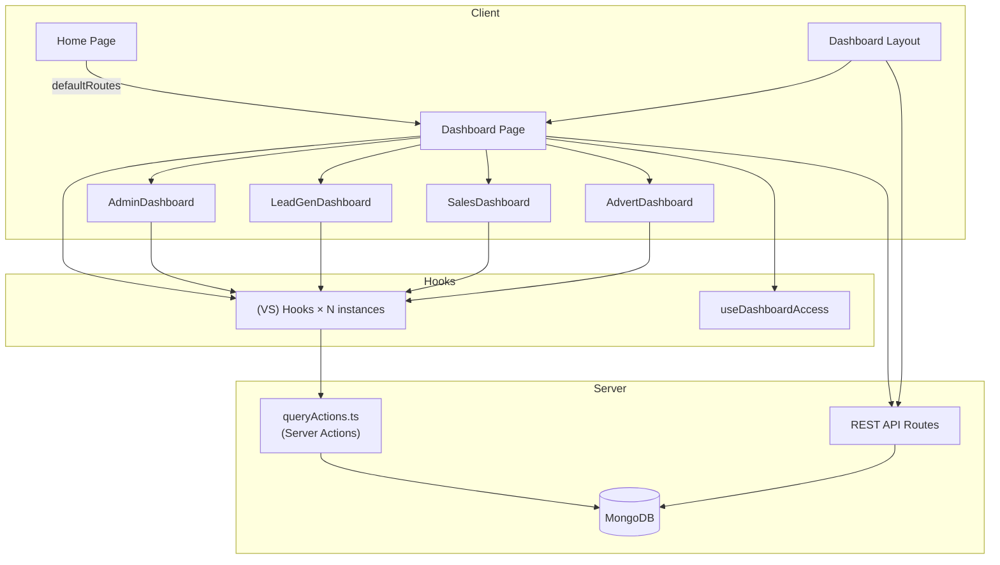
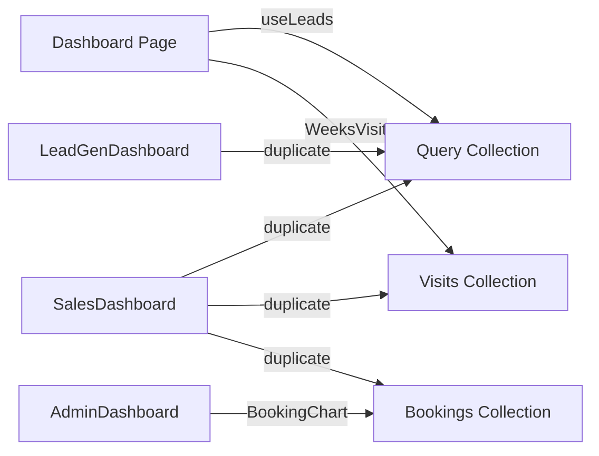

# Dashboard Performance Audit

**Date:** June 19, 2026  
**Scope:** `/dashboard` route, layout shell, role-based dashboard components, `(VS)` data hooks, server actions, and REST APIs  
**Method:** Static code analysis only — no code was modified.

---

## Executive Summary

The dashboard is a **client-rendered, multi-dashboard monolith** at `src/app/dashboard/(dashboard)/page.tsx`. A single page mounts **up to four role dashboards simultaneously** (Admin, LeadGen, Sales, Advert) for privileged roles, while the parent page **also instantiates nearly every data hook** — many of whose results are **never rendered** in the parent.

The dominant performance problem is **duplicate, uncached data fetching**: the same server actions and REST endpoints are invoked independently by the parent page and by child dashboard components, with **no shared cache** (no React Query, no SWR, no context provider). For `SuperAdmin`, initial load can trigger **60–80+ network round-trips** (server actions count as POSTs) and **100+ MongoDB operations** before the UI settles.

Secondary issues: a **global loading gate** on `useLeads` blocks the entire dashboard; **heavy aggregations** on large collections (`Query`, `Visits`, `Bookings`, `Properties`); **expensive chart components** (Recharts, MoleculeVisualization, framer-motion); and **layout-level polling** (celebrations, reminders, notifications).

---

## 1. Dashboard Architecture

### 1.1 Route Tree

```
/  (src/app/page.tsx)
└─ Home portal — "Dashboard" button → defaultRoutes[role]

/dashboard  (src/app/dashboard/(dashboard)/page.tsx)  ← MAIN ANALYTICS DASHBOARD
├─ template.tsx          — framer-motion page transition
└─ layout.tsx            — global dashboard shell (sidebar, nav, gates)

/dashboard/*             — 200+ other sub-routes (leads, visits, HR, etc.)
```

### 1.2 Entry Points

| Entry | Path | Role |
|-------|------|------|
| Home CTA | `src/app/page.tsx` | Routes via `defaultRoutes[token.role]` from `middleware.ts` |
| Primary dashboard | `src/app/dashboard/(dashboard)/page.tsx` | Role-composed analytics hub |
| Layout shell | `src/app/dashboard/layout.tsx` | Sidebar, notifications, monthly-target gate, socket |

**Default routes (relevant):**

| Role | Route |
|------|-------|
| SuperAdmin, LeadGen, Sales, HR, Developer, sales-intern | `/dashboard` |
| Admin | `/dashboard/user` |
| Advert | `/dashboard` |
| Sales-TeamLead, LeadGen-TeamLead | `/dashboard` |

### 1.3 Layout Hierarchy

```
DashboardLayout (client)
├─ Sidebar
├─ BreadCrumb
├─ InfoCard
├─ LeadSearch
├─ Notifications              (Sales / SuperAdmin / Sales-TeamLead)
├─ WhatsAppNotifications      (same roles)
├─ SystemNotificationCenter   (all authenticated)
├─ PersonalReminderNavBell    (all authenticated)
├─ CommandDialogDemo
├─ LogoutButton
├─ MonthlyTargetGate
│   └─ children
│       └─ Template (motion wrapper)
│           └─ Dashboard Page
├─ SystemNotificationToast    (global, WhatsApp + system)
└─ ScrollToTopButton
```

### 1.4 Context / Global State

| Provider / Store | Used For |
|------------------|----------|
| `useAuthStore` (Zustand) | JWT token, role, `allotedArea`, rentalType |
| `useSocket` | Real-time employee login/logout, force-logout |
| `useDashboardAccess` | RBAC sections, location access (derived from token) |
| `useLocationFilter` / `useFilteredDashboardData` | Client-side location filtering |

**No centralized dashboard data context exists.**

### 1.5 Dashboard Page Component Tree

```
Dashboard (page.tsx)
├─ CelebrationNotification
├─ PersonalReminderBanner          → GET /api/personal-reminders/due
├─ Welcome / Celebration flip card
│   └─ BroadcastNotificationForm (SuperAdmin / HR)
├─ AdminDashboard                  (isAdmin || HR)
│   ├─ CandidateStatsChart
│   ├─ LoggedInEmployeesList
│   ├─ Password Management Card
│   ├─ RecentEmployeeSessions
│   ├─ BookingChartImproved
│   ├─ WeeklyTargetDashboard (BookingTable)
│   ├─ PropertyCountHistogram
│   ├─ OwnerStageChart
│   └─ Listings LineChart
├─ LeadGenDashboard                (isLeadGen || isAdmin || LeadGen-TeamLead)
│   ├─ ChartAreaMultiple
│   ├─ WebsiteLeadsLineChart
│   ├─ CustomStackBarChart (today's leads)
│   ├─ ActiveEmployeeList
│   ├─ LocationCard (Fresh Leads)
│   ├─ LeadsCandleChart
│   ├─ ReviewPieChart
│   └─ StatsCard grid (monthly lead stats)
├─ AdvertDashboard                 (role === Advert only)
│   ├─ MoleculeVisualization
│   ├─ New Owners panels
│   ├─ Listings LineChart
│   └─ BoostMultiLineChart
├─ Sales by Agent Card             (salesByAgent section)
│   ├─ LeadCountPieChart
│   └─ Rejection reasons grid
├─ SalesDashboard                  (isSales || isAdmin || Sales-TeamLead)
│   ├─ BookingChartImproved
│   ├─ WeeklyTargetDashboard
│   ├─ VisitStatsCard grid
│   ├─ CityVisitsChart
│   ├─ New Owners section
│   └─ BoostMultiLineChart
└─ VisitsCreatedByMultiLineChart   (admin, not Advert)
```

**SuperAdmin renders Admin + LeadGen + Sales sections concurrently** (not Advert unless role is Advert).

---

## 2. Component Dependency Map

### 2.1 Core Orchestrator

| Component | Path | Purpose | Parent | Children |
|-----------|------|---------|--------|----------|
| `Dashboard` | `src/app/dashboard/(dashboard)/page.tsx` | Role routing, celebrations, sales-by-agent, mounts all sub-dashboards | `MonthlyTargetGate` | All dashboard components below |
| `DashboardLayout` | `src/app/dashboard/layout.tsx` | App chrome, notifications, target gate | Next.js layout | Sidebar, nav widgets, `{children}` |
| `HomePage` | `src/app/page.tsx` | Marketing landing + dashboard CTA | Root layout | Navbar, DashboardCard |

### 2.2 Role Dashboards

| Component | Path | Purpose | Parent | Key Children |
|-----------|------|---------|--------|--------------|
| `AdminDashboard` | `src/components/dashboards/AdminDashboard.tsx` | HR/Admin analytics | Dashboard | CandidateStatsChart, LoggedInEmployeesList, BookingChart, BookingTable, PropertyCountHistogram, OwnerStageChart, Listings chart |
| `LeadGenDashboard` | `src/components/dashboards/LeadGenDashboard.tsx` | Lead gen KPIs | Dashboard | ChartAreaMultiple, WebsiteLeadsLineChart, CustomStackBarChart, ActiveEmployeeList, LeadsCandleChart, ReviewPieChart, StatsCard |
| `SalesDashboard` | `src/components/dashboards/SalesDashboard.tsx` | Visits, owners, boosts, revenue | Dashboard | VisitStatsCard, CityVisitsChart, MoleculeVisualization, BoostMultiLineChart, BookingChart, BookingTable |
| `AdvertDashboard` | `src/components/dashboards/AdvertDashboard.tsx` | Advert listings & owners | Dashboard | MoleculeVisualization, Listings chart, BoostMultiLineChart |

### 2.3 Shared Heavy Children

| Component | Path | Purpose | Data Source |
|-----------|------|---------|-------------|
| `BookingChartImproved` | `src/components/BookingChart.tsx` | Revenue area/line/bar chart | `useBookingStats` → `getBookingStats` |
| `WeeklyTargetDashboard` | `src/components/BookingTable.tsx` | Radial weekly target table | `getLocationWeeklyTargets` |
| `LoggedInEmployeesList` | `src/components/VS/dashboard/logged-in-employees.tsx` | Online employees | `useLoggedInEmployees` + session counts API |
| `ActiveEmployeeList` | `src/components/VS/dashboard/active-employee-list.tsx` | LeadGen active agents | `useActiveEmployees` |
| `RecentEmployeeSessions` | `src/components/mini/RecentEmployeeSessions.tsx` | Recent login sessions | `GET /api/employee-activity/get-logs` |
| `MoleculeVisualization` | `src/components/molecule_visual` | 3D-style owner network | Props from `WeeksVisit` |
| `LeadsCandleChart` | `src/components/charts/LeadsCandleChart` | Candlestick leads by location | `useLeadsCandleAnalytics` |

### 2.4 Access Control Hooks

| Hook | Path | Purpose |
|------|------|---------|
| `useDashboardAccess` | `src/hooks/useDashboardAccess.ts` | RBAC sections, team flags, location lists |
| `useLocationFilter` | same file | API filter values, `filterDataByLocation` |
| `useFilteredDashboardData` | `src/hooks/useFilteredDashboardData.ts` | Memoized client-side location filter |

Config source: `src/config/dashboardConfig.ts`

---

## 3. Component → Data Source Mapping

### 3.1 Dashboard Page (`page.tsx`)

| Data Need | Source | Trigger |
|-----------|--------|---------|
| Grouped leads (gate) | `useLeads` → server actions | Mount |
| Sales by agent pie | `useLeads` → `getLeadsGroupCount`, `getRejectedLeadGroup` | Mount + filter change |
| Celebrations banner | `fetch("/api/celebrations/today")` | Mount, 10min interval, focus |
| Employee birthdays (flip card) | `GET /api/employee/getAllEmployee` × up to 10 pages | Mount |
| Visits created-by chart | `GET /api/visits/stats/created-by` | Mount |
| **Unused in JSX** | `usePropertyCount`, `useBookingStats`, `useCandidateCounts`, `useReview`, `useLeadStats`, `useVisitStats`, `useMonthlyVisitStats`, `useWebsiteLeadsCounts`, `SalesCard`, `WeeksVisit`, `useTodayLeads`, `ListingCounts`, `BoostCounts`, `useUnregisteredOwnerCounts` | Mount (dead fetches for parent) |

### 3.2 AdminDashboard

| Section | Hook / API |
|---------|------------|
| Candidate stats | `useCandidateCounts` |
| Logged-in employees | `useLoggedInEmployees` → `GET /api/employee/getLoggedInEmployees` |
| Session counts | `POST /api/employee/getActiveSessionsCounts` |
| Password mgmt | `GET /api/employee/getAllEmployee` |
| Recent sessions | `GET /api/employee-activity/get-logs` |
| Revenue | `BookingChartImproved` → `useBookingStats` |
| Weekly targets | `getLocationWeeklyTargets` |
| Property count | `usePropertyCount` |
| Owner journey | `GET /api/dashboard/owner-journey-stats` |
| Listings chart | `useListingCounts` |

### 3.3 LeadGenDashboard

| Section | Hook / API |
|---------|------------|
| Lead gen overview chart | `useTodayLeads` → `getLeadGenLeadsCount` |
| Website leads | `useWebsiteLeadsCounts` |
| Today's leads bar | `useTodayLeads` → `getTodayLeads` |
| Active employees | `useActiveEmployees` → `POST /api/employee/getActiveEmployees` |
| Fresh leads card | `SalesCard` → `getSalesCardDetails` |
| Leads by location candle | `useLeadsCandleAnalytics` |
| Reviews pie | `useReview` |
| Monthly lead stats | `useLeadStats` |
| Agent filter list | `useLeads` → `getAllAgent` |

### 3.4 SalesDashboard

| Section | Hook / API |
|---------|------------|
| Revenue / targets | `BookingChartImproved`, `WeeklyTargetDashboard` |
| Visit stat cards | `useVisitStats` |
| City visits chart | `useMonthlyVisitStats` |
| New owners | `WeeksVisit` (3 parallel actions) |
| Owner trend | `useUnregisteredOwnerCounts` |
| Boost chart | `useBoosterCounts` |
| Message status (commented UI) | `useLeads` → `GET /api/leads/getStatusCount` |

### 3.5 Layout Shell

| Widget | API |
|--------|-----|
| Token sync | `GET /api/user/getloggedinuser` |
| Monthly target gate | `GET /api/monthly-target/current` |
| Personal reminders (banner) | `GET /api/personal-reminders/due` |
| Personal reminders (nav bell) | `GET /api/personal-reminders/due` (**duplicate**) |
| Sales reminders | `GET /api/sales/reminders/getThreeDaysReminders` |
| WhatsApp summary | `GET /api/whatsapp/notifications/summary` |
| System notifications | `GET /api/notifications` |
| System toast | `GET /api/whatsapp/conversations/archive`, read/clear endpoints |

---

## 4. Complete API Inventory

### 4.1 Server Actions (`src/actions/(VS)/queryActions.ts`)

Server actions are invoked from client hooks via Next.js `"use server"` — each call is a **separate POST** to the server.

| Action | MongoDB Collections | Called By (hooks/components) |
|--------|---------------------|-------------------------------|
| `getGroupedLeads` | `Query` (2× `$group` agg) | `useLeads` |
| `getLeadsByLocation` | `Query` | `useLeads` |
| `getLeadsCandleAnalytics` | `Query` | `useLeadsCandleAnalytics` |
| `getAllAgent` | `Employees` | `useLeads` |
| `getLeadsGroupCount` | `Query` | `useLeads` |
| `getRejectedLeadGroup` | `Query` | `useLeads` |
| `getAverage` | `MonthlyTarget` / performance targets | `useLeads` |
| `getLeadGenLeadsCount` | `Query` | `useTodayLeads` |
| `getTodayLeads` | `Query` | `useTodayLeads` |
| `getLocationLeadStats` | `Query`, `MonthlyPerformanceTarget`, `MonthlyTarget` | `useLeadStats` |
| `getLocationVisitStats` | `Visits`, targets (similar pattern) | `useVisitStats` |
| `getMonthlyVisitStats` | `Visits` | `useMonthlyVisitStats` |
| `getWeeksVisit` | `Visits` | `WeeksVisit` |
| `getVisitsToday` | `Visits` | `WeeksVisit` |
| `getUnregisteredOwners` | `Visits`, `unregisteredOwner` (2 pipelines + merge) | `WeeksVisit` |
| `getNewOwnersCount` | `Visits` / owners | `WeeksVisit` |
| `OwnersCount` | `Visits` (`$facet` by city) | `WeeksVisit` |
| `getUnregisteredOwnerCounts` | `Visits` / owners time series | `useUnregisteredOwnerCounts` |
| `getSalesCardDetails` | `Query` | `SalesCard` |
| `getListingCounts` | `Properties` / listings | `useListingCounts` |
| `getBoostCounts` | `Boosters` | `useBoosterCounts` |
| `getWebsiteLeadsCounts` | `WebsiteLeads` | `useWebsiteLeadsCounts` |
| `getBookingStats` | `Bookings` + `$lookup` `queries` | `useBookingStats` / `BookingChart` |
| `getLocationWeeklyTargets` | targets + performance collections | `BookingTable` |
| `getPropertyCount` | `Properties` (agg + `countDocuments`) | `usePropertyCount` |
| `getCountryWisePropertyCount` | `Properties` | `usePropertyCount` (on filter) |
| `getReviews` | `Query` (multi-stage) | `useReview` |
| `getCandidateCounts` | candidates collection | `useCandidateCounts` |
| `getCandidateSummary` | candidates | `useCandidateCounts` |
| `getCandidatePositions` | candidates | `useCandidateCounts` |
| `getDashboardData` | multiple | `useDashboardData` (**not used in main dashboard**) |

### 4.2 REST API Routes

| Endpoint | Method | Route File | Called By | Purpose |
|----------|--------|------------|-----------|---------|
| `/api/user/getloggedinuser` | GET | `src/app/api/user/getloggedinuser/route.ts` | Layout | Sync `rentalType` on token |
| `/api/monthly-target/current` | GET | `src/app/api/monthly-target/current/route.ts` | MonthlyTargetGate | Block dashboard if targets missing |
| `/api/personal-reminders/due` | GET | `src/app/api/personal-reminders/due/route.ts` | Banner + NavBell | Due reminders |
| `/api/celebrations/today` | GET | `src/app/api/celebrations/today/route.ts` | Dashboard page | Company-wide celebrations |
| `/api/employee/getAllEmployee` | GET | `src/app/api/employee/getAllEmployee/route.ts` | Page (10 pages), AdminDashboard | Employee directory |
| `/api/employee/getLoggedInEmployees` | GET | `src/app/api/employee/getLoggedInEmployees/route.ts` | LoggedInEmployeesList | Online users |
| `/api/employee/getActiveSessionsCounts` | POST | `src/app/api/employee/getActiveSessionsCounts/route.ts` | LoggedInEmployeesList | Multi-session counts |
| `/api/employee/getActiveEmployees` | POST | `src/app/api/employee/getActiveEmployees/route.ts` | ActiveEmployeeList | LeadGen agents + lead counts |
| `/api/employee-activity/get-logs` | GET | `src/app/api/employee-activity/get-logs/route.ts` | RecentEmployeeSessions | Session log (limit 120) |
| `/api/visits/stats/created-by` | GET | `src/app/api/visits/stats/created-by/route.ts` | Dashboard page | Visits per creator time series |
| `/api/leads/getStatusCount` | GET | `src/app/api/leads/getStatusCount/route.ts` | `useLeads` | Message status by city |
| `/api/dashboard/owner-journey-stats` | GET | `src/app/api/dashboard/owner-journey-stats/route.ts` | AdminDashboard | Owner funnel stages |
| `/api/advert/pending-owners/count` | GET | advert route | AdvertDashboard | Pending listing queue count |
| `/api/sales/reminders/getThreeDaysReminders` | GET | sales reminders route | Notifications | Sales follow-up reminders |
| `/api/whatsapp/notifications/summary` | GET | whatsapp route | WhatsAppNotifications | Unread WA count |
| `/api/notifications` | GET | notifications route | SystemNotificationCenter | System notifications |

---

## 5. Initial Page Load Timeline

### 5.1 Sequence (SuperAdmin on `/dashboard`)

```
T0  User navigates to /dashboard
    ↓
T1  Middleware auth check (JWT cookie)
    ↓
T2  DashboardLayout mounts (client)
    ├─ GET /api/user/getloggedinuser
    ├─ Socket connect + register-user
    ├─ GET /api/monthly-target/current  ← may BLOCK children until resolved
    ├─ GET /api/personal-reminders/due (×2: banner + nav bell)
    ├─ GET /api/sales/reminders/getThreeDaysReminders
    ├─ GET /api/whatsapp/notifications/summary
    ├─ GET /api/notifications
    └─ SystemNotificationToast background fetches
    ↓
T3  Dashboard page mounts — ALL hooks fire in parallel
    ├─ useLeads: 6 server actions + 1 REST (BLOCKS UI until getGroupedLeads completes)
    ├─ useTodayLeads: 2 server actions
    ├─ WeeksVisit: 3 server actions (1 is Promise.all of 3)
    ├─ SalesCard, ListingCounts, BoostCounts, WebsiteLeads, UnregisteredOwners
    ├─ useBookingStats, useCandidateCounts (3 actions), usePropertyCount
    ├─ useReview, useLeadStats, useVisitStats, useMonthlyVisitStats
    ├─ GET /api/celebrations/today
    ├─ GET /api/employee/getAllEmployee (loop up to 10×)
    └─ GET /api/visits/stats/created-by
    ↓
T4  Spinner shown until useLeads.leads is truthy
    ↓
T5  Child dashboards mount (Admin + LeadGen + Sales simultaneously)
    ├─ DUPLICATE all overlapping hooks (see §6)
    ├─ Admin: employees, owner-journey, sessions, BookingChart, BookingTable
    ├─ LeadGen: candle analytics, active employees
    └─ Sales: duplicate visit/owner/boost/booking fetches
    ↓
T6  Cascading child fetches
    ├─ LoggedInEmployeesList → getLoggedInEmployees → getActiveSessionsCounts
    ├─ BookingChart useEffect → SECOND getBookingStats per instance
    └─ RecentEmployeeSessions → get-logs (120 records)
    ↓
T7  Re-render storm as ~20+ hooks each call setState
    ↓
T8  Charts paint (Recharts, heavy DOM)
```

### 5.2 Loading Gate Bottleneck

```656:663:src/app/dashboard/(dashboard)/page.tsx
  if (!leads) {
    return (
      <div className="w-full h-screen flex flex-col justify-center items-center gap-4">
        <Loader2 className="w-12 h-12 text-primary animate-spin" />
        <p className="text-lg text-muted-foreground">Loading dashboard...</p>
      </div>
    );
  }
```

The entire dashboard — including child components that have their own data — is **blocked** until `getGroupedLeads` returns, even though `leads` grouped data is only used implicitly for the loading check (sales-by-agent uses `leadsGroupCount`, not `leads` directly).

---

## 6. Duplicate Request Report

### 6.1 Hook Instance Duplication (SuperAdmin)

| Hook / Action | Parent `page.tsx` | AdminDashboard | LeadGenDashboard | SalesDashboard | AdvertDashboard | Total Instances |
|---------------|-------------------|----------------|------------------|----------------|-----------------|-----------------|
| `useLeads` (+6 actions on mount) | ✓ | — | ✓ | ✓ | — | **3×** |
| `useTodayLeads` | ✓ | — | ✓ | — | — | **2×** |
| `WeeksVisit` (+3 actions) | ✓ | — | — | ✓ | ✓ | **2–3×** |
| `useListingCounts` | ✓ | ✓ | — | — | ✓ | **3×** (Advert only) |
| `useBoosterCounts` | ✓ | — | — | ✓ | ✓ | **3×** (Advert) |
| `useUnregisteredOwnerCounts` | ✓ | — | — | ✓ | ✓ | **3×** |
| `useBookingStats` | ✓ | via BookingChart | — | via BookingChart | — | **3×** (+ double fetch each) |
| `usePropertyCount` | ✓ | ✓ | — | — | — | **2×** |
| `useCandidateCounts` | ✓ | ✓ | — | — | — | **2×** |
| `useReview` | ✓ | — | ✓ | — | — | **2×** |
| `useLeadStats` | ✓ | — | ✓ | — | — | **2×** |
| `useVisitStats` | ✓ | — | — | ✓ | — | **2×** |
| `useMonthlyVisitStats` | ✓ | — | — | ✓ | — | **2×** |
| `useWebsiteLeadsCounts` | ✓ | — | ✓ | — | — | **2×** |
| `SalesCard` | ✓ | — | ✓ | — | — | **2×** |
| `getLocationWeeklyTargets` | — | BookingTable | — | BookingTable | — | **2×** |
| `GET /api/employee/getAllEmployee` | ✓ (10 pages) | ✓ | — | — | — | **2+×** |
| `GET /api/personal-reminders/due` | Banner | Layout bell | — | — | — | **2×** |

### 6.2 Within-Component Duplicates

| Pattern | Location | Issue |
|---------|----------|-------|
| `useBookingStats` mount `useEffect` + `BookingChart` `useEffect` | `useBookingStats.ts` + `BookingChart.tsx` | **2× `getBookingStats`** per chart instance on load |
| `useDashboardData` empty deps | `useDashboardData.ts` | `refetch` ignores `date` changes; mount-only fetch |
| `useLeads` mount bundle | 6 parallel actions | Redundant with child dashboards |

### 6.3 Consolidation Opportunities

| Data | Current | Recommendation |
|------|---------|----------------|
| Lead stats / visit stats / listings / boosts | 2–3 independent hook instances | Single React Query key per filter set |
| Employee directory | Page loops 10 pages + Admin fetches again | One paginated query, shared context |
| Booking stats | 3 hook instances × 2 fetches | One provider, dedupe by `[days, location, offsets]` |
| Personal reminders | Banner + NavBell | Single fetch, context |
| WeeksVisit owner bundle | 3 actions × N instances | Single `/api/dashboard/owners-summary` endpoint |

---

## 7. Re-Render Analysis

### 7.1 Render Triggers

| Component | Re-render Causes | Severity |
|-----------|------------------|----------|
| `Dashboard` (page) | 15+ hooks each `setState`; celebrations; filter state | **Critical** |
| `AdminDashboard` | 5+ hooks; employee list filtering `useEffect` | High |
| `LeadGenDashboard` | 7+ hooks; filter changes refetch candle | High |
| `SalesDashboard` | 6+ hooks; month selector | High |
| `BookingChartImproved` | `fetchBookingStats` → loading → data; dark mode observer | Medium |
| `LoggedInEmployeesList` | Socket events; employees load → session counts fetch | Medium |
| `DashboardLayout` | `token` in socket effect deps; pathname | Low–Medium |

### 7.2 Missing Memoization

| Location | Issue |
|----------|-------|
| `page.tsx` | 20+ `useState` filters; no `React.memo` on child dashboards |
| `useDashboardAccess` | New function refs (`canAccess`, `getFilteredLocations`) every render |
| `LeadGenDashboard` | `todaysLeadChartData` mapped every render (not `useMemo`) |
| `AdminDashboard` | `chartData.sort()` inside JSX on every render |
| `SalesDashboard` / `AdvertDashboard` | `reduce` for owner location counts every render |

### 7.3 Cascade Pattern

```
Hook setState → Dashboard re-render → 4 dashboard children re-render
→ Recharts recalculate → Layout thrashing (600px molecule viz, 400px charts)
```

No `React.memo` on dashboard children means **any parent state change repaints all role dashboards**.

---

## 8. API / Database Performance

### 8.1 High-Cost Queries

| Action / API | Complexity | Collections | Risk |
|--------------|------------|-------------|------|
| `getBookingStats` | `$lookup` Bookings→Query, `$unwind` payment history, date grouping; optional comparison pipeline | `Bookings`, `queries` | **Very High** — runs 2× per chart load |
| `getUnregisteredOwners` | 2 aggregation pipelines + `$lookup` owners + merge arrays | `Visits`, `unregisteredOwner`, `owners` | **High** |
| `OwnersCount` | `$facet` multi-dimensional grouping by city | `Visits` | **High** |
| `getLocationLeadStats` | `$facet` on Query + 3 target collection reads + JS merge | `Query`, `MonthlyTarget`, `MonthlyPerformanceTarget` | **High** |
| `getLocationVisitStats` | Similar to lead stats on Visits | `Visits`, targets | **High** |
| `getLeadsCandleAnalytics` | Multi-day, multi-location aggregation | `Query` | **High** |
| `getPropertyCount` | Aggregate + full `countDocuments` | `Properties` | Medium |
| `owner-journey-stats` | Multi-stage user pipeline per site | `Users`, `HousingUsers` | Medium–High |
| `get-logs?limit=120` | Employee activity log scan | `EmployeeActivity` / sessions | Medium |
| `getAllEmployee` × 10 | Paginated employee scan | `Employees` | Medium (amplified) |

### 8.2 Index Considerations

Frequently filtered fields (verify indexes exist):

- `Query`: `createdAt`, `location`, `createdBy`, `leadStatus`, `messageStatus`, `typeOfProperty`
- `Visits`: `createdAt`, `location`, `createdBy`, `schedule`
- `Bookings`: `travellerPayment.history.date`, `travellerPayment.history.status`, `lead`
- `Properties`: `country`, `rentalType`, listing creation date
- `Boosters`: creation date fields used in `getBoostCounts`

### 8.3 N+1 / Sequential Patterns

| Pattern | Where |
|---------|-------|
| Employee celebration fetch | Sequential page loop 1→10 in `page.tsx` |
| Session counts after employees | `LoggedInEmployeesList`: waits for employees, then POST counts |
| MonthlyTargetGate blocks render | Children wait for target check even when `hasTarget=true` |

---

## 9. Frontend Performance

### 9.1 Expensive Components

| Component | Cost Driver |
|-----------|-------------|
| `MoleculeVisualization` | Canvas/WebGL-style viz, 600px height |
| `BookingChartImproved` | 862 lines, multiple chart types, comparison logic |
| `LeadsCandleChart` | Custom candlestick rendering |
| `CandidateStatsChart` | Multi-series + month navigation |
| `CityVisitsChart` | Stacked bar + pitch amounts |
| `BoostMultiLineChart` | Multi-line Recharts |
| `framer-motion` template | Animates entire page on every navigation |
| `StatsCard` / `VisitStatsCard` grids | Up to N locations × animated wrapper |

### 9.2 Frontend vs Backend Work Split

| Computation | Where |
|-------------|-------|
| Aggregations, grouping, targets | **Backend** (server actions) |
| Location access filtering | **Frontend** (`useFilteredDashboardData`, `filteredLeadStats`) |
| Chart data transform / sort | **Frontend** (often every render) |
| Rejection % / owner location reduce | **Frontend** |
| RBAC section visibility | **Frontend** (`canAccess`) |

### 9.3 Optimization Patterns Not Used

- No `React.memo` on dashboard components
- No shared data cache (SWR / TanStack Query)
- No chart data virtualization
- No lazy/dynamic import for heavy charts (MoleculeVisualization, BookingChart)
- No intersection-observer lazy mount for below-fold sections

---

## 10. Network Waterfall (SuperAdmin Estimate)

| Phase | Calls | Parallelism | Est. Latency Each | Notes |
|-------|-------|-------------|-------------------|-------|
| Layout shell | 6–8 REST | Parallel | 50–200ms | Target gate may serialize children |
| Page hooks (1st instance) | ~25 server actions + 3 REST | Parallel burst | 100–800ms | Server action queue on single Node process |
| Loading gate | — | Blocks UI | Until `getGroupedLeads` | Perceived slowness |
| Child dashboards | ~25–35 duplicate actions | Parallel burst | 100–800ms | Same DB queries repeated |
| Child components | 5–8 REST | Mixed | 100–400ms | Employees, sessions, logs |
| Chart re-fetch | 2–3× `getBookingStats` | Sequential per chart | 300–1500ms | `$lookup` heavy |

**Estimated total wall time (warm DB):** 3–8 seconds  
**Estimated total wall time (cold / large collections):** 8–20+ seconds  
**Estimated server actions + REST on SuperAdmin first paint:** 60–80+ requests

---

## 11. Database Collection Usage Matrix

| Collection | APIs / Actions | Frequency on SuperAdmin Load | Relative Cost |
|------------|----------------|------------------------------|---------------|
| `Query` | getGroupedLeads, getLeadsGroupCount, getRejectedLeadGroup, getLeadsByLocation, getTodayLeads, getLeadGenLeadsCount, getLocationLeadStats, getReviews, getSalesCardDetails, getLeadsCandleAnalytics, getStatusCount | **Very High** (15–25×) | **Critical** |
| `Visits` | getWeeksVisit, getVisitsToday, getUnregisteredOwners, OwnersCount, getNewOwnersCount, getLocationVisitStats, getMonthlyVisitStats, created-by API | **Very High** (12–20×) | **Critical** |
| `Bookings` | getBookingStats | High (4–6×) | **Very High** per call |
| `Properties` | getPropertyCount, getListingCounts, getCountryWisePropertyCount | Medium (4–6×) | Medium |
| `Boosters` | getBoostCounts | Medium (3–4×) | Medium |
| `Employees` | getAllAgent, getAllEmployee, getLoggedInEmployees, getActiveEmployees | Medium (5–15×) | Medium |
| `MonthlyTarget` / `MonthlyPerformanceTarget` | getLocationLeadStats, getLocationVisitStats, getLocationWeeklyTargets, getAverage | Medium (6–10×) | Medium |
| `WebsiteLeads` | getWebsiteLeadsCounts | Low (2×) | Low–Medium |
| `unregisteredOwner` | getUnregisteredOwners | Medium (2–3×) | Medium |
| `Users` / `HousingUsers` | owner-journey-stats | Low (1×) | Medium |
| Candidates | getCandidateCounts, getCandidateSummary | Low (4×) | Medium |

---

## 12. Architecture Diagrams

### 12.1 System Architecture



### 12.2 API Dependency Graph (simplified)



### 12.3 Request Flow (SuperAdmin)

```
Browser
  ├─ Layout APIs (parallel)
  ├─ Page hooks batch 1 (parallel, ~25 actions) ──► BLOCKED on getGroupedLeads
  ├─ Page REST (celebrations, employees×10, visits/created-by)
  ├─ AdminDashboard hooks batch 2 (parallel, ~15 actions)
  ├─ LeadGenDashboard hooks batch 3 (parallel, ~12 actions)
  ├─ SalesDashboard hooks batch 4 (parallel, ~15 actions)
  └─ Nested REST (employees, sessions, logs, owner-journey)
```

---

## 13. Root Causes of Slowness

1. **God page anti-pattern** — `page.tsx` imports and runs every hook but renders only a subset; duplicates all work in children.
2. **No request deduplication** — Identical server actions invoked from independent `useEffect([], [])` in multiple components.
3. **Global loading gate on non-critical data** — `getGroupedLeads` blocks entire UI.
4. **Multi-dashboard stacking** — SuperAdmin mounts Admin + LeadGen + Sales at once.
5. **Heavy MongoDB aggregations** — Especially `getBookingStats`, `getUnregisteredOwners`, `getLocationLeadStats`.
6. **Layout overhead** — Monthly target gate, dual reminder fetches, notification polling, socket listeners.
7. **Employee directory over-fetch** — Up to 10 sequential `getAllEmployee` pages for celebration detection.
8. **Chart-heavy UI** — Multiple Recharts instances + MoleculeVisualization without lazy loading.
9. **Server actions as primary transport** — Each hook action is a separate HTTP POST (no batching).
10. **BookingChart double-fetch** — Hook mount + component `useEffect` both call `fetchBookingStats`.

---

## 14. Prioritized Optimization Roadmap

### Priority 1 — Critical Impact, Structural

| Item | Expected Improvement | Files Affected | Risk |
|------|---------------------|----------------|------|
| Remove dead hooks from `page.tsx`; keep only what page renders (sales-by-agent, celebrations) | **40–60% fewer requests** for SuperAdmin | `src/app/dashboard/(dashboard)/page.tsx` | Medium |
| Introduce TanStack Query / SWR with shared keys for all `(VS)` hooks | **50–70% fewer duplicate DB hits** | All `src/hooks/(VS)/*`, dashboard components | Medium |
| Replace `!leads` full-page gate with per-section skeletons | **1–3s faster perceived load** | `page.tsx` | Low |
| Lazy-mount role dashboards (`dynamic(() => import(...), { ssr: false })`) or render only primary team dashboard | **30–50% fewer initial requests** for multi-role users | `page.tsx`, dashboard index | Medium |

### Priority 2 — High Impact, Targeted

| Item | Expected Improvement | Files Affected | Risk |
|------|---------------------|----------------|------|
| Consolidate `getBookingStats` to single provider; fix double-fetch in BookingChart | **3–6 fewer heavy aggregations** per load | `useBookingStats.ts`, `BookingChart.tsx`, dashboards | Low |
| Merge WeeksVisit mount bundle into one server action | **6–9 fewer round-trips** | `queryActions.ts`, `useWeeksVisit.ts` | Low |
| Deduplicate `GET /api/personal-reminders/due` | 1 fewer request + less polling | `PersonalReminderBanner.tsx`, layout | Low |
| Replace 10-page employee loop with `GET /api/celebrations/today` only (already exists) | **Up to 10 fewer employee queries** | `page.tsx` | Low |
| `React.memo` + `useMemo` on dashboard children and chart data | Smoother re-renders, lower CPU | Dashboard components | Low |

### Priority 3 — Medium Impact, Backend & UX

| Item | Expected Improvement | Files Affected | Risk |
|------|---------------------|----------------|------|
| Add compound indexes on `Query.createdAt+location`, `Visits.createdAt+location` | **20–40% faster aggregations** | MongoDB, models | Low |
| Lazy-load below-fold charts (Intersection Observer / `dynamic`) | Faster TTI, lower main-thread work | Chart components | Low |
| Cache owner-journey-stats (already has 60s cache header); extend to other read-heavy APIs | Reduced DB load | API routes | Low |
| Virtualize `LoggedInEmployeesList` / `RecentEmployeeSessions` | Better scroll perf with many employees | VS dashboard components | Low |
| Create `/api/dashboard/bootstrap?role=` batch endpoint | Single round-trip for initial data | New API + page refactor | High |

---

## 15. Role-Specific Load Profiles

| Role | Dashboards Mounted | Approx. Unique Server Actions | Notable Extras |
|------|-------------------|------------------------------|----------------|
| **SuperAdmin** | Admin + LeadGen + Sales + sales-by-agent | 45–55 (80+ with duplicates) | All collections, heaviest |
| **LeadGen** | LeadGen only (+ maybe sales-by-agent) | 15–20 | Candle analytics |
| **Sales** | Sales + sales-by-agent | 18–25 | Visit stats, owners, boosts |
| **Sales-TeamLead** | Sales + LeadGen sections + sales-by-agent | 30–40 | Near SuperAdmin subset |
| **HR** | Admin (HR sections only) | 12–18 | Candidates, employees |
| **Advert** | Advert only | 10–14 | Molecule + listings |
| **sales-intern** | Sales (newOwners only) | 8–12 | Reduced RBAC surface |

---

## 16. Hooks Reference (`src/hooks/(VS)`)

| Hook | Mount Actions | Used In |
|------|---------------|---------|
| `useDashboardData` | `getDashboardData` | **Not wired to main dashboard** |
| `useLeads` | 6 actions + REST | page, LeadGen (agents), Sales (message status) |
| `useTodayLeads` | 2 actions | page, LeadGen |
| `useWeeksVisit` | 3 parallel actions | page, Sales, Advert |
| `useLeadStats` | `getLocationLeadStats` | page, LeadGen |
| `useVisitStats` | `getLocationVisitStats` | page, Sales |
| `useMonthlyVisitStats` | `getMonthlyVisitStats` | page, Sales |
| `useListingCounts` | `getListingCounts` | page, Admin, Advert |
| `useBoosterCounts` | `getBoostCounts` | page, Sales, Advert |
| `useUnregisteredOwnerCounts` | `getUnregisteredOwnerCounts` | page, Sales, Advert |
| `usePropertyCount` | `getPropertyCount` | page, Admin |
| `useCandidateCounts` | 3 actions | page, Admin |
| `useReviews` | `getReviews` | page, LeadGen |
| `useWebsiteLeadsCounts` | `getWebsiteLeadsCounts` | page, LeadGen |
| `useSalesCard` | `getSalesCardDetails` | page, LeadGen |
| `useBookingStats` | `getBookingStats` | page (unused), Admin/Sales BookingChart |
| `useLeadsCandleAnalytics` | `getLeadsCandleAnalytics` | LeadGen only |

---

## 17. Files Analyzed

- `src/app/page.tsx`
- `src/app/dashboard/layout.tsx`
- `src/app/dashboard/(dashboard)/page.tsx`
- `src/app/dashboard/template.tsx`
- `src/components/dashboards/AdminDashboard.tsx`
- `src/components/dashboards/LeadGenDashboard.tsx`
- `src/components/dashboards/SalesDashboard.tsx`
- `src/components/dashboards/AdvertDashboard.tsx`
- `src/hooks/useDashboardAccess.ts`
- `src/hooks/useFilteredDashboardData.ts`
- `src/hooks/(VS)/*` (all 23 hooks)
- `src/actions/(VS)/queryActions.ts`
- `src/config/dashboardConfig.ts`
- Key child components: `BookingChart`, `BookingTable`, `logged-in-employees`, `active-employee-list`, `RecentEmployeeSessions`, `MonthlyTargetGate`, `PersonalReminderBanner`

---

## 18. Conclusion

The dashboard system is functionally rich but architecturally **not optimized for initial load**. The combination of a monolithic parent page, simultaneous multi-dashboard rendering, hook-per-widget data fetching without caching, and heavy MongoDB aggregations explains the observed slowness.

The highest-impact path forward is **not** micro-optimizing individual charts — it is **eliminating duplicate fetches** (shared cache + removing dead hooks from `page.tsx`), **removing the global loading gate**, and **batching or lazy-loading** role-specific dashboard sections.

*This document is analysis-only. No production code was changed.*
