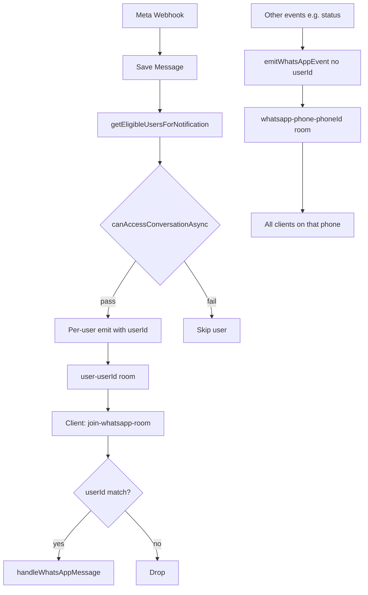
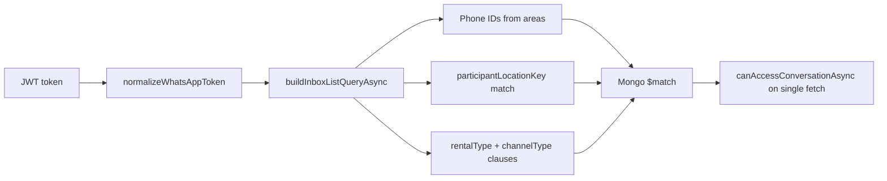

# WhatsApp CRM — Deep Verification Audit

**Date:** June 22, 2026  
**Scope:** Verify whether prior architectural, performance, notification, scalability, and UX improvements are implemented, partially implemented, or still missing.  
**Method:** Code tracing — imports, execution paths, React Query caches, socket handlers, providers, APIs, models. No assumptions.

**Status legend:** ✅ Implemented · ⚠️ Partially Implemented · ❌ Missing · ❌ Not Verified (if evidence absent)

---

## SECTION 1 — Render Isolation Verification

### Overall status: ⚠️ Partially Implemented

Context split exists; render isolation does not.

### 1. Does `WhatsAppChatInner` still subscribe to all contexts?

**Status: ✅ Yes (problem confirmed)**

**Evidence:**
- `WhatsAppChat()` → `WhatsAppProviders` → `WhatsAppChatInner` (`src/app/whatsapp/whatsapp.tsx` L362–367)
- Inner destructures full state from all three hooks (L423–514):
  - `useConversationListState()` — ~30 fields
  - `useActiveThreadState()` — messages, templates, compose, etc.
  - `useWhatsAppUIState()` — dialogs, CRM panel, forward/transfer

**Impact:** Any list/thread/UI context value change re-renders the entire ~4,700-line shell, including call overlays and CRM.

**Recommendation:** Extract memoized `ConversationSidebarContainer` and `MessageThreadContainer` that subscribe only to their slice; keep `WhatsAppChatInner` on action refs + minimal selection state only.

---

### 2. Socket event rerender blast radius

**Status: ⚠️ Partially isolated**

| Area | On `whatsapp-new-message` | Evidence |
|------|---------------------------|----------|
| **Shell (`WhatsAppChatInner`)** | ✅ Rerenders | Subscribes to all context state; handler calls `patchConversationsList`, `mutateActiveMessages`, `setSelectedConversation` (L1828–1926) |
| **Sidebar** | ✅ Rerenders | Rendered by inner; receives new `conversations` prop (L4311+) |
| **Thread (`MessageList`)** | ✅ Rerenders when open chat | `mutateActiveMessages` updates `messages` in `ActiveThreadContext` |
| **Composer** | ✅ Rerenders | Same parent + `newMessage`/`sendingMessage` in thread context |
| **Call UI** | ✅ Rerenders | Call state (`pendingIncomingInvite`, `callPermissions`, etc.) lives in inner (L680+) |
| **CRM panel** | ✅ Rerenders | `showCrmPanel` from `WhatsAppUIContext` via inner |

Handler location: `whatsapp.tsx` L1653–1949 (`handleWhatsAppMessage`).

---

### 3. Are memoized components protected?

**Status: ⚠️ Partially**

**Memoized:** `ChatHeader`, `MessageComposer`, `ConversationItem`, `TemplateDialog`, `ForwardDialog`  
**Not memoized:** `ConversationSidebar`, `MessageList` (`forwardRef` only, L1222), `CrmPanel`

**Evidence:** Parent rerender + many inline callbacks (e.g. `onAddOwner` L4336–4351) break memo equality even where `memo` exists.

**Impact:** Memo wrappers provide little benefit while the shell remains a single subscriber.

**Recommendation:** Stabilize callbacks with `useCallback` in container components; move render trees under context-scoped containers.

---

### 4. Context selectors?

**Status: ❌ Missing**

**Evidence:** No `use-context-selector` or similar (grep across `src/` — zero matches). Standard React Context with monolithic `stateValue` objects in:
- `ConversationListContext.tsx` L663+
- `ActiveThreadContext.tsx` L379+
- `WhatsAppUIContext.tsx` L46+

`useActiveThreadSelection()` exists (`ActiveThreadContext.tsx` L58) but is **not used** by any child component — only defined in provider file.

**Recommendation:** Adopt `use-context-selector` or split state/actions contexts further so children subscribe to slices.

---

### 5. Action refs?

**Status: ⚠️ Partially correct**

**Evidence:**
- `useConversationListActionsRef()` / `useActiveThreadActionsRef()` used in inner (L420–421)
- Socket handlers call `listActionsRef.current.patchConversationsList` etc.
- Inner **still** subscribes to full state, so refs reduce stale closures but not rerenders

**Recommendation:** Shell should use action refs only; move state subscriptions into isolated child containers.

---

### Component tree

```
WhatsAppChat
└── WhatsAppProviders
    ├── ConversationListProvider     ← list RQ, archive, filters
    │   └── ActiveThreadProvider     ← selection, messages RQ, templates, phone-configs
    │       └── WhatsAppUIProvider    ← dialogs, CRM panel flags
    │           └── WhatsAppChatInner ← sockets, calls, send, ALL state hooks
    │               ├── ConversationSidebar
    │               ├── ChatHeader (memo)
    │               ├── MessageList
    │               ├── MessageComposer (memo)
    │               ├── CrmPanel
    │               ├── Disposition/Reminder/Visit dialogs
    │               └── Incoming call overlay
```

### State ownership map

| State | Owner | Consumers |
|-------|--------|-----------|
| Conversation list, archive, filters | `ConversationListProvider` | Inner + Sidebar (props) |
| Selection, messages, templates, compose | `ActiveThreadProvider` | Inner → Header/List/Composer |
| Modal/dialog flags | `WhatsAppUIProvider` | Inner → dialogs/CRM |
| Socket handlers, WebRTC, call state | `WhatsAppChatInner` local `useState` | Inner only |
| Phone configs RQ | `ActiveThreadProvider` | Inner, utils |

### Rerender blast radius map

```
Socket NEW_MESSAGE
  → patchConversationsList (list context)
  → mutateActiveMessages (thread context, if open)
  → setSelectedConversation (thread context, if open)
  → bumpInitiationLimitRefreshKey (list context)
  → notificationController.process (inner)
  → FULL WhatsAppChatInner rerender
      → Sidebar (all rows reconcile)
      → MessageList + Composer + ChatHeader (if thread open)
      → Call overlay + CRM (even if unchanged)
```

---

## SECTION 2 — Socket Routing Verification

### Overall: ⚠️ Partially Implemented

### Room creation & joins

**Server (`socket.ts` L216–290):**
- `join-whatsapp-room` → `whatsapp-room` + `user-{userId}`
- `join-whatsapp-phone` → `whatsapp-phone-{phoneId}`
- `join-whatsapp-channel` → `whatsapp-channel-{channelId}`
- `join-whatsapp-retarget` → `whatsapp-retarget-{phoneId}`
- `join-conversation` → `conversation-{id}`

**Client (`whatsapp.tsx`):**
- L1662: `join-whatsapp-room` with userId
- L736–762: join all `allowedPhoneConfigs` phone + channel rooms
- L1667–1668: retarget room for Advert/SuperAdmin

### Routing dimensions

| Dimension | Server emit | Client filter |
|-----------|-------------|---------------|
| **Location** | ✅ `getEligibleUsersForNotification` → `canAccessConversationAsync` | ❌ Not on socket handler (only phone + userId) |
| **Phone** | ✅ Per-user emit includes `businessPhoneId`; phone-room broadcast for non-user-targeted events | ✅ L1691–1698 phone allowlist |
| **Role** | ✅ Via `canAccessConversationAsync` (retarget, rental, channel) | ✅ Retarget-only mode L1701–1704 |
| **Assignment** | ❌ Not used for notification eligibility (`locationAccess.ts` L6–7) | ❌ |

### Does every user still receive all events?

**Status: ⚠️ Depends on event type**

- **NEW_MESSAGE (primary path):** Per eligible user with `userId` → `user-{userId}` only (`webhook/route.ts` L1283–1413, `pusher.ts` L75–82). **Not** broadcast to phone room.
- **MESSAGE_STATUS_UPDATE:** No `userId` → **phone room broadcast** to all joined clients (`webhook/route.ts` L1626, `pusher.ts` L108–127).
- **emitWhatsAppEventToEligibleUsers** (archive, meta, transfer, calls): Phone/channel room broadcast **plus** per-user emits (`emitToEligibleUsers.ts` L25–40).

### Is `emitToEligibleUsers` being used?

**Status: ✅ Implemented** (not universal)

Used in:
- `src/app/api/whatsapp/webhook/route.ts` (calls via `emitCallEventForConversation`)
- `src/app/api/whatsapp/conversations/archive/route.ts`
- `src/app/api/whatsapp/conversations/transfer/route.ts`
- `src/app/api/whatsapp/conversations/[conversationId]/meta/route.ts`
- `src/app/api/whatsapp/conversations/[conversationId]/labels/route.ts`

**NEW_MESSAGE** uses direct `emitWhatsAppEvent` with `userId`, not `emitWhatsAppEventToEligibleUsers`.

### Frontend-only location filtering?

**Status: ⚠️ Yes for some events**

- NEW_MESSAGE: filters `userId` + `businessPhoneId`, **not** `participantLocationKey`
- Relies on server only emitting to eligible users for NEW_MESSAGE
- STATUS/call events via phone rooms bypass per-user location scoping on receive

**Impact:** Users joined to a phone room may receive status updates for conversations outside their location visibility.

**Recommendation:** Add `userId` to status emits or filter status handler by conversation access metadata.

### Flow: New Message → Location → Eligible Users → Emit

**Status: ✅ Exists (server-side for NEW_MESSAGE)**

```
Meta webhook (processIncomingMessage)
  → save message + update conversation
  → getEligibleUsersForNotification(conversation)     [notificationRecipients.ts]
      → Employee.find(whatsapp roles)
      → canAccessConversationAsync per employee       [access.ts + locationAccess.ts]
  → per eligible unread user:
      → emitWhatsAppEvent(NEW_MESSAGE, { userId, ... })  [user-{id} room only]
```

### Complete socket flow diagram



**Key files:**
- `src/lib/whatsapp/notificationRecipients.ts` — `getEligibleUsersForNotification`
- `src/lib/whatsapp/emitToEligibleUsers.ts` — `emitWhatsAppEventToEligibleUsers`
- `src/lib/pusher.ts` — `emitWhatsAppEvent`, `emitWhatsAppEventToUser`
- `socket.ts` — room join handlers
- `src/app/whatsapp/whatsapp.tsx` — client listeners and filters

---

## SECTION 3 — Notification Architecture Verification

### Overall: ⚠️ Partially Implemented

### Notification matrix

| Event | Exists | Scope | Delivery Method |
|-------|--------|-------|-----------------|
| Incoming message (in-app) | ✅ | Per-user socket (`userId`) | `whatsapp.tsx` handler + `whatsappNotificationController.process` |
| Incoming message (browser) | ✅ | Same tab leader, mute/archive/read filters | `src/lib/notifications/whatsappNotificationController.ts` |
| Dashboard toast | ✅ | `userId` filter on socket | `src/components/Notifications/SystemNotificationToast.tsx` |
| Expiring 24h window | ✅ | `buildConversationVisibilityFilterAsync` + role | `GET /api/whatsapp/notifications/summary` |
| Unread count (bell) | ✅ | Same visibility filter + read states | Summary route + socket patch in `WhatsAppNotifications.tsx` |
| Expo push | ✅ | Per eligible user | `webhook/route.ts` `sendIncomingWhatsAppExpoPush` |
| Archive mute | ✅ | Global archive state | Webhook skips archived; client archive set |
| CRM reminders | ⚠️ | Per employee | `POST /api/whatsapp/reminders`, disposition `set_reminder` — **not** unified push/socket toasts |
| SLA breach | ❌ | Analytics only | `slaBreached` on model + `whatsappAnalyticsService.ts` — no inbox notification |
| Escalation | ❌ | — | Webhook comment only (`route.ts` L1711) |
| Owner priority | ❌ | — | Summary sorts expiring by urgency, unread by time — no owner-type boost |

### Scoping capabilities

| Question | Status | Evidence |
|----------|--------|----------|
| Can notifications be scoped by location? | ✅ Server | `notificationRecipients.ts` + `locationAccess.ts` |
| Can notifications be scoped by employee? | ✅ Server | Per-user `userId` on emit |
| Can notifications be scoped by phone number? | ⚠️ | Phone access in `canAccessConversationAsync`; bell uses visibility filter |
| Unread reminders implemented? | ⚠️ | CRM reminder labels + `PersonalReminder` — not unified notification bus |
| SLA reminders implemented? | ❌ | Not in notification surfaces |
| Escalation notifications implemented? | ❌ | Not implemented |
| Owner messages prioritized? | ❌ | Not verified in summary or controller |

### Verified optimizations

| Fix | Status | Evidence |
|-----|--------|----------|
| Summary poll disabled on `/whatsapp` | ✅ | `WhatsAppNotifications.tsx` L88–92 `refetchInterval: false` when `pathname.startsWith('/whatsapp')` |

**Key files:**
- `src/components/whatsapp/WhatsAppNotifications.tsx`
- `src/components/Notifications/SystemNotificationToast.tsx`
- `src/lib/notifications/whatsappNotificationController.ts`
- `src/app/api/whatsapp/notifications/summary/route.ts`
- `src/app/api/whatsapp/notifications/clear/route.ts`

---

## SECTION 4 — Multi-Location Access Verification

### Overall: ✅ Implemented (server); ⚠️ client assist only

| Question | Status | Evidence |
|----------|--------|----------|
| Can a phone number be assigned to multiple locations? | ✅ | `WhatsappChannel.assignedLocations: string[]` (`src/models/whatsappChannel.ts` L37) |
| Can employees belong to multiple locations? | ✅ | `employee.allotedArea: [String]` (`src/models/employee.ts` L166–168) |
| Is access enforced server side? | ✅ | `buildConversationVisibilityFilter` / `canUserSeeConversation` (`src/lib/whatsapp/locationAccess.ts`) |
| Is access enforced client side? | ⚠️ | UI filters by role/phone; list pre-filtered by API |
| Can employees see conversations outside their location? | ❌ (if server correct) | `inboxQuery.ts` + `canAccessConversationAsync` on single-conv fetch |
| Is conversation visibility filtered at query level? | ✅ | `buildInboxListQueryAsync` (`conversations/route.ts` L175) |
| Is conversation visibility filtered after fetch? | ⚠️ | Sidebar `filteredConversations` for tab/unread only (`ConversationSidebar.tsx` L391–408) |

### Access flow diagram



**Canonical contract** (`locationAccess.ts` L4–11):
- Visibility = PhoneAccess AND participantLocationKeyAccess
- Ownership = assignedAgent (separate — never used for list visibility)
- AdminQueue = participantLocationKey empty / missing

**Middleware:** Route allowlist only (`src/middleware.ts`) — no location logic.

**Key files:**
- `src/lib/whatsapp/locationAccess.ts`
- `src/lib/whatsapp/access.ts`
- `src/lib/whatsapp/inboxQuery.ts`
- `src/lib/whatsapp/phoneAreaConfigService.ts`
- `src/lib/whatsapp/participantLocationPrivileges.ts`
- `src/app/api/whatsapp/conversations/route.ts`

---

## SECTION 5 — Multi-Number Architecture Verification

### Overall: ✅ Implemented

| Question | Status | Evidence |
|----------|--------|----------|
| How are business phone numbers stored? | ✅ | `WhatsappChannel` model + legacy `WHATSAPP_PHONE_CONFIGS` |
| How are conversations linked? | ✅ | `businessPhoneId` + frozen `whatsappChannelId` |
| How are socket rooms linked? | ✅ | Per phone (`whatsapp-phone-{id}`) + per channel (`whatsapp-channel-{id}`) |
| Are subscriptions limited to assigned numbers? | ⚠️ | User joins `allowedPhoneConfigs` from server-filtered `/phone-configs` |
| Does frontend subscribe to all numbers? | ✅ | All non-internal configs in one join effect (`whatsapp.tsx` L736–762) |
| Can one location own multiple numbers? | ✅ | Different `(location, rentalType, channelType)` → different channels |
| Can one number belong to multiple locations? | ✅ | `assignedLocations[]` on channel |

### Number assignment architecture

```
Location + RentalType + ChannelType
        ↓
   WhatsappChannel (active row)
        ↓
   phoneNumberId + wabaId + accessToken
        ↓
   Conversations.whatsappChannelId (frozen on create)
        ↓
   Socket rooms: whatsapp-phone-{phoneNumberId}
                 whatsapp-channel-{channelId}
```

**API:** `GET /api/whatsapp/phone-configs`  
**React Query:** `["whatsappPhoneConfigs"]` in `ActiveThreadContext.tsx` (30m stale)

**Key files:**
- `src/models/whatsappChannel.ts`
- `src/lib/whatsapp/channelService.ts`
- `src/lib/whatsapp/resolveAllowedPhoneConfigs.ts`
- `src/app/api/whatsapp/phone-configs/route.ts`

---

## SECTION 6 — Template System Verification

### Overall: ✅ Implemented

| Question | Status | Evidence |
|----------|--------|----------|
| Are templates cached? | ✅ | React Query in `ActiveThreadContext.tsx` L143–162 |
| Cache key uses conversationId? | ❌ | Key is channel/WABA/route — not conversationId |
| Cache key uses phoneId / WABA / channel? | ✅ | `resolveTemplatesCacheKey()` in `utils.ts` L367–394 |
| Does switching conversations refetch templates? | ⚠️ | Only if cache key changes; same channel → cache hit |
| Does switching numbers refetch templates? | ✅ | Key includes phone/channel routing |
| Are duplicate Meta API calls occurring? | ⚠️ | `retarget/page.tsx` + `hooks/useWhatsApp.ts` call `/templates` outside RQ |
| Are templates preloaded? | ❌ | Fetch on `enabled: Boolean(templatesCacheKey && selectedConversationId)` |

### Template lifecycle diagram

```
Select conversation
  → resolveTemplatesCacheKey(conv, phoneConfigs)
      → channel:{channelId} | waba:{wabaId} | route:{location|rental|channel|phone}
  → RQ ["whatsappTemplates", templatesCacheKey]
  → if cache miss: GET /api/whatsapp/templates?conversationId=...
  → staleTime 10m, gcTime 15m
  → MessageComposer / TemplateDialog consume templates from ActiveThreadContext
```

**Key files:**
- `src/app/whatsapp/context/ActiveThreadContext.tsx`
- `src/app/whatsapp/utils.ts` — `resolveTemplatesCacheKey`
- `src/app/api/whatsapp/templates/route.ts`
- `src/app/whatsapp/components/MessageComposer.tsx`
- `src/app/whatsapp/components/TemplateDialog.tsx`

---

## SECTION 7 — Sidebar Scalability Verification

### Overall: ⚠️ Partially Implemented

| Item | Status | Evidence |
|------|--------|----------|
| Is conversation list virtualized? | ❌ | `filteredConversations.map` (`ConversationSidebar.tsx` L1134) |
| Which library (if any)? | Messages only | `@tanstack/react-virtual` in `MessageList.tsx` (threshold 30) |
| Infinite scroll implementation? | ✅ | `useConversationsList` cursor pagination + sidebar scroll handler (L422–438) |
| Search: client, server, or both? | Both | Server: `useUnifiedWhatsAppSearch` → `/api/whatsapp/search/unified`; list param search via `useConversationsList` |
| Filters: server or client? | Mixed | Server: location, label, adminQueue; Client: owner/guest tab, unread pill |

### Estimated performance

| Chats loaded | DOM nodes | Socket patch cost | Risk |
|--------------|-----------|-------------------|------|
| 100 | ~100 rows | Maps full array | Moderate |
| 500 | ~500 rows | Maps full array | High |
| 1000 | ~1000 rows | Maps full array | Very high |
| 5000 | Impractical | O(n) per message | Critical |

**Impact:** Socket updates reconcile every loaded row; scroll performance degrades without windowing.

**Recommendation:** Add `@tanstack/react-virtual` to `ConversationSidebar`; stabilize `ConversationItem` props.

---

## SECTION 8 — API Duplication Verification

| API | Source files | Trigger | Call count | Recommendation |
|-----|--------------|---------|------------|----------------|
| **initiation-limit** | `whatsapp.tsx` L516; `InitiationLimitBadge` in sidebar; banner L4430 | Mount (+ 2s delay each) + `refreshKey` bump | **3 hooks** | Single RQ `["whatsappInitiationLimit"]`; pass status as prop |
| **phone-configs** | `ActiveThreadContext.tsx` only | Mount | 1 | ✅ OK |
| **archive idsOnly** | `ConversationListContext.tsx` L382; `SystemNotificationToast.tsx` L533 | Mount on WhatsApp + dashboard | **2** | Shared RQ key or defer until archive UI / idle |
| **templates** | `ActiveThreadContext` RQ; `retarget/page.tsx`; `hooks/useWhatsApp.ts` | Thread select; retarget page | 2–3 paths | Unify on `whatsappTemplates` RQ key |
| **conversations** | `useConversationsList`; deep links; `AddGuestModal` | Infinite list + ad hoc GET | 1 + N | Prefer RQ invalidation over raw GET |
| **messages** | `useMessages` per `conversationId` | Thread open | 1 per thread | ✅ OK |
| **readers** | `ChatHeader.tsx` L195 | Open thread + `readersRefreshToken` | 1 per open chat | ✅ OK |
| **notifications/summary** | `WhatsAppNotifications.tsx` | Mount (poll off on `/whatsapp`) | 1 | ✅ OK |

### initiation-limit detail

- `src/app/whatsapp/hooks/useInitiationLimit.ts` — `INITIAL_FETCH_DELAY_MS = 2000` on first mount
- Called from:
  1. `whatsapp.tsx` — `guestInitiationAtLimit` logic
  2. `ConversationSidebar` → `InitiationLimitBadge`
  3. Thread banner → `InitiationLimitBadge variant="banner"`

---

## SECTION 9 — Database Query Audit

### Overall: ⚠️ Mostly batched; some heavy paths

| Area | N+1? | Evidence |
|------|------|----------|
| Inbox page enrichment | ❌ | `enrichInboxConversationPage` batches read states, statuses, types, archive, unread |
| Profile pictures | ❌ | `batchLoadLeadProfilePics` + 5m in-process TTL |
| Guest outbound stats | ❌ | `getGuestOutboundStatsByConversationIds` batch per page |
| Tab counts | ⚠️ | `aggregateInboxConversationCounts` parallel to page fetch — second scan |
| Notification recipients | ⚠️ | O(employees) loop + `canAccessConversationAsync` per employee per message |
| Indexes | ✅ | Multiple compound indexes on `whatsappConversation` schema |
| Projections | ✅ | Aggregation `$limit`; batch queries use `.select()` |
| Expensive sorts | ⚠️ | `$sort: { lastMessageTime: -1 }` every page — indexed |

### Query performance table

| Operation | Pattern | Risk | Recommendation |
|-----------|---------|------|----------------|
| Inbox list | `$match → $sort → $limit` + 5 parallel enrichments | Low–medium | Keep; monitor at high volume |
| Counts facet | Second aggregation on same visibility filter | Medium | Cache counts 30–60s |
| Summary notifications | Full visibility query + unread aggregation | Medium | Limit candidate set; ensure `lastCustomerMessageAt` index use |
| `getEligibleUsersForNotification` | Scan all WhatsApp-role employees | **High at scale** | Precomputed eligibility or cached recipient sets |
| Profile pic batch | `Query.find({ phoneNo: { $in } })` + TTL | Low | ✅ Done |
| Unread aggregation | Single `$or` pipeline `$group` | Low | ✅ Batched per page |

**Key files:**
- `src/app/api/whatsapp/conversations/route.ts`
- `src/lib/whatsapp/conversationsListEnrichment.ts`
- `src/lib/whatsapp/notificationRecipients.ts`
- `src/models/whatsappConversation.ts` (indexes L481–560)

---

## SECTION 10 — UX Audit

### WhatsApp Web likeness: ⚠️ Partial

**Present:** Split inbox/thread layout, archive, unread pill filter, message grouping/virtualization (≥30 items), reactions, reply, media, voice/video calls, unified search, dark mode, mobile back navigation, CRM side panel.

### Missing UX patterns

| Pattern | Status | Notes |
|---------|--------|-------|
| Pinned chats | ❌ | Not found in whatsapp module |
| Assigned chats filter | ❌ | `assignedAgent` not used for inbox visibility |
| Unread filter | ⚠️ | Client-side pill only; not server-paginated |
| Quick actions | ⚠️ | Context menu on `ConversationItem` |
| Keyboard shortcuts | ❌ | Enter-to-send in composer only; no j/k navigation |
| Smart search | ⚠️ | Server unified search; no recent/suggested |
| Recent activity | ❌ | Not implemented |

### Priority-ranked UX improvements

1. **Pinned + assigned-to-me filters** — high CRM value
2. **Keyboard navigation** (j/k, archive, focus search)
3. **Sidebar virtualization** — performance = UX at scale
4. **Server-side unread filter** — correct with cursor pagination
5. **SLA / expiring window badges in list** — reuse summary logic

### UX friction points (verified)

- Duplicate initiation-limit fetches delay sidebar banner accuracy by 2s+ on cold load
- Owner/guest tab counts fall back to client `.filter()` when counts not mounted (`ConversationSidebar.tsx` L412–420)
- Full shell rerender on every message causes input/composer jank under load
- No pin/archive keyboard shortcuts

---

## SECTION 11 — Production Readiness Score

| Dimension | Score | Current State | Target State | Gap | Priority |
|-----------|-------|---------------|--------------|-----|----------|
| **Architecture** | 6/10 | Context split done; shell still god component | Isolated containers + selectors | Render blast radius | **P0** |
| **Scalability** | 5/10 | Server batched; sidebar not virtualized; employee scan on notify | Virtual list + eligibility cache | List + notify path | **P0** |
| **Notifications** | 7/10 | Per-user NEW_MESSAGE, summary bell, push | SLA/escalation/owner priority | Alert types | P1 |
| **Multi-location** | 8/10 | Canonical `locationAccess.ts` | — | Phone-room status leaks | P1 |
| **Multi-number** | 8/10 | Channel model + dual room join | — | Minor emit duplication | P2 |
| **Performance** | 6/10 | RQ caches, deferred initiation, profile TTL | Single initiation query, memo shells | Duplicate fetches | **P0** |
| **Realtime reliability** | 7/10 | userId targeting, eventId dedupe | Location-aware status emits | Phone-room broadcasts | P1 |
| **UX** | 6/10 | Solid core chat | WA Web parity features | Pins, shortcuts, assigned | P2 |

**Composite score: 6.6 / 10**

---

## Prior audit recommendations — verification summary

| Prior recommendation | Verified status |
|---------------------|-----------------|
| Context split (List / Thread / UI) | ⚠️ Providers exist; inner still subscribes to all |
| Defer initiation-limit | ⚠️ 2s delay added; **3 duplicate hooks** remain |
| Profile pic server cache | ✅ `batchLoadLeadProfilePics` 5m TTL in `conversationsListEnrichment.ts` |
| Summary poll off on `/whatsapp` | ✅ `WhatsAppNotifications.tsx` |
| Socket room watchers (500ms interval) removed | ✅ Effect-based join/leave on `allowedPhoneConfigs` |
| `emitToEligibleUsers` for all events | ⚠️ Partial — NEW_MESSAGE uses direct per-user emit; status uses phone room |
| Memoized sidebar/thread containers | ❌ Missing |
| Sidebar virtualization | ❌ Missing |
| Context selectors | ❌ Missing |
| Call permissions deferred | ✅ `fetchCallPermissions` on hover/focus/click in `ChatHeader` |

---

## Recommended implementation sequence

1. **P0 — Render isolation:** Memoized `ConversationSidebarContainer` + `MessageThreadContainer`; shell uses action refs only
2. **P0 — API dedup:** Single React Query for `initiation-limit`; shared archive `idsOnly` query
3. **P0 — Sidebar virtualization:** `@tanstack/react-virtual` on conversation list
4. **P1 — Socket hardening:** User-targeted or access-filtered `MESSAGE_STATUS_UPDATE` emits
5. **P1 — Notification expansion:** SLA/expiring badges in list; optional escalation hooks
6. **P2 — UX parity:** Pinned chats, assigned filter, keyboard shortcuts

---

## Key file index

| Path | Role |
|------|------|
| `src/app/whatsapp/whatsapp.tsx` | Shell, sockets, calls, send handlers |
| `src/app/whatsapp/context/ConversationListContext.tsx` | List state + archive |
| `src/app/whatsapp/context/ActiveThreadContext.tsx` | Thread, messages, templates |
| `src/app/whatsapp/context/WhatsAppUIContext.tsx` | Dialog/modal state |
| `src/app/whatsapp/context/WhatsAppProviders.tsx` | Provider nesting |
| `src/app/whatsapp/hooks/useConversationsList.ts` | Infinite list RQ |
| `src/app/whatsapp/hooks/useMessages.ts` | Message pagination RQ |
| `src/app/whatsapp/hooks/useInitiationLimit.ts` | Initiation limit fetch |
| `src/app/whatsapp/lib/whatsappQueryCache.ts` | Cache mutators |
| `src/app/whatsapp/components/ConversationSidebar.tsx` | Inbox sidebar |
| `src/app/whatsapp/components/MessageList.tsx` | Virtualized message list |
| `src/components/whatsapp/WhatsAppNotifications.tsx` | Dashboard bell |
| `src/components/Notifications/SystemNotificationToast.tsx` | Toast notifications |
| `src/lib/notifications/whatsappNotificationController.ts` | Browser notify bus |
| `src/lib/pusher.ts` | Socket emit helpers |
| `src/lib/whatsapp/emitToEligibleUsers.ts` | Eligible-user routing |
| `src/lib/whatsapp/notificationRecipients.ts` | Recipient resolution |
| `src/lib/whatsapp/locationAccess.ts` | Location visibility SSOT |
| `src/lib/whatsapp/access.ts` | Per-document access checks |
| `src/lib/whatsapp/conversationsListEnrichment.ts` | Batch enrichment + profile cache |
| `src/app/api/whatsapp/conversations/route.ts` | Main inbox API |
| `src/app/api/whatsapp/webhook/route.ts` | Inbound message + emit pipeline |
| `socket.ts` | Server-side room management |

---

*Related document: `WHATSAPP_PERFORMANCE_AUDIT.md` (static performance audit, read-only reference).*
