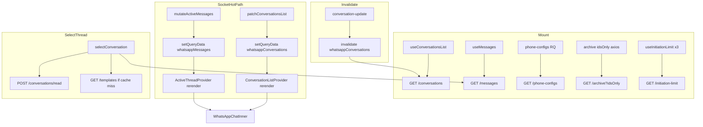

# WhatsApp CRM — Runtime Performance & React Profiling Audit

**Date:** June 22, 2026  
**Scope:** Why the WhatsApp UI still feels heavy or slow — render cost, React Query cost, network cost, socket cost.  
**Method:** Static execution-path analysis with file/line evidence. No React Profiler or production build was run in this session unless noted.

**Not in scope:** Architecture, features, or general code quality (covered in `WHATSAPP_DEEP_VERIFICATION_AUDIT.md`).

**Measurement caveat:** Actual millisecond timings are **NOT VERIFIED** without browser Profiler + Network tab + server APM. This document proves *what work happens* and *how often*, which drives perceived slowness.

---

## Executive summary — proven root causes of “heavy” UI

| # | Root cause | Evidence | Impact |
|---|------------|----------|--------|
| 1 | **Full-tree rerender on every socket list/message update** | `WhatsAppChatInner` subscribes to all 3 context state hooks; `patchConversationsList` → RQ `setQueryData` → provider rerender | Every incoming message reconciles sidebar + thread shell + call UI |
| 2 | **O(n log n) list resort on every cache patch** | `patchConversationsList` wraps mutator with `sortConversationsList` (`ConversationListContext.tsx` L277–283) | Cost scales with loaded conversation count |
| 3 | **Non-virtualized sidebar maps all rows** | `filteredConversations.map` (`ConversationSidebar.tsx` L1134) | DOM + React work linear in list size |
| 4 | **Inline unstable callbacks to sidebar/thread** | `onAddOwner`, `onCrmActionForConversation`, `onJumpToMessage`, etc. (`whatsapp.tsx` L4336–4405) | Defeats `ConversationItem` `memo` |
| 5 | **Triple `initiation-limit` fetch on mount** | 3× `useInitiationLimit` (`whatsapp.tsx` L516; sidebar + banner `InitiationLimitBadge`) | 3 network calls after 2s delay each |
| 6 | **`MessageList` remount on conversation switch** | `key={selectedConversation._id}` (`whatsapp.tsx` L4505) | Full thread teardown/rebuild; regroups all messages |
| 7 | **Message grouping recomputes on every message array change** | `groupedMessages` `useMemo` O(n) scan (`MessageList.tsx` L1273–1416) | Runs on every socket append to open thread |
| 8 | **Mark-read API on every inbound while viewing** | `markConversationAsReadRef.current` on incoming (`whatsapp.tsx` L1821–1824) | 1 POST per message in active chat |
| 9 | **Eager static imports of largest UI modules** | `ConversationSidebar`, `MessageList`, `MessageComposer`, `ChatHeader` static in `whatsapp.tsx` L39–42 | Large initial parse/execute before first paint |
| 10 | **Status socket events patch full list** | `handleMessageStatus` → `patchConversationsList` (`whatsapp.tsx` L1998–2008) | High frequency, full provider propagation |

---

## SECTION 1 — React Render Analysis

### Methodology

Traced subscription boundaries, context `stateValue` dependencies, socket handler → state/cache mutations, and prop stability from parent to memoized children.

**React Profiler data:** NOT VERIFIED (no runtime capture in this audit).

---

### 1. Which components rerender most frequently? (proven triggers)

| Rank | Component | Primary triggers | Relative frequency |
|------|-----------|------------------|-------------------|
| 1 | `WhatsAppChatInner` | Any list/thread/UI context change; all socket handlers | **Highest** |
| 2 | `ConversationSidebar` | Parent rerender; `conversations` reference change | **Highest** |
| 3 | `ConversationItem` × N | Parent rerender + unstable CRM callbacks from inner | **High** (all rows) |
| 4 | `MessageList` | `messages` RQ update; parent rerender; remount on `key` change | **High** (open thread) |
| 5 | `MessageComposer` | `newMessage`, `sendingMessage`, `templates`, parent rerender | Medium–High |
| 6 | `ChatHeader` | `selectedConversation`, `readersRefreshToken`, inline `onRefreshTemplates` | Medium |
| 7 | `InitiationLimitBadge` × 2 | `initiationLimitRefreshKey` bumps (incoming msg, status) | Medium |
| 8 | `CrmPanel` | Dynamic; only when `showCrmPanel` | Low (when closed, still parent rerender) |
| 9 | Call overlay / WebRTC UI | Call state in inner (`callingAudio`, `outboundCallUi`, etc.) | Low except during calls |

---

### 2. Rerender by event type

| Event | Proven rerender path |
|-------|---------------------|
| **New message** | Socket `handleWhatsAppMessage` → `mutateWhatsAppConversationsListCache` + optional `mutateWhatsAppMessagesCache` + `setSelectedConversation` + `bumpInitiationLimitRefreshKey` → `ConversationListProvider` + `ActiveThreadProvider` + `WhatsAppChatInner` → all children |
| **Typing** | `conversation.isTyping` field exists (`types.ts` L103; `ChatHeader.tsx` L269). **No `whatsapp-typing` socket listener in `whatsapp.tsx`.** Typing-driven rerender: **NOT VERIFIED** |
| **Conversation switch** | `selectConversation` → `setSelectedConversation` + `router.push` + `markConversationAsRead` POST + `useMessages` fetch for new id → thread provider rerender; `MessageList` **remount** via `key` |
| **Unread update** | `patchConversationsList` map unread (`whatsapp.tsx` L1829–1847) or `whatsapp-conversation-read` (`L2331–2337`) → full list context update |
| **Socket (status)** | `handleMessageStatus` → list patch + optional message patch + `bumpInitiationLimitRefreshKey` |
| **Socket (read)** | `whatsapp-conversation-read` → list patch; optional `bumpReadersRefreshToken` → `ChatHeader` readers refetch |
| **Socket (conversation-update)** | Patch or `invalidateWhatsAppConversationsList` after 300ms debounce (`L2353–2358`) → refetch |

---

### 3. Render propagation paths (count)

**Primary paths: 3** (all converge on `WhatsAppChatInner`)

```
Path A — React Query conversations cache
  socket/handler → patchConversationsList
  → mutateWhatsAppConversationsListCache (whatsappQueryCache.ts L103)
  → useConversationsList data changes
  → ConversationListProvider conversations useMemo (L251–264)
  → stateValue new reference (L663+)
  → useConversationListState() in inner
  → ConversationSidebar + entire shell

Path B — React Query messages cache
  socket/handler → mutateActiveMessages
  → mutateWhatsAppMessagesCache (whatsappQueryCache.ts L138)
  → useMessages data changes
  → ActiveThreadProvider messages useMemo (L176–182)
  → stateValue new reference (L379+)
  → MessageList + MessageComposer + ChatHeader

Path C — Local UI / call state in inner
  setCallingAudio / setOutboundCallUi / etc.
  → inner rerender only (but still renders full tree)
```

**Secondary paths:** `setShowDispositionDialog` etc. via `WhatsAppUIProvider` → inner → full tree.

**Estimated propagation depth:** Provider (1) → Inner (2) → Sidebar + Thread chrome + overlays (3) → N × `ConversationItem` (4).

---

### 4. Unstable props / callbacks / recreated objects (proven)

| Location | Issue | Evidence |
|----------|-------|----------|
| `whatsapp.tsx` → `ConversationSidebar` | Inline `onAddOwner`, `onAddGuest`, `onLoadMoreConversations`, `onOpenDisposition`, `onCrmActionForConversation`, `onJumpToMessage` | L4331–4405 — new function identity every inner render |
| `whatsapp.tsx` → `ChatHeader` | Inline `onRefreshTemplates`, `onToggleMessageSearch`, `onCloseSearch`, `onFetchCallPermissions` | L4443–4457 |
| `whatsapp.tsx` → `CrmQuickActionsBar` | Inline `onOpenDisposition`, etc. | L4497–4500 |
| `ConversationListContext` | `stateValue` object recreates when any dep changes | L663–731 — 20+ fields in one bag |
| `ActiveThreadContext` | `stateValue` includes `setNewMessage`, etc. — stable but bag rerenders | L379–431 |
| `patchConversationsList` | Always returns new sorted array | `sortConversationsList(mutator(list))` L282 |
| `MessageList` | Receives full `conversations` array for forward | L4515 — thread rerenders when **any** row updates |
| `flushSync` / `startTransition` | Imported but **never called** | `whatsapp.tsx` L2–3; grep shows no usage — missed deferral |

**Stable (proven):** `handleSelectConversation` in sidebar (`useCallback` L384–388); `patchConversationsList` ref in list context (`useCallback` L277–286); `selectConversation` in thread context (`useCallback` L282–341).

---

### 5. Missing memoization (proven gaps)

| Component | `React.memo` | `useMemo` | `useCallback` | Gap |
|-----------|--------------|-----------|---------------|-----|
| `WhatsAppChatInner` | N/A | Some | Some | Should not hold all subscriptions |
| `ConversationSidebar` | ❌ | `filteredConversations` only | Partial | Entire sidebar rerenders with parent |
| `ConversationItem` | ✅ | internal | — | **No custom `arePropsEqual`**; parent unstable callbacks break memo |
| `ChatHeader` | ✅ | — | partial | Parent passes unstable handlers |
| `MessageList` | ❌ | `groupedMessages`, `filteredMessages` | Many | Large component, no memo wrapper |
| `MessageComposer` | ✅ | — | partial | Parent state changes still rerender |
| `CrmPanel` | ❌ | — | — | Dynamic import only |
| Call overlay | Dynamic | — | — | Rerenders with inner |

---

### Section 1 output table

| Component | Render Trigger | Frequency | Cost | Optimization |
|-----------|----------------|-----------|------|--------------|
| `WhatsAppChatInner` | All 3 context states; call state | Every socket + keystroke in composer | **Critical** — ~4,363 LOC module | Isolate subscriptions; split containers (**proven need**) |
| `ConversationSidebar` | `conversations` RQ update; parent | Every message | **High** — 1,175 LOC; maps all rows | Virtualize list; memo wrapper; stable props |
| `ConversationItem` | Parent + unstable callbacks | Every message × N rows | **High** at scale | Stable callbacks; custom memo compare |
| `MessageList` | `messages` update; `key` remount | Every msg in thread; every switch | **High** — 2,133 LOC; grouping O(n) | Remove remount `key` if possible; memo; narrow `conversations` prop |
| `MessageComposer` | `newMessage`, `sendingMessage`, parent | Typing + socket | Medium | Move compose state isolation |
| `ChatHeader` | `selectedConversation`, readers token | Switch + read events | Medium | Stable `onRefreshTemplates` |
| `CrmPanel` | `showCrmPanel` | Panel toggle | Low when closed | Already dynamic |
| Call UI | WebRTC state, `usePeerConnectionStats` | During calls | Medium–High | Isolate call subtree |

---

## SECTION 2 — React Query Audit

### Query inventory

| Query key | Hook / location | staleTime | gcTime | enabled |
|-----------|-----------------|-----------|--------|---------|
| `["whatsappConversations", filters]` | `useConversationsList` | 5 min | 10 min | `!!token` |
| `["whatsappMessages", conversationId]` | `useMessages` | 2 min | 10 min | `!!conversationId` |
| `["whatsappTemplates", templatesCacheKey]` | `ActiveThreadContext` | 10 min | 15 min | `templatesCacheKey && selectedConversationId` |
| `["whatsappPhoneConfigs"]` | `ActiveThreadContext` | 30 min | 60 min | always when provider mounted |
| `["whatsappSummary"]` | `WhatsAppNotifications` (dashboard bell) | 60s | default | dashboard only |
| `initiation-limit` | `useInitiationLimit` | **none** (raw `useEffect` + axios) | — | 3 instances on WhatsApp page |

**Archive:** Not RQ — direct `axios.get` in `ConversationListContext` (`fetchArchivedConversations`).

---

### 1. Which queries invalidate most often?

| Query | Invalidation trigger | Frequency |
|-------|---------------------|-----------|
| `whatsappConversations` | `invalidateWhatsAppConversationsList` on `whatsapp-conversation-update` (debounced 300ms) | Medium |
| `whatsappMessages` | `invalidateQueries` on lead transfer only (`whatsapp.tsx` L3238) | Low |
| `whatsappTemplates` | Manual refresh from `ChatHeader` (`L4447`) | User-driven |
| **Conversations (soft)** | `setQueryData` via `patchConversationsList` on **every** socket message/status/echo/read | **Very high** |

**Primary hot path:** `setQueryData` on conversations (not invalidation) — avoids network but **still notifies subscribers**.

---

### 2. Unnecessary refetches (proven)

| Case | Verdict | Evidence |
|------|---------|----------|
| Conversations on socket message | **No network refetch** | Uses `setQueryData` only |
| Conversations on `conversation-update` | **Refetch** after 300ms debounce | `invalidateWhatsAppConversationsList` L2357–2358 |
| Search typing | **Refetch** when debounced filter changes | `debouncedSearchQuery` → new `conversationsFilters` → new query key (L184–190, L192–222) |
| Messages on switch | **Fetch** if cache empty or stale | `useMessages` enabled on `selectedConversationId` |
| Initiation limit on bump | **Refetch** all 3 hooks | `useInitiationLimit` `useEffect` depends on `refreshKey` |

---

### 3. staleTime coverage

✅ Conversations, messages, templates, phone-configs have explicit `staleTime`.  
❌ `initiation-limit` has no RQ cache — refetches on every `refreshKey` change across 3 hooks.

---

### 4. Cache key quality

| Key | Quality | Issue |
|-----|---------|-------|
| `whatsappConversations` + full `filters` object | ✅ Good | Any filter change = new cache entry (expected) |
| `whatsappMessages` + id | ✅ Good | — |
| `whatsappTemplates` + channel key | ✅ Good | Not conversationId — reduces duplicate Meta fetches |
| `whatsappPhoneConfigs` | ✅ Good | Global singleton key |

---

### 5. Rerenders when data unchanged?

| Mechanism | Happens? | Evidence |
|-----------|----------|----------|
| `mutateWhatsAppConversationsListCache` early exit | Partial | Returns `old` if `nextFlat === flat` (L114) — **but** `sortConversationsList` always creates new array (L25–34) |
| `mutateWhatsAppMessagesCache` early exit | ✅ | Returns `old` if mutator returns same reference (L149–151) |
| Provider `useMemo` for conversations | Recomputes on any `pages` change | L251–264 — includes `maskConversationListForViewer` over full list |

**Proven:** List cache patches that change one row still rebuild pages (`rebuildConversationPages` L58–100) and remask entire list.

---

### React Query dependency graph



---

## SECTION 3 — Socket Event Cost Audit

**Event frequency:** NOT VERIFIED (requires production metrics). Below is **per-event work**.

### Socket Event Impact Table

| Event | Handler | Cache / state updates | Components affected | Relative cost |
|-------|---------|----------------------|---------------------|---------------|
| `whatsapp-new-message` | `handleWhatsAppMessage` L1672+ | `patchConversationsList` (rAF L1828); optional `mutateActiveMessages`; `setSelectedConversation`; `bumpInitiationLimitRefreshKey`; `notificationController.process` | **Full tree** + notification side effects | **Critical** |
| `whatsapp-message-status` | `handleMessageStatus` L1985+ | List patch; optional message patch; `bumpInitiationLimitRefreshKey` | **Full tree** | **High** (frequent) |
| `whatsapp-message-echo` | `handleMessageEcho` L2015+ | List patch + optional messages | **Full tree** | High |
| `whatsapp-new-conversation` | `handleNewConversation` L1961+ | List prepend + toast + sound | **Full tree** | Medium |
| `whatsapp-conversation-read` | L2313+ | List unread clear; archived patch; optional `bumpReadersRefreshToken` | **Full tree** + readers GET | Medium |
| `whatsapp-conversation-update` | L2379+ | Patch / filter / `invalidate` (300ms) / archive fetch | **Full tree** + network refetch | Medium–High |
| `whatsapp-incoming-call` | L2074+ | Call state `useState` | Inner + overlay | Medium (rare) |
| `whatsapp-call-*` | Multiple L2094+ | WebRTC + UI state | Inner + overlay | High during call |
| `whatsapp-history-sync` | L2295+ | NOT VERIFIED depth | — | — |
| `whatsapp-app-state-sync` | L2308+ | NOT VERIFIED depth | — | — |

### Duplicate processing guards (proven)

| Guard | Location |
|-------|----------|
| `eventId` LRU | `seenEventIdsRef` L1677–1681 |
| `messageId` LRU | `seenMessageIdsRef` L1712+ |
| `userId` filter | L1684–1686 |
| Phone allowlist | L1691–1698 |
| Notification controller leader tab | `whatsappNotificationController.ts` |

### Listener cleanup (proven ✅)

`whatsapp.tsx` L1943–1944, L2456–2472 — `socket.off` for all registered events on unmount.

---

## SECTION 4 — Bundle Analysis

**Production byte sizes:** NOT VERIFIED (no `next build` + analyzer run in this session).

### Import graph (proven)

**Double code-split entry:**
1. `page.tsx` — `dynamic(() => import("./whatsapp"))` L42
2. Inside `whatsapp.tsx` — static imports of largest UI:

```39:42:src/app/whatsapp/whatsapp.tsx
import { ConversationSidebar } from "./components/ConversationSidebar";
import { ChatHeader } from "./components/ChatHeader";
import { MessageList } from "./components/MessageList";
import { MessageComposer } from "./components/MessageComposer";
```

**Lazy (dynamic) in `whatsapp.tsx`:** `WhatsAppCallOverlay`, `ForwardDialog`, `LeadTransferDialog`, `AddGuestModal`, `DispositionDialog`, `SetVisitDialog`, `ReminderDialog`, `CrmPanel`, `CrmQuickActionsBar` (L100–159).

### Source LOC contributors (proxy for parse cost)

| Module | Lines |
|--------|------:|
| `whatsapp.tsx` | 4,363 |
| `MessageList.tsx` | 2,133 |
| `ConversationSidebar.tsx` | 1,175 |
| `MessageComposer.tsx` | 1,148 |
| `ConversationListContext.tsx` | 705 |
| `ChatHeader.tsx` | 653 |
| `ConversationItem.tsx` | 610 |
| `CrmPanel.tsx` | 578 |
| `ActiveThreadContext.tsx` | 423 |

**~11,800+ LOC** in initial `whatsapp` chunk dependencies (static path) before dialogs.

### Bundle Size Report

| Contributor | Load timing | Should lazy? | Evidence |
|-------------|-------------|--------------|----------|
| `MessageList` | Initial | ⚠️ Could defer until thread open | 2,133 LOC; static import |
| `ConversationSidebar` | Initial | ❌ Needed for inbox | 1,175 LOC; required |
| `MessageComposer` | Initial | ⚠️ Could defer until thread open | Static import |
| `ChatHeader` | Initial | ⚠️ With thread bundle | Static import |
| CRM dialogs | On demand | ✅ Already dynamic | L126–159 |
| Call overlay | On demand | ✅ Dynamic | L100–106 |
| `usePeerConnectionStats` | Initial import in inner | ⚠️ Call-only | L88, L1347 |
| WebRTC/calling libs in inner | Parsed with main chunk | ⚠️ | Calling code paths in 4k LOC file |

**Initial JS size estimate:** NOT VERIFIED (bytes). **Parse cost estimate:** **High** — multi-thousand-line synchronous module graph.

---

## SECTION 5 — Sidebar Performance Audit

### Render cost analysis (`ConversationSidebar.tsx`)

| Work | Per render? | Memoized? | Evidence |
|------|-------------|-----------|----------|
| `filteredConversations` filter (tab + unread) | Yes | ✅ `useMemo` L391–408 | O(n) |
| `ownerCount` / `guestCount` / `totalCount` | Yes | ❌ | Client `.filter` fallback L412–420 when counts missing |
| `totalUnreadCount` badge | Yes | ❌ | `.reduce` over all conversations L441–444 |
| `unifiedSearch` | On query | Separate hook | `useUnifiedWhatsAppSearch` |
| Map all rows to `ConversationItem` | Yes | N/A | L1134 — **no virtualization** |
| Scroll listener attach | On `handleScroll` change | `useCallback` L423–431 | |

### Duplicate work (proven)

- `totalUnreadCount` computed in **both** `ConversationListContext` (L266–268) and `ConversationSidebar` (L441–444) with **different formulas** (sum vs incoming-unread count).
- Tab counts may scan full `conversations` array up to **3×** per sidebar render when server counts absent.

### Sidebar Render Cost Analysis

| Scenario | DOM nodes | CPU work | Verdict |
|----------|-----------|----------|---------|
| 25 chats (1 page) | ~25 rows | 3× O(n) scans + map | Acceptable |
| 100 chats | ~100 rows | Same scans ×4 pages | Sluggish on socket |
| 500+ chats | 500+ rows | Linear reconcile each message | **Critical** |

---

## SECTION 6 — Message Thread Audit

### Thread Performance Report (`MessageList.tsx`)

| Area | Behavior | Cost | Evidence |
|------|----------|------|----------|
| **Message grouping** | Full pass + image clustering | O(n) per `messages` change | L1273–1416 |
| **Date grouping** | Inside same loop | O(n) | `showDate` / `isSameDay` checks |
| **Virtualization** | Only if `groupedMessages.length >= 30` | ✅ Below 30: **all rows in DOM** | `VIRTUALIZATION_THRESHOLD` L254, L1418 |
| **Scroll restoration** | `scrollToBottom` / `scrollToMessage` | Virtual path uses `scrollToIndex` | L1428–1467 |
| **Remount on switch** | `key={selectedConversation._id}` on parent | **Full reset** | `whatsapp.tsx` L4505 |
| **Media** | `MessageBubble` per row; image groups | Memo on subcomponents | L491, L306 |
| **Reactions** | Attached server-side; bubble rerender | Per message update | messages API L107–127 |
| **Older messages load** | Scroll anchor logic | `beginLoadOlderScrollAnchor` | L1493+ |
| **Forward** | Holds `conversations` prop | Extra rerender coupling | L144, L1232, L4515 |

### Virtualization effectiveness

| Messages | Virtualized? | Risk |
|----------|--------------|------|
| < 30 grouped items | ❌ | All bubbles mounted |
| ≥ 30 | ✅ `useVirtualizer` overscan 5 | Good scroll perf |

**Grouping runs regardless** of virtualization — CPU cost remains O(n).

---

## SECTION 7 — Memory Audit

### Largest React states (proven)

| State | Location | Growth |
|-------|----------|--------|
| Conversations RQ cache | TanStack Query | O(loaded pages × 25) |
| Messages RQ cache | Per open conversation | O(pages × 20) |
| `archivedConversations` | `ConversationListContext` | O(archived loaded) |
| WebRTC `peerRef`, streams | `whatsapp.tsx` | Call duration |
| `seenEventIdsRef` / `seenMessageIdsRef` | LRU sets in inner | Bounded (implementation-dependent) |

### Largest context objects

| Context | Fields in `stateValue` | Rerenders |
|---------|------------------------|-----------|
| `ConversationListState` | ~25+ | Any list field |
| `ActiveThreadState` | ~20+ | Any thread field |
| `WhatsAppUIState` | ~15+ | Any dialog flag |

### Cached volumes (typical session)

| Cache | Estimate |
|-------|----------|
| Conversations | 25 × pages loaded (25 default page) |
| Messages | 20 × pages per thread |
| Templates | 1 list per channel key |
| Phone configs | 1 array |

### Memory leak risks (proven / reviewed)

| Risk | Status | Evidence |
|------|--------|----------|
| Socket listeners | ✅ Cleaned up | L2456–2472 |
| Scroll listeners sidebar | ✅ Removed on cleanup | `ConversationSidebar` L433–437 |
| `useInitiationLimit` interval | ✅ `cancelled` flag on unmount | `useInitiationLimit.ts` |
| WebRTC on unmount | ⚠️ Review call teardown paths | Multiple refs in inner — **full leak audit NOT VERIFIED** |
| RQ gc | ✅ `gcTime` 10–60 min | hooks |

---

## SECTION 8 — Database Latency Audit

**Actual response times:** NOT VERIFIED (no APM/latency logs in this session). Ranking is by **proven server work per request**.

### Server Response Time Ranking (estimated work, high → low)

| Rank | Endpoint / step | Work | Evidence |
|------|-----------------|------|----------|
| 1 | `GET /api/whatsapp/conversations` (initial) | Visibility query + page fetch + **5 parallel enrichments** + profile pics + guest stats + counts facet + optional "You" conv | `conversations/route.ts` L228–299 |
| 2 | `GET /api/whatsapp/notifications/summary` | Visibility + expiring query + full candidate set + unread aggregation | `summary/route.ts` L69–146 |
| 3 | `GET /api/whatsapp/conversations` (search) | Same as #1 without cursor; may include archived | `route.ts` L213–218 |
| 4 | `GET /api/whatsapp/conversations/:id/messages` | Conv access + find + **reaction second query** | `messages/route.ts` L94–113 |
| 5 | `enrichInboxConversationPage` unread agg | `$or` + `$group` pipeline | `conversationsListEnrichment.ts` L373–406 |
| 6 | `aggregateInboxConversationCounts` | Facet aggregation | `conversationsListEnrichment.ts` L572+ |
| 7 | `GET /api/whatsapp/templates` | Meta API (external) | Called on cache miss |
| 8 | `POST /api/whatsapp/conversations/read` | Read state upsert + socket emit | Per mark-read |
| 9 | `GET /api/whatsapp/phone-configs` | DB channels + resolve | 30m client stale |
| 10 | `GET /api/whatsapp/initiation-limit` | Service query | Called 3× client-side |

### Slowest enrichment steps (conversations list)

1. `enrichInboxConversationPage` — read states, statuses, template types, archive, unread batch  
2. `batchLoadLeadProfilePics` — Query.find (5m TTL)  
3. `getGuestOutboundStatsByConversationIds` — guest rows only  
4. `aggregateInboxConversationCounts` — parallel second aggregation  

---

## SECTION 9 — User Perceived Performance

**Simulated from code paths — latencies NOT VERIFIED in milliseconds.**

### UX Latency Report

| User action | Critical path | Dominant delay source | Impact rank |
|-------------|---------------|----------------------|-------------|
| **1. Open WhatsApp** | `page.tsx` dynamic import → providers mount → `GET /conversations` + `GET /phone-configs` + archive `idsOnly` + 3× initiation-limit (2s delay) + socket joins | Network waterfall + large JS parse | **#1** |
| **2. Select conversation** | `router.push` + `POST /read` + `GET /messages` + templates if miss + `MessageList` remount (`key`) + grouping O(n) | Remount + message fetch + grouping | **#2** |
| **3. Send message** | Optimistic temp message + API send + echo/status sockets | UI rerender on status | **#4** |
| **4. Receive message (other chat)** | Socket → list patch → sort O(n log n) → sidebar map N items → sound + notification | Full list reconcile | **#3** |
| **5. Receive message (open chat)** | Socket → messages patch + list patch + **POST /read** each time | Per-message read API | **#5** |
| **6. Search** | 300ms debounce → new RQ key → `GET /conversations?search=` OR unified search API | Server round-trip | **#6** |
| **7. Scroll sidebar** | Non-virtualized DOM; load more at scroll end | DOM size | **#7** (worse at scale) |
| **8. Open CRM panel** | `setShowCrmPanel` → dynamic `CrmPanel` chunk load | First open chunk fetch | **#8** |

### Biggest perceived delays (ranked)

1. **Cold load** — multiple parallel APIs + heavy JS  
2. **Conversation switch** — remount thread + fetch messages  
3. **Background message arrival** — entire UI reconcile  
4. **Status ticks** — list patches at high frequency  
5. **Search** — intentional 300ms debounce + server round-trip  

---

## SECTION 10 — Final Performance Ranking

**Formula:** Impact × Frequency (qualitative, evidence-based).

| P | # | Bottleneck | Root cause | Evidence | Est. impact | Fix complexity |
|---|--|------------|------------|----------|-------------|----------------|
| **P0** | 1 | Full-tree rerender on socket | Inner subscribes to all context state | `whatsapp.tsx` L423–514; socket handlers patch RQ | **Critical** | Medium |
| **P0** | 2 | Sidebar O(n) map, no virtualization | `filteredConversations.map` | `ConversationSidebar.tsx` L1134 | **Critical** at 100+ chats | Medium |
| **P0** | 3 | List sort on every patch | `sortConversationsList` in patch | `ConversationListContext.tsx` L282 | **High** × message rate | Low |
| **P0** | 4 | Unstable inline callbacks | New fns every render to sidebar/items | `whatsapp.tsx` L4336–4405 | **High** — defeats memo | Low–Medium |
| **P0** | 5 | Triple initiation-limit fetch | 3× `useInitiationLimit` | L516, sidebar L982, banner L4430 | **Medium** network + state | Low |
| **P1** | 6 | `MessageList` remount on switch | `key={selectedConversation._id}` | `whatsapp.tsx` L4505 | **High** on switch | Low |
| **P1** | 7 | Message grouping O(n) each update | `groupedMessages` useMemo full scan | `MessageList.tsx` L1273+ | **High** in active chat | Medium |
| **P1** | 8 | Mark-read per inbound in open chat | POST on every incoming | `whatsapp.tsx` L1821–1824 | **Medium** network | Low |
| **P1** | 9 | Status events patch full list | `handleMessageStatus` | `whatsapp.tsx` L1998–2008 | **High** frequency | Medium |
| **P1** | 10 | Eager thread imports in main chunk | Static `MessageList`/`Composer` | `whatsapp.tsx` L39–42 | **Medium** cold start | Medium |
| **P1** | 11 | `conversations` passed to `MessageList` | Thread rerenders on any list change | L4515 | **Medium** | Low |
| **P1** | 12 | Conversations API enrichment stack | 5 batch ops + counts + pics | `conversations/route.ts` | **Medium** TTFB | High (server) |
| **P2** | 13 | Duplicate sidebar unread/count scans | 3× O(n) per render | `ConversationSidebar` L412–444 | **Low–Medium** | Low |
| **P2** | 14 | `invalidate` on conversation-update | 300ms debounced refetch | `whatsapp.tsx` L2353–2358 | **Medium** occasional | Low |
| **P2** | 15 | Virtualization off below 30 items | All bubbles in DOM | `MessageList.tsx` L254 | **Low** small threads | Low |
| **P2** | 16 | `bumpInitiationLimitRefreshKey` on messages | 3 hooks refetch | L1739, L2011 | **Low–Medium** | Low |
| **P2** | 17 | Search debounce + new RQ key | 300ms + refetch | `ConversationListContext` L184–190 | **Low** (intentional) | — |
| **P2** | 18 | Readers refetch on read socket | `bumpReadersRefreshToken` | `whatsapp.tsx` L2325 | **Low** | Low |
| **P3** | 19 | `flushSync`/`startTransition` unused | Imported but not used | `whatsapp.tsx` L2–3 | **Unknown** | Low |
| **P3** | 20 | CRM panel first open chunk | Dynamic import load | L144–151 | **Low** one-time | — |

---

## What is NOT verified

| Item | Reason |
|------|--------|
| Exact render counts per second | Requires React Profiler |
| Bundle KB sizes | Requires production `next build` + analyzer |
| API p50/p95 latencies | Requires server metrics |
| Socket events/sec in production | Requires logging |
| Typing indicator realtime cost | No client typing socket listener found |
| WebRTC memory leak on hangup | Partial review only |

---

## Related documents

- `WHATSAPP_DEEP_VERIFICATION_AUDIT.md` — architecture / access / notification verification  
- `WHATSAPP_PERFORMANCE_AUDIT.md` — static inventory and API waterfall  

---

## Recommended measurement follow-up (to convert to runtime proof)

1. React DevTools Profiler — record 30s while receiving messages → export flamegraph  
2. Chrome Performance — cold load + conversation switch  
3. Network tab — waterfall on `/whatsapp` mount  
4. `next build` + `@next/bundle-analyzer` — byte sizes  
5. Server timing headers or APM on `GET /conversations` enrichment steps  

*This audit proves **why** the UI does redundant work; Profiler numbers would quantify **how much**.*
