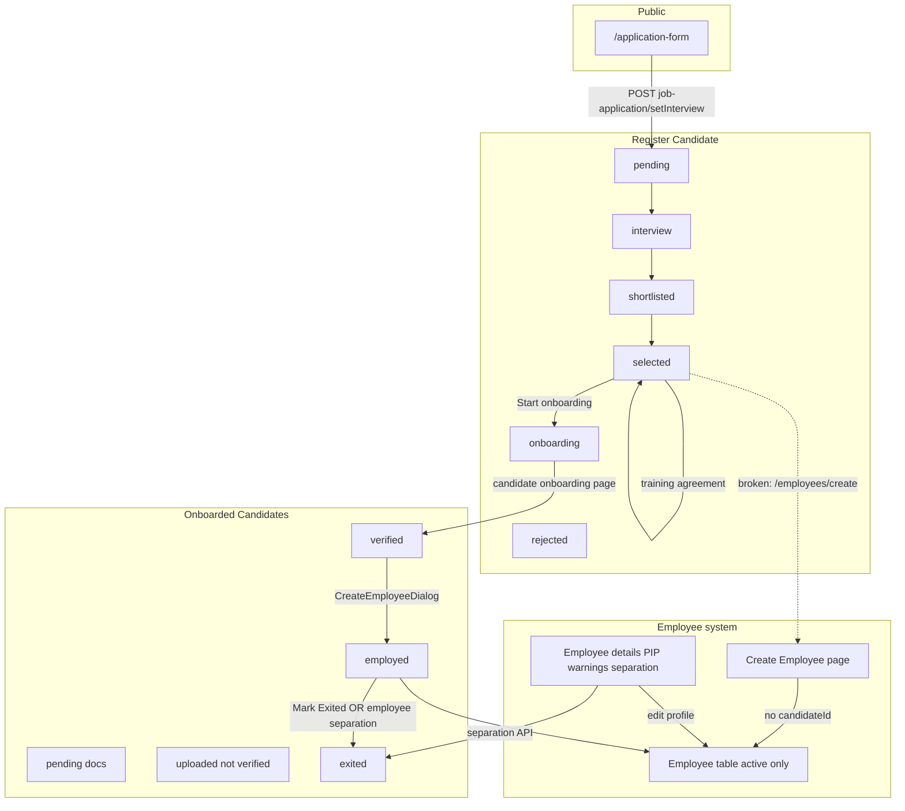

# Candidate ↔ Employee Unification — Architecture Audit

**Date:** 2026-08-18  
**Scope:** Full hiring pipeline (job application → exit) and overlap with employee management  
**Goal:** One coherent lifecycle, one UX pace, less redundancy, correct data mapping  

---

## Executive summary

Adminstro currently runs **two parallel HR systems**:

| System | Purpose | Primary UI | Model |
|--------|---------|------------|-------|
| **Candidate** | Hiring pipeline + onboarding artifacts | Register Candidate, Onboarded Candidates, Candidate Detail | `Candidate` |
| **Employee** | Active workforce ops (PIP, warnings, login, rules) | Manage Employee, Employee Details, Create Employee | `Employees` |

They connect through a **one-way optional link**: `Candidate.employeeId → Employees._id`. Profile data is **copied once at hire** and **never kept in sync** afterward. Exit is **partially synced** (separation ↔ exited), but reactivation and profile edits do not reconcile.

**Result:** HR sees the same person in 3–4 places with different buttons, different gates, and different data. ~**11,700 lines** across the five largest pages alone, with **~900-line duplicate create-employee forms**.

**Recommended direction:** Treat **Candidate as the lifecycle record** (apply → exit) and **Employee as the operational account** (login, PIP, targets). Unify **navigation and person detail** into one **People** hub with lifecycle-aware tabs—not two disconnected sidebars.

---

## 1. Lifecycle map (today)



### Stage ownership (who owns what)

| Stage | Canonical record | Where HR works | Candidate `status` / flags |
|-------|------------------|----------------|---------------------------|
| Application | Candidate | Register list | `pending` |
| Interview | Candidate | Register list + detail | `interview` |
| Shortlist / Select | Candidate | Detail | `shortlisted` / `selected` |
| Training docs | Candidate | Detail + public training page | `selected` |
| Onboarding | Candidate | Detail + Onboarded tabs + public onboarding | `onboarding` |
| Doc verification | Candidate | Detail `OnboardingDetailsView` | `onboardingDetails.*` |
| Hired | Candidate + Employee | Onboarded **Employed** + Employee table | `employeeId`, `employedAt` |
| Active ops | Employee | Employee details | `Employees.isActive` |
| Exit | Both (partial sync) | Onboarded **Exited** OR Employee separation | `exitedAt`, `exitReason` |

---

## 2. Inventory — pages & line weight

| Route | File | ~Lines | Role |
|-------|------|--------|------|
| `/dashboard/candidatePortal` | `candidatePortal/page.tsx` | 2,488 | Pipeline list (tabs, schedule interview, filters) |
| `/dashboard/candidatePortal/[id]` | `candidatePortal/[id]/page.tsx` | 3,588 | Full hiring + onboarding HR view |
| `/dashboard/onboardedCandidates` | `onboardedCandidates/page.tsx` | 941 | Post-onboarding tabs + employed/exited |
| `/dashboard/employee` | `employeeTable/employee-table.tsx` | — | Active employees only |
| `/dashboard/employee/employeeList` | `employee/employeeList/...` | — | All employees (incl. inactive) |
| `/dashboard/createnewEmployee` | `createnewEmployee/page.tsx` | 967 | Standalone hire (no candidate link) |
| `/dashboard/employeedetails/[id]` | `employeedetails/[...id]/page.tsx` | 2,689 | PIP, warnings, separation, profile |
| `/dashboard/editemployeedetails/[id]` | `editemployeedetails/[...id]/page.tsx` | — | Edit employee |
| `/application-form` | `application-form/page.tsx` | — | Public apply |
| Public signing | `[id]/onboarding`, `training-agreement`, `offer-letter` | — | Candidate self-serve |

**Sidebar today (HR):** 7+ entries for what is effectively one person journey:

- Register Candidate  
- Onboarded Candidates  
- Manage Employee  
- All Employees  
- Create Employee  
- Employee Activity  
- Office Addresses (related)

---

## 3. Inventory — API routes

### Candidate APIs (`/api/candidates/*`) — 30 route files

| Group | Routes | Purpose |
|-------|--------|---------|
| List / CRUD | `route.ts`, `[id]/route.ts` | List, filter, patch |
| Pipeline actions | `[id]/action` | shortlist, select, reject, onboarding |
| Interviews | `schedule-interview`, `schedule-second-round`, `interview-remarks`, reschedule* | Scheduling |
| Onboarding | `[id]/onboarding`, `onboardingDocument`, `verification`, `hr-verification`, reupload*, resignature* | Docs + verify |
| PDFs | `trainingAgreement`, `hrPolicies`, `letterOfIntent`, `offerLetter` | Generate PDFs |
| Offer | `[id]/send-offer-letter`, `[id]/offer-letter` | Offer flow |
| Notes | `[id]/notes`, `[id]/notes/[noteId]` | HR notes |
| Exit | `[id]/exit` | Resigned exit + deactivate employee |
| Meta | `colleges`, `positions`, `reschedule-requests` | Filters |

### Employee APIs (`/api/employee/*`, `/api/user/createnewEmployee`)

| Route | Purpose | Syncs candidate? |
|-------|---------|------------------|
| `POST /api/user/createnewEmployee` | Create employee | ✓ sets `employeeId`, `employedAt` if `candidateId` |
| `POST /api/employee/separation` | Terminate / suspend / abscond / resign | ✓ via `markCandidateExitedByEmployeeId` |
| `PUT /api/employee/editEmployee` | Profile, reactivate | ✗ |
| `GET /api/employee/getAllEmployee` | Lists | ✗ |
| warnings / pip / appreciations | HR ops | ✗ |

### Application entry

| Route | Purpose |
|-------|---------|
| `POST /api/job-application/setInterview` | Creates `Candidate` from public form |

---

## 4. Data model — overlap & drift

### Link (one-way)

```
Candidate.employeeId  →  Employees._id
(Employee has NO candidateId)
```

Reverse lookup: `Candidate.findOne({ employeeId })`.

### Fields copied at hire (not synced after)

| Candidate source | Employee field | Risk |
|------------------|----------------|------|
| `name`, `email`, `phone` | same | Edit on one side only |
| `experience` (years?) | `experience` (months in UI?) | Unit mismatch |
| `address`, `city` | `address`, `allotedArea` | City not auto-mapped |
| `onboardingDetails.personalDetails.*` | `gender`, `nationality`, `aadhar`, `dateOfBirth` | Different shapes |
| `onboardingDetails.bankDetails.*` | `accountNo`, `ifsc` | Docs only on candidate |
| `photoUrl` | `profilePic` | |
| `position` / `selectionDetails.role` | `role` | Heuristic mapping |
| `selectionDetails.salary` (string) | `salary` (number) | Type drift |

### Candidate-only (hiring artifact — should stay on candidate)

Interview records, college, resume, training/onboarding/offer PDFs, e-signatures, document verification, HR notes, selection/rejection metadata, office preference.

### Employee-only (ops — should stay on employee)

Password/sessions, lock, organization, allotedArea, rentalType, pricing/visibility rules, PIP/warnings/appreciations, monthly targets, WhatsApp/CRM config.

### Exit fields (must stay aligned)

| Employee | Candidate |
|----------|-----------|
| `isActive` | implied by `!exitedAt` |
| `inactiveReason` | `exitReason` |
| `inactiveDate` | `exitedAt` |
| separation reason (API body) | `exitNotes` |

### Sync matrix (current)

| Action | Employee | Candidate |
|--------|----------|-----------|
| Create from candidate | ✓ | ✓ link |
| Create standalone | ✓ | ✗ |
| Edit employee | ✓ | ✗ |
| Edit candidate onboarding | ✓ | ✗ employee |
| Employee separation | ✓ | ✓ exit |
| Candidate exit API | ✓ | ✓ |
| Reactivate employee | ✓ clears inactive | ✗ **stays Exited** |
| Delete employee | ✓ | ✗ orphan `employeeId` |

---

## 5. Redundancy matrix

### A. Create Employee — 3 entry points, 2 implementations

| Entry | Gate | Implementation | Sends `candidateId` |
|-------|------|----------------|---------------------|
| Register list menu | `status === "selected"` (**too early**) | Navigate `/employees/create?candidateId=` | Intended — **route missing/broken** |
| Candidate detail | `onboarding` + `onboardingComplete` + no `employeeId` | `CreateEmployeeDialog` → `new-user.tsx` | ✓ |
| Onboarded verified tab | HR verified + no `employeeId` | Same dialog | ✓ |
| Sidebar Create Employee | None | `createnewEmployee/page.tsx` (~967 lines) | ✗ |

**Duplicate forms:** `createnewEmployee/page.tsx` (~967 lines) vs `candidatePortal/components/new-user.tsx` (~1,102 lines) — same API, ~70% overlap.

### B. Employee lists — 2 tables, same API

| Page | Shows inactive | Create | Lock |
|------|----------------|--------|------|
| `/dashboard/employee` | No (client filter) | Yes | Yes |
| `/dashboard/employee/employeeList` | Yes (HR) | No | No |

### C. Workforce visibility — 3 views of same people

After hire, a linked person appears in:

1. Onboarded → **Employed** tab  
2. `/dashboard/employee` (active)  
3. Candidate detail (still full hiring UI)

Each exposes different actions with no cross-links.

### D. Exit / separation — 2 UIs

| UI | Reasons | Sync |
|----|---------|------|
| Employee details → Deactivate | resigned, terminated, suspended, abscond | → candidate |
| Onboarded → Mark as Exited | **resigned only** | → employee |

### E. Schedule interview — duplicated

Full schedule dialog exists on **Register list** (~2.5k page) and **Candidate detail** (~3.6k page) — same PATCH endpoints.

### F. Shared logic not extracted

- `getStatusColor`, `formatDate`, `Candidate` interface duplicated across list pages  
- Permission gates: only on detail hook; lists use inline ad-hoc rules  
- Fetch/error handling: inconsistent (silent failures on lists)  
- Toast libraries: `sonner` vs `@/hooks/use-toast` mixed  

### G. Known bugs affecting trust

| Issue | Location | Impact |
|-------|----------|--------|
| Permission fns used without `()` | `candidatePortal/[id]/page.tsx` | Shortlist/reject/schedule gates broken |
| Dead create route | `candidatePortal/page.tsx` → `/employees/create` | Broken hire from register list |
| Wrong fetch URL | `new-user.tsx` → `/api/candidate/` | Should be `/api/candidates/` |
| Detail `onCreated` no refresh | detail page | Stale Create Employee button |
| In-memory onboarded filter | `api/candidates/route.ts` | Slow at scale |

*(See also `docs/candidates-ux-audit.md` for UI-level findings.)*

---

## 6. UX problems (why it feels “different pace”)

1. **Split mental model** — HR must know: “Is this person still a candidate or already an employee?” instead of one profile with lifecycle phase.

2. **Split navigation** — Pipeline vs Onboarded vs Employee are three apps in one sidebar.

3. **Inconsistent hire gates** — Can attempt hire from Register at `selected`; detail requires onboarding complete; onboarded requires HR verification.

4. **No bridge links** — Employee details has no “View hiring record”; candidate detail has no “View employee ops (PIP)” after hire.

5. **Duplicate heavy pages** — Detail (3.6k) + Employee details (2.7k) both show overlapping personal/bank info with no single source of truth.

6. **Exit confusion** — Two paths, different reason pickers; reactivation desyncs Exited tab.

7. **Naming** — Sidebar “Register Candidate” opens a **management list**, not registration (`/application-form` is separate).

---

## 7. Target architecture

### 7.1 Conceptual model

```
┌─────────────────────────────────────────────────────────┐
│                    Person (logical)                      │
│  lifecyclePhase: applicant | onboarding | active | exit  │
└──────────────────────────┬──────────────────────────────┘
                           │
         ┌─────────────────┴─────────────────┐
         ▼                                   ▼
┌─────────────────┐                 ┌─────────────────┐
│ Candidate doc   │                 │ Employee doc    │
│ (hiring record) │◄── employeeId ──│ (ops account)   │
│ ALWAYS kept     │    candidateId  │ created at hire │
│ until archive   │    (add this)   │                 │
└─────────────────┘                 └─────────────────┘
```

**Rules:**

- **Candidate** = legal/hiring trail (docs, interviews, offers) — never deleted on hire.  
- **Employee** = system access + ongoing HR ops — created at hire, deactivated on exit.  
- **Bidirectional link:** add `Employees.candidateId` (indexed).  
- **Lifecycle phase** = derived helper (not necessarily stored):

```typescript
type LifecyclePhase =
  | "applicant"      // pending → selected
  | "onboarding"     // status onboarding, not employed
  | "active"         // employeeId && !exitedAt && employee.isActive
  | "exited";        // exitedAt set OR !employee.isActive
```

### 7.2 Unified navigation (sidebar)

Replace 5 HR entries with **one hub**:

| New nav item | Route | Replaces |
|--------------|-------|----------|
| **People** | `/dashboard/people` | Register + Onboarded + partial Employee |
| **People → Active** (sub or tab) | filter phase=active | Manage Employee |
| **People → Pipeline** | filter phase=applicant | Register Candidate |
| **People → Onboarding** | filter phase=onboarding | Onboarded (pending/verified) |
| **People → Exited** | filter phase=exited | Onboarded Exited + inactive employees |

Keep **Employee Activity**, **Office Addresses** as utilities.

Optional: redirect old URLs for bookmarks.

### 7.3 Unified person detail page

**Route:** `/dashboard/people/[id]` where `id` is **candidateId** (primary). After hire, load linked employee by `employeeId`.

**Layout — lifecycle-aware tabs:**

| Tab | Visible when | Content (source) |
|-----|--------------|------------------|
| **Overview** | always | Name, contact, role, phase badge, quick actions |
| **Pipeline** | phase ≤ onboarding | Status actions, interviews (from candidate detail) |
| **Documents** | onboarding+ | Training, offer, onboarding verify (existing components) |
| **Employment** | employeeId | Bank/profile summary, edit → sync policy |
| **Performance** | employeeId | PIP, warnings, appreciations (from employee details) |
| **Activity** | employeeId | Login activity link/embed |
| **History** | always | Notes, status timeline, exit info |

**Action bar** (contextual, one permission module):

| Phase | Primary actions |
|-------|-------------------|
| applicant | Schedule, Shortlist, Select, Reject |
| onboarding | Verify docs, Send offer, Create Employee |
| active | View employee ops, Mark Exited (all reasons) |
| exited | View exit summary, optional rehire flow |

### 7.4 Service layer (backend)

Introduce `src/services/people/` (or `hr-lifecycle/`):

| Service | Responsibility |
|---------|----------------|
| `getPersonProfile(candidateId)` | Candidate + populated employee + derived phase |
| `createEmployeeFromCandidate(candidateId, payload)` | Single hire path; map fields; set both links |
| `separatePerson({ candidateId?, employeeId?, reason, date, notes })` | **One exit API** — updates both sides atomically |
| `reactivateEmployee(employeeId)` | Clears employee inactive **and** candidate exit fields (or explicit “rehire” new cycle) |
| `syncProfileFields(source, fields)` | Optional: push allowed fields candidate ↔ employee |

**Deprecate duplicate endpoints gradually:**

- Merge `POST /api/candidates/[id]/exit` + `POST /api/employee/separation` → `POST /api/people/[id]/separate`  
- Keep thin wrappers for backward compatibility during migration.

### 7.5 Shared frontend modules

```
src/features/people/
  components/
    PeopleListShell.tsx      # one list: tabs, filters, pagination
    PeopleTable.tsx
    LifecycleBadge.tsx
    CreateEmployeeDialog.tsx # single form (from new-user.tsx)
    SeparatePersonDialog.tsx # all exit reasons
    ScheduleInterviewDialog.tsx
  hooks/
    usePersonPermissions.ts  # single gate module
    usePersonProfile.ts
  lib/
    lifecycle.ts             # derive phase, canCreateEmployee, etc.
    fieldMapping.ts            # candidate ↔ employee field map
```

**Delete / merge after migration:**

- Duplicate schedule UI on register list → use shared dialog  
- `createnewEmployee/page.tsx` → redirect to People create with optional `?candidateId=`  
- Consolidate `employee-table.tsx` + `employee-list-table.tsx`  

### 7.6 Single policy definitions

```typescript
// src/features/people/lib/lifecycle.ts

export function canCreateEmployee(c: Candidate): boolean {
  return (
    c.status === "onboarding" &&
    c.onboardingDetails?.onboardingComplete === true &&
    c.onboardingDetails?.verifiedByHR?.verified === true &&
    !c.employeeId
  );
}

export function canSeparate(c: Candidate, e?: Employee): boolean {
  return Boolean(c.employeeId && !c.exitedAt && e?.isActive !== false);
}
```

Use **everywhere** — register list, onboarded, detail, APIs.

---

## 8. Migration plan (phased)

### Phase 0 — Stabilize (1–3 days, no IA change)

**Fix trust-breaking bugs:**

- [ ] Invoke all `useCandidatePermissions` functions with `()` or return booleans  
- [ ] Remove or fix Register list Create Employee → use `CreateEmployeeDialog` with `canCreateEmployee()`  
- [ ] Fix `/employees/create` dead navigation  
- [ ] Fix `new-user.tsx` fetch URL `/api/candidates/[id]`  
- [ ] Refresh candidate after Create Employee on detail  
- [ ] Toast + retry on list fetch errors  
- [ ] On exit: support all separation reasons on onboarded dialog (not resigned-only)  
- [ ] On employee reactivate: clear `candidate.exitedAt` / `exitReason` OR show warning + explicit “Rehire”  

**Add bidirectional link:**

- [ ] `Employees.candidateId` on schema + backfill from `Candidate.employeeId`  
- [ ] Set both fields in `createnewEmployee`  

### Phase 1 — Extract shared layer (1 week)

- [ ] `lifecycle.ts` + `usePersonPermissions`  
- [ ] `PeopleListShell` — refactor Register + Onboarded to use it (keep separate routes, shared component)  
- [ ] Single `CreateEmployeeForm` component (merge createnewEmployee + new-user)  
- [ ] Single `SeparatePersonDialog` wired to unified separation service  
- [ ] `ScheduleInterviewDialog` shared by list + detail  

### Phase 2 — Unified detail (2 weeks)

- [ ] New `/dashboard/people/[candidateId]` composing existing sections  
- [ ] Embed PIP/warnings from employee details as tab (not separate navigation)  
- [ ] Cross-links: employee details → “Full hiring record” ; people → “Employee ops”  
- [ ] Redirect `/dashboard/candidatePortal/[id]` → people detail  

### Phase 3 — Unified list & nav (1 week)

- [ ] `/dashboard/people` with lifecycle tabs (replaces register + onboarded lists)  
- [ ] Employee table becomes **People → Active** filtered view (or embedded tab)  
- [ ] Sidebar consolidation + redirects  
- [ ] Update middleware role paths  

### Phase 4 — API consolidation & sync (1 week)

- [ ] Unified `separatePerson` service  
- [ ] Profile sync rules (document which fields are master on which side)  
- [ ] Server-side onboarded filtering (Mongo query, not in-memory)  
- [ ] Email uniqueness check across candidate + employee before hire  

### Phase 5 — Cleanup

- [ ] Remove deprecated pages/routes  
- [ ] Archive duplicate table components  
- [ ] Update `docs/candidates-ux-audit.md` → point to People hub  

---

## 9. What NOT to merge (keep separate concerns)

| Keep on Candidate | Keep on Employee |
|-------------------|------------------|
| Interview pipeline & remarks | Login, sessions, lock |
| Application & resume | PIP / warnings / appreciations |
| Training / offer / onboarding PDFs | Pricing, visibility, lead rules |
| Document verification workflow | Organization, allotedArea |
| Public signing pages | Monthly targets, WhatsApp config |
| HR notes on hiring | Force logout, featured flag |

**UI can be unified; data stores should stay split** with explicit linking and sync rules.

---

## 10. File-level action list

### High priority fixes

| File | Action |
|------|--------|
| `candidatePortal/[id]/page.tsx` | Fix permission `()` calls |
| `candidatePortal/page.tsx` | Remove dead `/employees/create`; use shared dialog + policy |
| `candidatePortal/components/new-user.tsx` | Fix API URL; become sole create form |
| `createnewEmployee/page.tsx` | Thin wrapper → shared form |
| `onboardedCandidates/page.tsx` | Use shared SeparatePersonDialog (all reasons) |
| `employeedetails/[...id]/page.tsx` | Link to candidate; reactivate sync |
| `api/user/createnewEmployee/route.ts` | Set `employee.candidateId` |
| `api/employee/editEmployee/route.ts` | On reactivate, sync candidate exit clear |
| `models/employee.ts` | Add `candidateId` |
| `lib/candidate/markCandidateExited.ts` | Add `clearCandidateExit` for reactivate |

### Consolidation targets

| Files to merge | Into |
|----------------|------|
| `candidatePortal/page.tsx` + `onboardedCandidates/page.tsx` list logic | `features/people/PeopleListShell` |
| `createnewEmployee/page.tsx` + `new-user.tsx` | `CreateEmployeeForm` |
| `employee-table.tsx` + `employee-list-table.tsx` | `PeopleTable` with `showInactive` prop |
| Schedule interview blocks (×2) | `ScheduleInterviewDialog` |
| Exit dialog + separation dialog | `SeparatePersonDialog` |

### Routes to add (target)

| Route | Purpose |
|-------|---------|
| `GET /api/people` | Unified list with `phase` filter |
| `GET /api/people/[candidateId]` | Candidate + employee + phase |
| `POST /api/people/[candidateId]/separate` | Unified exit |
| `POST /api/people/[candidateId]/hire` | Wrapper over createnewEmployee |

---

## 11. Success criteria

HR should be able to:

1. Open **one person profile** and see hiring docs, onboarding status, employee ops, and exit history.  
2. **Hire once** from a single gate (verified onboarding complete).  
3. **Exit once** from any surface with the same reason picker and email flow.  
4. Trust that **Employed / Active / Exited** tabs never disagree after an action.  
5. Navigate **one sidebar entry** for the full apply → exit journey.

---

## 12. Related documents

- `docs/candidates-ux-audit.md` — UI-level bugs and quick wins on current pages  
- `src/app/dashboard/candidatePortal/[id]/hooks/useCandidatePermissions.ts` — gates to centralize  
- `src/lib/candidate/markCandidateExited.ts` — exit sync helper to extend  

---

*This audit is based on static review of routes, models, and ~11.7k lines across primary HR pages. Implementation estimates assume one developer familiar with the codebase.*
