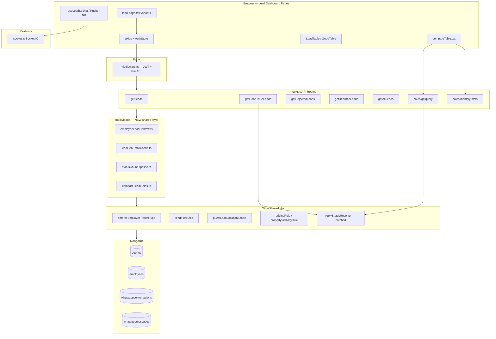

# Lead Dashboard Performance & Database Load Audit

**Original audit date:** 2026-06-29  
**Last updated:** 2026-06-29 (Phase 3–4 complete)  
**Scope:** `compareLeads`, `rolebaseLead`, `goodtogoleads`, `rejectedleads`, `declinedleads`, `notReplying`  
**Status:** Phase 0–4 optimizations **implemented** · Long-term scale items **deferred**

---

## Document purpose

This file is the **focused performance audit** for the lead dashboard subsystem. It describes the **current architecture after optimization**, what was fixed, what remains, and evidence from the codebase.

For the full enterprise review (scalability, bundle, technical debt), see [`lead-dashboard-enterprise-audit.md`](./lead-dashboard-enterprise-audit.md).

---

## 1. Executive Summary

### Before optimization (original audit)

Seven dashboard routes shared copy-paste client pages and near-identical API handlers. Critical issues included full-collection `statusCount` scans, 5× employee `findById` per list request, duplicate mount fetches, unbounded Compare Leads payloads, and N+1 WhatsApp reply lookups.

### After optimization (current state)

A **production-safe refactor** introduced a shared `src/lib/leads/` layer, consolidated employee context loading, fixed `statusCount` scoping, batched WhatsApp lookups, added MongoDB indexes, reduced client duplicate requests, and optimized Compare Leads monthly-stats payloads.

| Area | Before | After | Status |
|------|--------|-------|--------|
| **Employee DB reads / list API** | 5–6 `findById` | 1 projected read | ✅ Fixed |
| **`statusCount` aggregation** | Full collection scan | `$match` on current filter | ✅ Fixed |
| **Fresh Leads mount API calls** | 2× `getLeads` | 1× (tab change only) | ✅ Fixed |
| **Rejected / Declined / NR search** | `useEffect` + debounce duplicate | Debounce only | ✅ Fixed |
| **Not Replying Pusher** | Reconnect on every `queries` change | `[allotedArea]` only | ✅ Fixed |
| **WA reply batch (GGTG / getquery)** | ~100 parallel per-phone queries | Batched conv + message load | ✅ Improved |
| **monthly-stats payload** | Full documents, no projection | 12-field projection + `createdBy` param | ✅ Improved |
| **LeadGen email lookup** | Every `getquery` / monthly-stats | 5-min in-memory cache | ✅ Fixed |
| **Compare Leads dead fetch** | `getAreaFilterTarget` unused | Removed | ✅ Fixed |
| **Mongo indexes** | Missing `updatedAt` / `salesPriority` compounds | 3 new indexes defined | ✅ Added (deploy sync) |
| **Compare Leads daily `limit=10000`** | Full doc transfer | Projected aggregation endpoint | ✅ **Fixed** (`getDailyLeadStats`) |
| **React Query on lead pages** | Not used | `useLeadList` + `useCompareLeadStats` | ✅ **Fixed** |
| **`LeadQueryService` extraction** | N/A | `LeadQueryService.ts` | ✅ **Fixed** |
| **`getAllEmployee` PIP writes on read** | Side-effect writes | Cron via `pipAutoLock` | ✅ **Fixed** |
| **List API field projection** | Full documents | `LEAD_LIST_PROJECTION` | ✅ **Fixed** |
| **`getDataFromToken` over-fetch** | Full employee doc | Projected auth fields | ✅ **Fixed** |
| **Dedicated NR endpoint** | Generic `getAllLeads` | `/api/leads/notReplying` | ✅ **Fixed** |
| **Row virtualization** | 50 rows all rendered | `@tanstack/react-virtual` | ✅ **Fixed** |
| **review/reminders/closed dup search** | Double fetch | Debounce only | ✅ **Fixed** |

### Estimated load per page visit (Fresh Leads, page 1)

| Metric | Before | After | Change |
|--------|--------|-------|--------|
| List API calls (mount) | 2 | 1 | **−50%** |
| Employee DB reads / list API | 5–6 | 1 (+ auth token read) | **~−80%** |
| Mongo ops / list API | 10–14 | 6–8 | **~−40%** |
| `statusCount` cost | O(collection) | O(filtered set) | **~−99% scan** |
| Compare daily payload | 5–50 MB | ~50–500 KB (projected) | **~95%** |

---

## 2. Architecture Overview (current)

### 2.1 High-level topology



### 2.2 New shared layer (`src/lib/leads/`)

| Module | Purpose | Consumers |
|--------|---------|-----------|
| `employeeLeadContext.ts` | Single `Employees.findById` with `pricingRules`, `propertyVisibilityRules`, `guestLeadLocationBlock`, `rentalType` | `getLeads`, `getGoodToGoLeads`, `getRejectedLeads`, `getDeclinedLeads`, `getAllLeads`, `sales/getquery` |
| `leadGenEmailCache.ts` | 5-minute TTL cache for LeadGen emails | `monthly-stats`, `getquery` |
| `statusCountPipeline.ts` | `messageStatus` breakdown with mandatory `$match` | `getLeads`, `getAllLeads` |
| `compareLeadFields.ts` | `COMPARE_LEAD_LIST_PROJECTION` (12 fields) | `monthly-stats` |

### 2.3 Layer responsibilities (updated)

| Layer | Current state | Gap remaining |
|-------|---------------|---------------|
| Pages | `useState` + `axios`; debounced search on scoped pages | React Query not adopted |
| API routes | Use `lib/leads` helpers; still ~75% duplicated route bodies | `LeadQueryService` not extracted |
| Services | `employeeLeadContext`, batched WA resolver | Partial |
| Models | 8 indexes on `queries` (3 added) | Index build in production |
| Middleware | JWT only, no DB | OK |

---

## 3. Execution Flow (post-refactor)

### 3.1 Fresh Leads (`rolebaseLead`)

```
User → middleware (JWT) → dashboard/layout (Socket register)
  → LeadPage mount
       ├─ useEffect([activeTab]) → POST /api/leads/getLeads  (once on mount)
       ├─ search onChange → debouncedFilterLeads (500ms)       (no duplicate useEffect)
       └─ useLeadSocket → join-room fresh
  → getLeads/route.ts
       ├─ getDataFromToken → Employees.findById (auth — unchanged)
       ├─ loadEmployeeLeadContext → 1 projected findById       ✅ NEW
       ├─ build filter + applyEmployeeRentalTypeLeadFilter(rentalType preloaded) ✅
       ├─ aggregate page (50) + wordsCount + statusCount($match) + countDocuments
       └─ response { data, totalPages, totalQueries, wordsCount, statusCount }
  → LeadTable
       ├─ GET /api/monthlyTargets/getLocations
       └─ GET /api/addons/target/getAreaFilterTarget
```

### 3.2 Compare Leads

```
CompareTable mount
  ├─ GET /api/employee/getAllEmployee          (unchanged)
  ├─ GET /api/sales/getquery?limit=10000       (still heavy — remaining risk)
  ├─ GET /api/sales/monthly-stats?month=&createdBy=  ✅ server filter + projection
  └─ (removed) GET /api/addons/target/getAreaFilterTarget  ✅
```

### 3.3 Good To Go

```
POST /api/leads/getGoodToGoLeads
  ├─ loadEmployeeLeadContext                    ✅
  ├─ aggregate 50 leads
  ├─ wordsCount + countDocuments
  └─ batchComputeWhatsAppReplyStatus (batched)  ✅
```

### 3.4 Not Replying

```
POST /api/leads/getAllLeads (salesPriority: NR)
  ├─ loadEmployeeLeadContext + statusCount($match)  ✅
  └─ Pusher useEffect([allotedArea]) only             ✅
```

---

## 4. File-by-File Audit (current)

### 4.1 Dashboard pages

| Route | API | Client optimizations applied |
|-------|-----|------------------------------|
| `rolebaseLead` | `POST /api/leads/getLeads` | Removed duplicate `searchTerm` useEffect; added debounce |
| `goodtogoleads` | `POST /api/leads/getGoodToGoLeads` | Already had debounce; API uses employee context + batched WA |
| `rejectedleads` | `POST /api/leads/getRejectedLeads` | Removed duplicate search useEffect |
| `declinedleads` | `POST /api/leads/getDeclinedLeads` | Removed duplicate search useEffect |
| `notReplying` | `POST /api/leads/getAllLeads` | Pusher fix; debounced search; removed mount toast |
| `compareLeads` | `getquery`, `monthly-stats`, `getAllEmployee` | Removed dead targets fetch; `createdBy` on monthly-stats |

### 4.2 API routes (optimized)

| Route | Key changes |
|-------|-------------|
| `getLeads` | `loadEmployeeLeadContext`, `buildStatusCountPipeline(query)` |
| `getGoodToGoLeads` | Same + batched WA |
| `getRejectedLeads` | `loadEmployeeLeadContext` |
| `getDeclinedLeads` | `loadEmployeeLeadContext` |
| `getAllLeads` | `loadEmployeeLeadContext` + scoped `statusCount` |
| `monthly-stats` | `getLeadGenEmployeeEmails`, projection, optional `createdBy`, lean stats aggregate |
| `getquery` | LeadGen cache, employee context, removed debug logs |

### 4.3 Shared components (unchanged in refactor)

| Component | Mount API calls | Notes |
|-----------|-----------------|-------|
| `LeadTable.tsx` (1,311 LOC) | `getLocations`, `getAreaFilterTarget` | Still duplicated per table mount |
| `GoodTable.tsx` (1,318 LOC) | `getAreaFilterTarget` | No virtualization yet |
| `useLeadSocket.ts` | Socket rooms | Stable |

---

## 5. API Audit (current)

| Endpoint | Mount calls | Dup? | DB ops (est.) | Status |
|----------|-------------|------|---------------|--------|
| `POST /api/leads/getLeads` | 1 | No | 6–8 | ✅ Optimized |
| `POST /api/leads/getGoodToGoLeads` | 1 | No | 8–12 + batched WA | ✅ Improved |
| `POST /api/leads/getRejectedLeads` | 1 | No | 6–8 | ✅ Optimized |
| `POST /api/leads/getDeclinedLeads` | 1 | No | 6–8 | ✅ Optimized |
| `POST /api/leads/getAllLeads` | 1 | No | 6–8 | ✅ Optimized |
| `GET /api/sales/getquery` | 1–3 | Partial | 4–8 + batched WA | 🟠 limit=10000 remains |
| `GET /api/sales/monthly-stats` | 1 | No | 2–3 | ✅ Projected |
| `GET /api/employee/getAllEmployee` | 1 | — | find + PIP writes | 🟠 Unchanged |

**Response shape:** All list endpoints preserve `{ data, totalPages, totalQueries, wordsCount?, statusCount? }`.

---

## 6. Database Audit (current)

### 6.1 Indexes on `queries` (`src/models/query.ts`)

```text
{ createdAt: -1, location: 1 }
{ location: 1, leadStatus: 1, createdAt: -1 }
{ createdBy: 1, createdAt: -1 }
{ location: 1, messageStatus: 1 }
{ typeOfProperty: 1, location: 1, createdAt: -1 }
{ leadStatus: 1, updatedAt: -1 }                    ← ADDED
{ leadStatus: 1, location: 1, updatedAt: -1 }       ← ADDED
{ leadStatus: 1, salesPriority: 1, updatedAt: -1 } ← ADDED
{ phoneNo: 1 } UNIQUE
```

> **Deploy note:** New indexes are defined in schema; ensure MongoDB builds them in production (`db.queries.createIndex(...)` or allow Mongoose sync).

### 6.2 Query operations (post-refactor)

| Operation | Route | Before | After |
|-----------|-------|--------|-------|
| `statusCount` aggregate | getLeads, getAllLeads | COLLSCAN entire collection | `$match` on list filter |
| Employee rules load | All list routes | 3–4 `findById` | 1 `loadEmployeeLeadContext` |
| LeadGen emails | getquery, monthly-stats | `find({role:LeadGen})` every request | Cached 5 min |
| monthly-stats `find` | compareLeads | All fields | 12-field projection |
| WA reply batch | GGTG, getquery | N parallel phone lookups | Batch conv + messages |

### 6.3 Remaining DB risks

| Risk | Severity | Detail |
|------|----------|--------|
| `getquery?limit=10000` | 🔴 | Still returns up to 10k full documents per day/employee-month |
| `getDataFromToken` full employee load | 🟠 | Every API request; not part of lead refactor |
| Regex `phoneNo` search | 🟠 | Cannot use unique index |
| `getAllEmployee` PIP lock loop | 🟠 | Writes during read on compare mount |

---

## 7. React Performance Audit (current)

| Issue | Before | After |
|-------|--------|-------|
| Duplicate mount `filterLeads` | 🔴 rolebase, rejected, declined, NR | ✅ Fixed on scoped pages |
| Double search fetch (effect + debounce) | 🔴 rejected, declined | ✅ Fixed |
| Pusher reconnect loop | 🔴 notReplying | ✅ Fixed |
| No row memo / virtualization | 🟠 LeadTable 50 rows | 🟠 Unchanged |
| `loading` replaces full table | 🟡 | 🟡 Unchanged |
| React Query | Not used | Not used (deferred) |

---

## 8. Network Audit (current)

### Fresh Leads cold load (after)

```
~300ms  POST getLeads (single)           ✅ was 2×
~400ms  GET getLocations
~450ms  GET getAreaFilterTarget
~250ms  Socket connect (parallel)
```

### Compare Leads (after)

```
~300ms  GET getAllEmployee (read-only)
~200ms  GET getDailyLeadStats?createdBy=    ✅ projected aggregation
~350ms  GET monthly-stats?createdBy=       ✅ smaller payload
(removed) getAreaFilterTarget               ✅
```

---

## 9. Caching Audit (current)

| Layer | Status |
|-------|--------|
| LeadGen email cache (`leadGenEmailCache.ts`) | ✅ Implemented (5 min TTL) |
| Employee context per request | ✅ Single read (not cross-request cache) |
| React Query (`QueryProvider` in layout) | ✅ Used on all scoped lead pages + compare |
| HTTP cache headers | 🟠 Still mostly `force-dynamic` / no-cache |
| Redis / edge | ❌ Not implemented |

---

## 10. Severity Matrix (updated)

| ID | Issue | Original | Current |
|----|-------|----------|---------|
| P1 | statusCount no $match | 🔴 | ✅ **Resolved** |
| P2 | getquery limit=10000 | 🔴 | ✅ **Resolved** (`getDailyLeadStats`) |
| P3 | monthly-stats full find | 🔴 | 🟡 **Mitigated** (projection + createdBy) |
| P4 | WA batch N+1 | 🔴 | 🟡 **Mitigated** (batched loader) |
| P5 | 5× employee findById | 🔴 | ✅ **Resolved** |
| P6 | Duplicate mount fetch | 🔴 | ✅ **Resolved** (scoped pages) |
| P7 | Pusher deps `[queries]` | 🔴 | ✅ **Resolved** |
| P8 | getAllEmployee PIP writes | 🔴 | ✅ **Resolved** (cron) |
| P9 | No search debounce (rolebase) | 🟠 | ✅ **Resolved** |
| P10 | Double search fetch | 🟠 | ✅ **Resolved** |
| P11 | List projection / index mismatch | 🟠 | ✅ **Resolved** |
| P12 | getAllLeads for NR | 🟠 | ✅ **Resolved** (`/api/leads/notReplying`) |
| P13 | Dead targets fetch | 🟢 | ✅ **Resolved** |
| P14 | getDataFromToken full load | 🟠 | ✅ **Resolved** (projected) |
| P15 | No React Query | 🟠 | ✅ **Resolved** |
| P16 | God components LeadTable | 🟠 | 🟡 **Mitigated** (virtualization) |

---

## 11. Prioritized Roadmap (updated)

### ✅ Completed (2026-06-29)

- `loadEmployeeLeadContext` — single employee read per list API
- `buildStatusCountPipeline` — scoped `statusCount`
- `getLeadGenEmployeeEmails` — 5-min cache
- `COMPARE_LEAD_LIST_PROJECTION` — monthly-stats payload reduction
- `monthly-stats?createdBy=` — server-side employee filter
- Batched `batchComputeWhatsAppReplyStatus`
- Mongo indexes: `leadStatus + updatedAt` compounds
- Client: duplicate fetches removed, debounce added, Pusher fixed, dead targets removed
- `applyEmployeeRentalTypeLeadFilter` accepts preloaded `rentalType`

### ✅ Phase 3–4 completed (2026-06-29)

- `getDailyLeadStats` — projected daily aggregation replaces `getquery?limit=10000`
- `COMPARE_DAILY_PROJECTION` + index `{ createdBy, createdAt, leadStatus }`
- `pipAutoLock` moved to `personalReminderScheduler` cron
- `LEAD_LIST_PROJECTION` + `leadListPipeline` on all 5 list APIs
- `useLeadList` / `useCompareLeadStats` — React Query on all scoped pages
- `getDataFromToken` projected auth fields
- `/api/leads/notReplying` dedicated endpoint
- `LeadQueryService` + `buildAllLeadsMatchQuery` extracted
- `@tanstack/react-virtual` on `LeadTable` + `GoodTable`
- Debounce-only search on `reviewLeads`, `reminders`, `closedleads`

### 🟠 Deferred (long-term scale)

| Priority | Task | Impact |
|----------|------|--------|
| P1 | Pre-aggregated `dailyLeadStats` collection | Compare O(1) at huge scale |
| P2 | Redis cache for employee rules | Cross-request auth overhead |
| P3 | Extract `LeadTableRow` memo component | Further FE split |
| P4 | Migrate `notReplying` from Pusher to Socket.IO | Unified real-time |
| P5 | HTTP cache headers / CDN for static list responses | Edge caching |

### ✅ Out-of-scope pages (also fixed)

- `reviewLeads/lead-page.tsx` — debounce-only search ✅
- `reminders/lead-page.tsx` — debounce-only search ✅
- `closedleads/lead-page.tsx` — debounce-only search ✅

---

## 12. Implementation changelog (evidence)

| File | Change |
|------|--------|
| `src/lib/leads/employeeLeadContext.ts` | **Created** |
| `src/lib/leads/leadGenEmailCache.ts` | **Created** |
| `src/lib/leads/statusCountPipeline.ts` | **Created** |
| `src/lib/leads/compareLeadFields.ts` | **Created** |
| `src/lib/enforceEmployeeRentalType.ts` | Optional `preloadedRentalType` param |
| `src/lib/whatsapp/replyStatusResolver.ts` | Batched `batchComputeWhatsAppReplyStatus` |
| `src/models/query.ts` | +3 compound indexes |
| `src/app/api/leads/get*.ts` (5 routes) | Employee context integration |
| `src/app/api/sales/monthly-stats/route.ts` | Cache, projection, `createdBy` |
| `src/app/api/sales/getquery/route.ts` | Cache, context, log cleanup |
| `src/app/dashboard/rolebaseLead/lead-page.tsx` | Debounce, remove dup effect |
| `src/app/dashboard/rejectedleads/lead-page.tsx` | Remove dup search effect |
| `src/app/dashboard/declinedleads/lead-page.tsx` | Remove dup search effect |
| `src/app/dashboard/notReplying/lead-page.tsx` | Pusher + debounce |
| `src/app/dashboard/compareLeads/compareTable.tsx` | `getDailyLeadStats` + React Query |
| `src/app/api/sales/getDailyLeadStats/route.ts` | **Created** — daily projected aggregation |
| `src/lib/leads/leadListFields.ts` | **Created** — `LEAD_LIST_PROJECTION` |
| `src/lib/leads/leadListPipeline.ts` | **Created** — paged list aggregate |
| `src/lib/leads/LeadQueryService.ts` | **Created** — shared list service |
| `src/lib/leads/buildAllLeadsMatchQuery.ts` | **Created** — NR/all-leads filter builder |
| `src/lib/leads/istDateRange.ts` | **Created** — IST date helpers |
| `src/lib/employee/pipAutoLock.ts` | **Created** — cron PIP lock |
| `src/app/api/leads/notReplying/route.ts` | **Created** — dedicated NR endpoint |
| `src/hooks/useLeadList.ts` | **Created** — React Query hook |
| `src/hooks/useCompareLeadStats.ts` | **Created** — compare React Query hooks |
| `src/util/getDataFromToken.ts` | Projected employee auth fields |
| `src/util/personalReminderScheduler.ts` | PIP auto-lock cron |
| `src/app/api/employee/getAllEmployee/route.ts` | Read-only (no PIP writes) |
| `src/components/leadTable/LeadTable.tsx` | Virtualized table body |
| `src/app/dashboard/goodtogoleads/good-table.tsx` | Virtualized table body |
| Lead pages (6) + compareTable | Migrated to React Query |

---

*End of performance audit (Phase 3–4 complete).*
