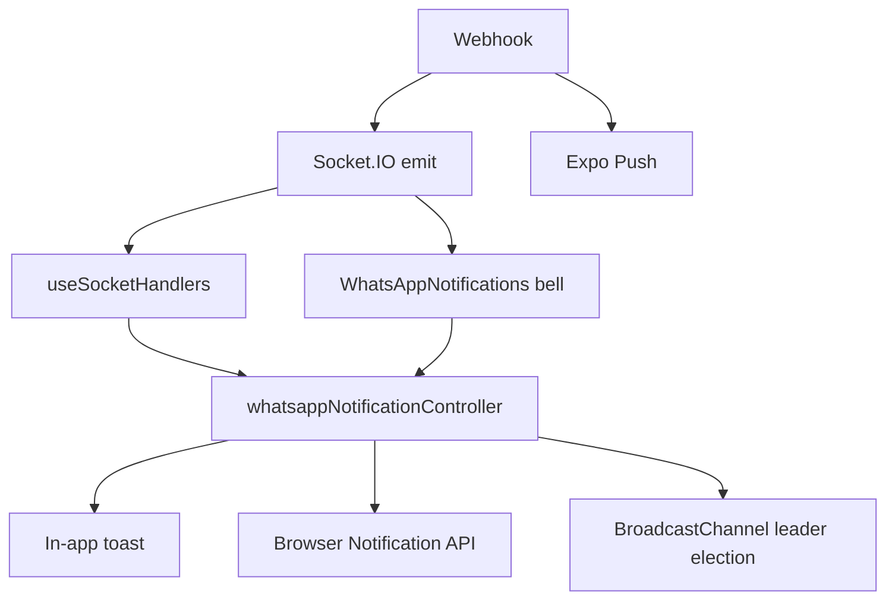
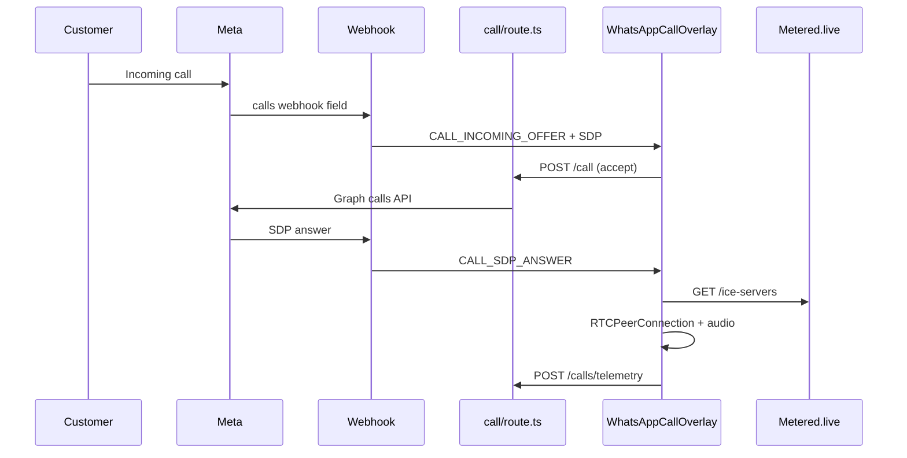

# WhatsApp Module — Official Architecture Specification

**Repository:** `c:\Admin`  
**Stack:** Next.js App Router · TypeScript · MongoDB/Mongoose · Socket.IO · Meta WhatsApp Cloud API v24.0 · Bunny CDN · Expo Push  
**Last updated:** July 3, 2026  
**Audience:** Senior engineers onboarding to the WhatsApp CRM subsystem

> **July 2026 update:** Section [19](#19-crm-integration--disposition) and [Document Changelog](#document-changelog--implementation-gap) were expanded for the strict lead disposition funnel, label sync, conversation merge tool, and dashboard parity work. See changelog for features still only on dashboard vs WhatsApp UI.

---

## Table of Contents

1. [Executive Summary](#1-executive-summary)
2. [System Topology](#2-system-topology)
3. [Technology Stack & Dependencies](#3-technology-stack--dependencies)
4. [Runtime Architecture](#4-runtime-architecture)
5. [Authentication, Authorization & Route Guards](#5-authentication-authorization--route-guards)
6. [Environment & Configuration](#6-environment--configuration)
7. [Data Model Layer](#7-data-model-layer)
8. [Multi-WABA Channel Routing](#8-multi-waba-channel-routing)
9. [Access Control & Visibility Contract](#9-access-control--visibility-contract)
10. [API Layer — Complete Inventory](#10-api-layer--complete-inventory)
11. [Webhook Processing (Inbound)](#11-webhook-processing-inbound)
12. [Outbound Messaging Pipeline](#12-outbound-messaging-pipeline)
13. [Media Pipeline](#13-media-pipeline)
14. [Conversations & Inbox Subsystem](#14-conversations--inbox-subsystem)
15. [Real-Time Layer (Socket.IO)](#15-real-time-layer-socketio)
16. [Frontend Architecture](#16-frontend-architecture)
17. [State Management & React Query](#17-state-management--react-query)
18. [Notification Subsystem](#18-notification-subsystem)
19. [CRM Integration & Disposition](#19-crm-integration--disposition)
20. [Retargeting Subsystem](#20-retargeting-subsystem)
21. [WhatsApp Calling & WebRTC](#21-whatsapp-calling--webrtc)
22. [Translation Pipeline](#22-translation-pipeline)
23. [Analytics Subsystem](#23-analytics-subsystem)
24. [Search Subsystem](#24-search-subsystem)
25. [Guest Initiation Limits](#25-guest-initiation-limits)
26. [Internal "You" Conversation](#26-internal-you-conversation)
27. [Caching, Debouncing & Idempotency](#27-caching-debouncing--idempotency)
28. [Error Handling Strategy](#28-error-handling-strategy)
29. [Background Jobs, Scripts & Schedulers](#29-background-jobs-scripts--schedulers)
30. [Cross-Module Integrations](#30-cross-module-integrations)
31. [Performance & Scalability Notes](#31-performance--scalability-notes)
32. [Security Protections](#32-security-protections)
33. [Database Index Reference](#33-database-index-reference)
34. [Complete File Map](#34-complete-file-map)
35. [Cross-Reference Flow Index](#35-cross-reference-flow-index)
36. [Document Changelog & Implementation Gap](#document-changelog--implementation-gap)

---

## 1. Executive Summary

The WhatsApp module is a full CRM inbox integrated into the VacationSaga admin platform. It provides:

- **Multi-line, multi-WABA messaging** across Greek cities, Italy, and Crete
- **Role- and location-scoped inbox visibility** for Sales, LeadGen, Advert, and Admin teams
- **Real-time updates** via Socket.IO (not Pusher — `src/lib/pusher.ts` is a misnomer; it wraps Socket.IO)
- **CRM workflows**: labels, disposition, lead linking, visits, reminders
- **Advert retargeting campaigns** with a dedicated phone line and handover to Sales
- **WhatsApp Business Calling** with WebRTC, SDP exchange, and call history
- **Mobile push** via Expo for inbound messages
- **Cross-tab desktop notifications** with leader election

The system follows a **monolithic single-process architecture**: `socket.ts` boots Next.js, Socket.IO, and two `node-cron` schedulers in one Node process. API routes handle validation + auth; business logic lives in `src/lib/whatsapp/`; UI never touches the database directly.

### Primary Data Flow (Inbound Message)

```
Meta Webhook POST
  → webhook/route.ts (verify signature, parse payload)
  → findOrCreateConversationWithSnapshot (conversationHelper)
  → WhatsAppMessage.save + WhatsAppConversation.update
  → conversationMetricsService (async SLA/temperature)
  → getEligibleUsersForNotification → emitWhatsAppEventToEligibleUsers
  → sendExpoPushToEmployee (per eligible agent)
  → Socket.IO rooms (whatsapp-phone-*, whatsapp-channel-*, user-*)
  → useSocketHandlers (client) → whatsappQueryCache patches
  → UI re-render (ConversationSidebar, MessageList)
```

### Primary Data Flow (Outbound Message)

```
MessageComposer (UI)
  → whatsapp.tsx send handler (axios)
  → POST /api/whatsapp/send-message (or send-media, send-template, etc.)
  → getDataFromToken (auth) → canAccessConversationAsync (access)
  → resolveOutboundChannelForConversation (channelService)
  → Graph API POST /{phoneNumberId}/messages
  → WhatsAppMessage.save
  → emitWhatsAppEvent(NEW_MESSAGE)
  → useSocketHandlers → cache patch → UI
```

---

## 2. System Topology

```mermaid  
flowchart TB
  subgraph external [External Services]
    Meta[Meta Graph API v24.0]
    Bunny[Bunny CDN Storage]
    Metered[Metered.live TURN]
    Expo[Expo Push Service]
    Translate[Translate API]
  end

  subgraph runtime [Single Node Process — socket.ts]
    Next[Next.js App Router]
  end

  subgraph api [API Layer — src/app/api/whatsapp/]
    WH[webhook/route.ts]
    Send[send-* routes]
    Conv[conversations/* routes]
    Call[call + ice-servers]
    Admin[channels, admin/*]
  end

  subgraph lib [Business Logic — src/lib/whatsapp/]
    CS[channelService]
    LA[locationAccess]
    AC[access]
    CH[conversationHelper]
    NR[notificationRecipients]
  end

  subgraph db [MongoDB]
    WAC[(whatsappconversations)]
    WAM[(whatsappmessages)]
    WCH[(whatsappchannels)]
    WCA[(whatsappchannelassignments)]
    WCL[(whatsappcalllogs)]
    CRS[(conversationreadstates)]
    CAS[(conversationarchivestates)]
    QRY[(queries)]
    EMP[(employees)]
  end

  subgraph realtime [Socket.IO]
    SIO[socket.ts rooms + pusher.ts emit]
  end

  subgraph client [Browser / Mobile]
    UI[/whatsapp page]
    Dash[Dashboard bell]
    Mobile[Expo app]
  end

  Meta -->|webhook POST| WH
  Meta <-->|REST| Send
  WH --> lib
  Send --> lib
  Conv --> lib
  lib --> db
  WH --> SIO
  Send --> SIO
  WH --> Bunny
  Send --> Bunny
  Call --> Metered
  WH --> Expo
  SIO --> UI
  SIO --> Dash
  Expo --> Mobile
  UI --> api
  Dash --> api
  UI --> Translate
```

---

## 3. Technology Stack & Dependencies

| Layer | Technology | Location |
|-------|-----------|----------|
| Framework | Next.js 14+ App Router | `src/app/` |
| Language | TypeScript (strict) | entire `src/` |
| Database | MongoDB via Mongoose | `src/models/` |
| Real-time | Socket.IO (server: `socket.ts`, client: `useSocket.ts`) | `src/hooks/useSocket.ts` |
| Server state (client) | TanStack React Query v5 | `src/app/whatsapp/hooks/` |
| Client state | React Context (3 providers) | `src/app/whatsapp/context/` |
| Auth token | JWT in cookie → `getDataFromToken` | `src/util/getDataFromToken.ts` |
| Auth store | Zustand `useAuthStore` | `src/AuthStore` |
| HTTP client | axios | components + shell |
| Validation | Zod (API routes) | per-route |
| Media transcode | ffmpeg-static | webhook audio processing |
| Virtualization | `@tanstack/react-virtual` | `MessageList`, `ConversationSidebar` |
| Animation | framer-motion | UI transitions |
| Styling | TailwindCSS | `globals.css` (`.scrollbar-whatsapp`) |
| Push | Expo Push API | `src/services/push/expoPush.service.ts` |
| CDN | Bunny.net | env `NEXT_PUBLIC_BUNNY_*` |

### External SDK Integrations

| Service | Purpose | Config |
|---------|---------|--------|
| Meta Graph API | Send/receive messages, templates, media, calls | `whatsapp_token`, per-channel `accessToken` in DB |
| Bunny CDN | Permanent media storage | `NEXT_PUBLIC_BUNNY_STORAGE_ZONE`, `NEXT_PUBLIC_BUNNY_ACCESS_KEY`, `NEXT_PUBLIC_BUNNY_CDN_URL` |
| Metered.live | TURN/STUN for WebRTC | `METERED_API_KEY` |
| Expo | Mobile push notifications | employee `expoPushTokens` |
| Google STUN | WebRTC fallback ICE | `calling/iceServers.ts` |

---

## 4. Runtime Architecture

### Process Model

`socket.ts` at repository root:

1. Loads `dotenv`
2. Creates Next.js app + HTTP server
3. Attaches Socket.IO with CORS allowlist (localhost, adminstro.in, devtunnels, ngrok)
4. Starts `startDailyPasswordScheduler()` and `startPersonalReminderScheduler()` (shared process — reminders can surface in WhatsApp UI)
5. Exposes `global.io` for API route emits

**Implication:** All WhatsApp socket emits and API handlers share one event loop. Heavy webhook media processing blocks other requests.

### Build-Time vs Runtime

| Concern | Build-time | Runtime |
|---------|-----------|---------|
| Route compilation | Next.js build | — |
| Phone configs (legacy) | Env vars baked at deploy | `config.ts` reads `process.env` |
| Channel credentials | — | MongoDB `WhatsappChannel.accessToken` |
| Socket URL | `NEXT_PUBLIC_SOCKET_URL` | Client connects on mount |
| Feature flags | `NEXT_PUBLIC_FEATURE_WHATSAPP_NOTIFICATIONS` | Evaluated in browser |

### Dynamic Imports (Code Splitting)

Heavy dialogs loaded with `next/dynamic({ ssr: false })`:

| Shell file | Lazy components |
|-----------|----------------|
| `whatsapp.tsx` | `WhatsAppCallOverlay`, `ForwardDialog`, `LeadTransferDialog`, `AddGuestModal` |
| `MessageThreadContainer.tsx` | `DispositionDialog`, `SetVisitDialog`, `ReminderDialog`, `CrmPanel` |

---

## 5. Authentication, Authorization & Route Guards

### Page-Level Middleware

**File:** `src/middleware.ts`  
**Scope:** Page routes only — `/api/*` is excluded from the matcher.

| Role | WhatsApp Routes |
|------|----------------|
| SuperAdmin | `/whatsapp`, `/whatsapp/retarget`, `/whatsapp/channels`, `/dashboard/whatsapp/channels`, `/dashboard/whatsapp-analytics`, all `/dashboard/*` |
| Admin | `/dashboard/whatsapp-analytics` |
| Advert | `/whatsapp` (client-filtered to retarget), `/whatsapp/retarget` |
| Sales / sales-intern / Sales-TeamLead | `/whatsapp`, `/whatsapp/retarget`, `/dashboard/whatsapp-analytics` |
| LeadGen / LeadGen-TeamLead | `/whatsapp` |
| Developer | `/whatsapp`, `/whatsapp/calls` |

Middleware validates JWT from cookie and checks role against `roleAccess` map. **API routes perform their own auth** via `getDataFromToken(req)`.

### API Authentication Flow

```
Request → getDataFromToken(req)
  → jwtVerify / cookie parse
  → { id, role, allotedArea, rentalType, email }
  → normalizeWhatsAppToken (apiContext.ts)
  → access checks per route
```

### Conversation Access (Central Validator)

**File:** `src/lib/whatsapp/access.ts`

| Function | Use case |
|----------|----------|
| `canAccessConversation` | Sync check (sockets, quick paths) |
| `canAccessConversationAsync` | API routes — DB-aware phone/channel mapping |
| `assertAccessOrThrow` / `assertAccessOrThrowAsync` | Throws 403 |
| `shouldEmitToUser` | Socket fan-out filtering |
| `CONVERSATION_ACCESS_SELECT` | Mongoose `.select()` fields required for access checks |

**Access decision tree:**

```
1. SuperAdmin / Admin / Developer → allow
2. source === "internal" OR businessPhoneId === "internal-you" → allow (all WA roles)
3. Non-WA role (except Advert retarget rules) → deny
4. isRetarget → evaluateRetargetAccess (stage + role matrix)
5. Default → conversationMatchesStaffVisibilityAsync (locationAccess)
```

### Retarget Access Matrix

| Role | Allowed stages |
|------|---------------|
| Advert | `initiated`, `awaiting_reply`, `engaged` (pre-handover) |
| Sales | `handed_to_sales` only; if `assignedAgent` set, must match current user |
| SuperAdmin | Full access (via FULL_ACCESS_ROLES) |

### Permission Resolution Chain

```
Employee JWT
  → config.ts (WHATSAPP_ACCESS_ROLES, area → phone IDs)
  → phoneAreaConfigService.ts (DB channel overlay, rental type)
  → locationAccess.ts (participantLocationKey visibility)
  → channelTypeAccess.ts (guest/owner/support/backup by role)
  → rentalTypeAccess.ts (Short Term / Long Term / General)
  → access.ts (conversation-level composite)
```

---

## 6. Environment & Configuration

### Environment Variables

| Variable | Purpose | Consumed by |
|----------|---------|-------------|
| `whatsapp_token` | Default Meta access token | `config.ts`, channel fallback |
| `WhatsApp_Business_Account_ID` | Shared WABA ID | `config.ts` |
| `WHATSAPP_ATHENS_PHONE_ID` | Athens phone + retarget line | `config.ts` |
| `WHATSAPP_PHONE_A_ID` | Athens region (alias) | `config.ts` |
| `WHATSAPP_PHONE_B_ID` / `WHATSAPP_THESSALONIKI_PHONE_ID` | North Greece | `config.ts` |
| `WHATSAPP_PHONE_C_ID` | Italy | `config.ts` |
| `WHATSAPP_CHANIA_PHONE_ID` | Crete | `config.ts` |
| `Phone_number_ID` | Legacy fallback for Phone A | `config.ts` |
| `WHATSAPP_WEBHOOK_VERIFY_TOKEN` | Meta hub challenge | `webhook/route.ts` GET |
| `WHATSAPP_APP_SECRET` | `x-hub-signature-256` HMAC | `webhook/route.ts` POST |
| `WHATSAPP_DAILY_LIMIT_TIMEZONE` | Guest initiation day boundary | `guestInitiationDay.ts` |
| `METERED_API_KEY` | TURN credentials | `ice-servers/route.ts` |
| `NEXT_PUBLIC_BUNNY_STORAGE_ZONE` | Bunny upload zone | webhook, send-media, upload-to-bunny |
| `NEXT_PUBLIC_BUNNY_ACCESS_KEY` | Bunny auth | same |
| `NEXT_PUBLIC_BUNNY_CDN_URL` | CDN public URL | same |
| `NEXT_PUBLIC_SOCKET_URL` | Socket.IO client URL | `useSocket.ts` |
| `NEXT_PUBLIC_FEATURE_WHATSAPP_NOTIFICATIONS` | Feature flag | `WhatsAppNotifications.tsx` |
| `TOKEN_SECRET` | JWT verify (socket auto-join) | `socket.ts` |
| `MONGODB_URI` | Database | `connectDb()` |

Per-channel tokens are stored in **MongoDB** (`WhatsappChannel.accessToken`), not env.

### Legacy Phone Configuration

**File:** `src/lib/whatsapp/config.ts`

| Phone | Areas | Env key |
|-------|-------|---------|
| Phone A | athens, piraeus, glyfada | `WHATSAPP_PHONE_A_ID` |
| Phone B | thessaloniki, halkidiki | `WHATSAPP_PHONE_B_ID` |
| Phone C | milan, rome | `WHATSAPP_PHONE_C_ID` |
| Chania | chania | `WHATSAPP_CHANIA_PHONE_ID` |
| Retarget | dedicated line | `WHATSAPP_ATHENS_PHONE_ID` |
| Internal You | all (virtual) | `INTERNAL_YOU_PHONE_ID = "internal-you"` |

### Role Constants

| Constant | Roles |
|----------|-------|
| `FULL_ACCESS_ROLES` | SuperAdmin, Admin, Developer |
| `WHATSAPP_ACCESS_ROLES` | SuperAdmin, Admin, Advert, Sales, sales-intern, Sales-TeamLead, LeadGen, LeadGen-TeamLead, Developer |
| `SALES_WHATSAPP_ROLES` | Sales, sales-intern, Subscription-Sales |

---

## 7. Data Model Layer

### Primary Collections

#### `whatsappconversations` — `src/models/whatsappConversation.ts`

Central thread entity. Key fields:

| Field group | Fields | Purpose |
|------------|--------|---------|
| Identity | `participantPhone`, `participantName`, `participantLocation`, `participantLocationKey`, `businessPhoneId`, `identityVersion` | Thread identity; v2 = phone + `whatsappChannelId` unique |
| Source | `source: "meta" \| "internal"` | Internal threads skip Meta |
| Assignment | `assignedAgent`, `assignmentHistory[]` | Agent ownership (separate from visibility) |
| Preview | `lastMessage*`, `unreadCount` | Inbox list |
| Session | `lastCustomerMessageAt`, `lastCustomerMessageAtByPhone`, `sessionExpiresAt` | 24h messaging window |
| Metrics | `engagementScore`, `leadTemperature`, `slaBreached`, `openingTemplateName`, message counts | CRM analytics |
| Guest initiation | `guestInitiationAgentId`, `guestInitiationReservedAt/PendingAt/ConfirmedAt` | Daily quota tracking |
| CRM | `labels[]`, `notes`, `leadQueryId`, `hasActiveReminder`, `reminderAt` | Disposition workflow |
| Type | `conversationType: "owner" \| "guest"`, `referenceLink` | Inferred from first template |
| Retarget | `isRetarget`, `retargetStage`, `ownerRole`, `handoverCompletedAt`, `retargetTemplateName` | Advert pipeline |
| Channel routing | `whatsappChannelId`, `channelType`, `rentalType`, `wabaId`, `businessPortfolioId` | Frozen at creation |
| Status | `status: active \| archived \| blocked \| merged`, `mergedInto` | Lifecycle |

#### `whatsappmessages` — `src/models/whatsappMessage.ts`

| Field group | Fields |
|------------|--------|
| Identity | `conversationId`, `messageId` (wamid), `businessPhoneId` |
| Content | `type`, `content`, `mediaUrl`, `mediaId`, `mimeType`, `templateName` |
| Delivery | `status`, `statusEvents[]`, `failureReason`, `pricing` |
| Context | `direction`, `sentBy`, `replyToMessageId`, `replyContext`, `reactedToMessageId`, `reactionEmoji` |
| Meta | `source`, `isForwarded`, `forwardedFrom`, `conversationSnapshot` |

#### `whatsappchannels` — `src/models/whatsappChannel.ts`

Multi-WABA routing layer. One active row per `phoneNumberId` (partial unique index).

| Field | Purpose |
|-------|---------|
| `channelType` | guest \| owner \| support \| backup |
| `rentalType` | Short Term \| Long Term \| General |
| `assignedLocations[]` | Normalized city keys |
| `phoneNumberId`, `accessToken`, `wabaId` | Meta credentials |
| `active`, `endedAt` | Versioning — deactivated channels preserved for history |

#### `whatsappchannelassignments` — `src/models/whatsappChannelAssignment.ts`

Maps `(locationKey, rentalType, channelType)` → `channelId`. Partial unique on active triple.

#### `whatsappcalllogs` — `src/models/whatsappCallLog.ts`

Call lifecycle, SDP dedup (`shouldEmitSdpAnswerAndMark`), WebRTC telemetry linkage.

#### `conversationreadstates` — `src/models/conversationReadState.ts`

Per-user read cursor: `{ conversationId, userId }` unique.

#### `conversationarchivestates` — `src/models/conversationArchiveState.ts`

Global archive flag per conversation (user-independent).

### CRM-Linked Models

#### `queries` — WhatsApp fields (`src/models/query.ts`)

| Field | Purpose |
|-------|---------|
| `whatsappOptIn` | Lead replied to first message |
| `whatsappRetargetCount` | Retarget attempt counter (max 3) |
| `whatsappLastRetargetAt` | Cooldown tracking |
| `whatsappBlocked` | Permanent block flag |
| `whatsappBlockReason` | ecosystem_protection, number_not_on_whatsapp, etc. |
| `whatsappLastErrorCode` | Last Meta error (131049, 131021, 131215 = blocking) |
| `whatsappLastMessageAt` | Last outbound timestamp |
| `customerFirstReply` | CRM first-reply tracking |
| `leadStatus` | `fresh` \| `active` \| `rejected` \| `declined` \| `reminder` \| `closed` — disposition funnel |
| `reason` | Free-text disposition reason (decline/reject) |
| `rejectionReason` | Enum rejection reason on `Query` |
| `leadQualityByReviewer` | `Good` \| `Average` \| `Below Average` — required before G2G/reject/decline from WA CRM |
| `note[]` | CRM notes array — synced in `CrmPanel` via `/api/sales/createNote` |

#### `employees` — `whatsappPhoneMask`

Rules for masking owner/guest phone numbers in UI (`src/lib/whatsapp/phoneMask.ts`).

#### `personalreminders` — `whatsappConversationId`

Links reminders created from WhatsApp disposition to inbox.

---

## 8. Multi-WABA Channel Routing

### Conceptual Model

```
Location + RentalType + ChannelType  →  WhatsappChannel  →  PhoneNumberId + Token + WABA
```

Employees interact via **locations and rental types**, not channels directly. Channels are the admin-managed routing layer.

### Service: `src/lib/whatsapp/channelService.ts`

| Export | Purpose |
|--------|---------|
| `resolveWhatsappChannel({ location, rentalType, channelType })` | Outbound routing by triple |
| `resolveOutboundChannelForConversation(conv)` | Conversation-aware routing; retarget uses frozen line |
| `resolveOutboundSendCredentials(conv)` | Returns `{ phoneNumberId, accessToken }` for Graph API |
| `getActiveChannelByPhoneNumberId(id)` | Inbound webhook routing |
| `createChannelWithAssignment(...)` | SuperAdmin channel CRUD |
| `deactivateChannel(id)` | Sets `active=false`, `endedAt=now` |
| `inferChannelTypeFromConversation(...)` | Maps `conversationType` → channelType |

### Outbound Routing Priority

```
1. isRetarget → businessPhoneId line (frozen)
2. participantLocation + rentalType + channelType → DB assignment lookup
3. Frozen whatsappChannelId on conversation (historical fallback)
4. businessPhoneId direct lookup
5. Env-based config.ts fallback
```

### Number Migration (Dual-Room Strategy)

When a phone number is replaced on a channel:
- Old conversations keep frozen `whatsappChannelId`
- Socket emits go to **both** `whatsapp-phone-{phoneNumberId}` AND `whatsapp-channel-{channelId}`
- Clients join both rooms; `eventId` dedup prevents duplicate UI updates

**Related:** `channels/[id]/migrate/route.ts`, `useWhatsAppSocketRooms.ts`

---

## 9. Access Control & Visibility Contract

**Canonical contract** (`src/lib/whatsapp/locationAccess.ts`):

```
Visibility = PhoneAccess AND participantLocationKeyAccess AND rentalTypeAccess AND channelTypeAccess
Ownership  = assignedAgent (NEVER used for list visibility)
AdminQueue = participantLocationKey empty/missing (staff with admin-queue privilege)
```

### Key Functions

| Function | Layer |
|----------|-------|
| `buildConversationVisibilityFilterAsync(user)` | Mongo query for inbox/search/notifications |
| `canUserSeeConversation(user, conv)` | Per-document runtime check |
| `conversationMatchesStaffVisibilityAsync(user, conv)` | Async DB-aware variant |
| `resolveLocationFromLeadPhone(phone)` | Auto-assign location from CRM lead |

### Supporting Access Modules

| File | Responsibility |
|------|---------------|
| `phoneAreaConfigService.ts` | DB channel → phone ID mapping; `canUserAccessPhoneId`, cached channel lists |
| `channelTypeAccess.ts` | Role → allowed channel types (guest vs owner lines) |
| `rentalTypeAccess.ts` | Employee rental type → conversation rental type visibility |
| `participantLocationPrivileges.ts` | Who can see admin queue; who can assign participant location |
| `areaTokenUtils.ts` | Parse/normalize `allotedArea` from JWT |

### SuperAdmin Inbox Location Filter

- `SUPERADMIN_INBOX_LOCATION_ALL` / `SUPERADMIN_DEFAULT_INBOX_LOCATION` in `locationConstants.ts`
- Persisted client-side: `whatsapp_location_filter` localStorage key (`whatsappInboxUrl.ts`)

---

## 10. API Layer — Complete Inventory

All routes under `src/app/api/whatsapp/` unless noted. Auth = `getDataFromToken` unless public webhook.

### Webhooks

| Route | Methods | Handler chain |
|-------|---------|---------------|
| `webhook/route.ts` | GET, POST | Meta verify → signature check → field dispatch → DB → socket → push |

### Outbound Messaging

| Route | Methods | Graph endpoint | Notes |
|-------|---------|---------------|-------|
| `send-message/route.ts` | POST | `/{phoneNumberId}/messages` | Text, internal "You" notes (no Meta) |
| `send-media/route.ts` | POST | same | Bunny URL or Meta media ID |
| `send-template/route.ts` | POST | same | Multi-recipient batch |
| `send-interactive/route.ts` | POST | same | Buttons/lists |
| `send-reaction/route.ts` | POST | same | Emoji reactions |
| `forward-message/route.ts` | POST | same | Forward existing message |

### Media

| Route | Methods | External |
|-------|---------|----------|
| `upload-media/route.ts` | POST, GET | Graph `/{phoneNumberId}/media`, `/{mediaId}` |
| `upload-to-bunny/route.ts` | POST | Bunny storage API |

### Conversations

| Route | Methods | Service deps |
|-------|---------|-------------|
| `conversations/route.ts` | GET, POST | `inboxQuery`, `conversationsListEnrichment`, `youConversationService` |
| `conversations/counts/route.ts` | GET | `inboxUnreadBadgeQuery` |
| `conversations/unread-count/route.ts` | GET | `inboxUnreadQuery` |
| `conversations/read/route.ts` | POST | `conversationReadState` → socket `whatsapp-conversation-read` |
| `conversations/archive/route.ts` | POST, DELETE, GET | `conversationArchiveState` |
| `conversations/transfer/route.ts` | POST | `emitToEligibleUsers` |
| `conversations/you/route.ts` | GET | `youConversationService` |
| `conversations/media/route.ts` | GET | Message media gallery |
| `conversations/[id]/messages/route.ts` | GET | `replyStatusResolver` |
| `conversations/[id]/meta/route.ts` | POST | Participant name/location/notes |
| `conversations/[id]/labels/route.ts` | GET, PATCH | `conversationLabelService` — add/remove/set; `syncFromLeadStatus` aligns funnel labels |
| `conversations/[id]/preferences/route.ts` | GET, PATCH | Translation language prefs |
| `conversations/[id]/readers/route.ts` | GET | `conversationReaders` |
| `conversations/[id]/shared-properties/route.ts` | GET | `propertyLinkExtractor` |

### Templates & Config

| Route | Methods | External |
|-------|---------|----------|
| `templates/route.ts` | GET | Graph `/{wabaId}/message_templates` |
| `phone-configs/route.ts` | GET | Env + DB channel overlay |
| `phone-health/route.ts` | GET | Graph phone quality fields |
| `configured-locations/route.ts` | GET | `assignableLocations` |
| `resolve-phone-for-location/route.ts` | GET | City → phoneNumberId |
| `initiation-limit/route.ts` | GET | `initiationLimitService` |

### Notifications

| Route | Methods | Notes |
|-------|---------|-------|
| `notifications/summary/route.ts` | GET | Expiring 24h windows + unread preview; 30s cache |
| `notifications/clear/route.ts` | POST | Emits `whatsapp-notifications-cleared` |

### Channels (SuperAdmin)

| Route | Methods |
|-------|---------|
| `channels/route.ts` | GET, POST |
| `channels/[id]/route.ts` | PATCH, DELETE |
| `channels/[id]/migrate/route.ts` | POST |

### Calling

| Route | Methods | External |
|-------|---------|----------|
| `call/route.ts` | POST, GET | Graph `/{phoneNumberId}/calls`, `call_permissions` |
| `calls/history/route.ts` | GET | `callHistoryService` |
| `calls/telemetry/route.ts` | POST | WebRTC stats persistence |
| `ice-servers/route.ts` | GET | Metered.live API |

### CRM & Search

| Route | Methods | Service |
|-------|---------|---------|
| `disposition/route.ts` | POST | `whatsappDispositionService` |
| `reminders/route.ts` | GET, POST | `whatsappReminderService` |
| `leads/lookup/route.ts` | GET | `leadLookupService` |
| `properties/search/route.ts` | GET | Property search for sharing |
| `search/unified/route.ts` | GET | `unifiedSearchUtils`, `searchUtils` |

### Retarget

| Route | Methods | Roles |
|-------|---------|-------|
| `retarget/route.ts` | POST | SuperAdmin, Sales, Advert |
| `retarget/handover/route.ts` | POST | Hand to Sales |
| `retarget/upload/route.ts` | POST | Bulk contact upload |
| `retarget/uploaded-contacts/route.ts` | GET | List uploaded |

### Admin

| Route | Methods |
|-------|---------|
| `admin/migrate-conversation-types/route.ts` | POST — backfill owner/guest types |

### Related Routes (Outside `/api/whatsapp/`)

| Route | WhatsApp touchpoint |
|-------|-------------------|
| `api/analytics/whatsapp-overview/route.ts` | `whatsappAnalyticsService` |
| `api/admin/merge-conversations/route.ts` | `conversationMergeService` — SuperAdmin duplicate merge |
| `api/employee/whatsapp-phone-mask/route.ts` | `phoneMask` rules |
| `api/sales/createquery/route.ts` | Create lead + send WA template + `NEW_CONVERSATION` socket |
| `api/sales/getquery/route.ts` | Lead WA retarget fields |
| `api/sales/rejectionReason/route.ts` | WA block reasons on rejection |
| `api/leads/mark-first-reply/route.ts` | `CONVERSATION_UPDATE` socket |
| `api/leads/getGoodToGoLeads/route.ts` | G2G leads with WA context |
| `api/notifications/broadcast/route.ts` | `system-notification` via WA socket bus |
| `api/notifications/[notificationId]/route.ts` | WA socket integration |
| `api/employeelogin/route.ts` | Returns `whatsappPhoneMask` in login response |
| `api/translate` | Message translation (used by `useMessageTranslation`) |

---

## 11. Webhook Processing (Inbound)

**File:** `src/app/api/whatsapp/webhook/route.ts` (~2,200 lines)

### Verification (GET)

```
hub.mode=subscribe + hub.verify_token === WHATSAPP_WEBHOOK_VERIFY_TOKEN
  → return hub.challenge (200)
```

### Security (POST)

- Optional HMAC: `x-hub-signature-256` verified with `WHATSAPP_APP_SECRET`
- `export const dynamic = "force-dynamic"`

### Meta Webhook Field Handlers

| `change.field` | Handler | Socket events |
|---------------|---------|---------------|
| `messages` (inbound) | `processIncomingMessage` | `NEW_MESSAGE` |
| `messages` (statuses) | `processStatusUpdate` | `MESSAGE_STATUS_UPDATE` |
| `calls` | `processCallEvent` | `INCOMING_CALL`, `CALL_MISSED`, `CALL_STATUS_UPDATE`, `CALL_SDP_ANSWER`, `CALL_INCOMING_OFFER` |
| `history` | `processHistoryEvent` | `HISTORY_SYNC` |
| `smb_app_state_sync` | `processAppStateSyncEvent` | `APP_STATE_SYNC` |
| `smb_message_echoes` | `processMessageEchoEvent` | `MESSAGE_ECHO` |

### Inbound Message Side Effects

```
processIncomingMessage
  → normalizePhone(from)
  → getActiveChannelByPhoneNumberId(phoneNumberId)
  → findOrCreateConversationWithSnapshot
  → resolveLocationFromLeadPhone (if no location)
  → download media → Bunny CDN (image/video/audio/document)
  → audio: ffmpeg transcode if needed
  → WhatsAppMessage.create (idempotent on messageId+businessPhoneId)
  → refreshMessagingWindowFields ($max, unconditional — 24h window fields)
  → update conversation preview + metrics (guarded by lastMessageTime ordering)
  → guest initiation state machine updates
  → auto guest-questions template (business rule)
  → getEligibleUsersForNotification
  → emitWhatsAppEventToEligibleUsers (debounced 300ms per conv+user)
  → sendIncomingWhatsAppExpoPush (idempotent 24h per message+user)
```

### Idempotency & Debouncing

| Mechanism | TTL | Purpose |
|-----------|-----|---------|
| `lastEmitMap` | 300ms debounce, 60s cleanup | Prevent socket burst per user |
| `pushedForMessageUser` | 24h | Prevent duplicate Expo push on webhook retry |
| Unique index `{ messageId, businessPhoneId }` | permanent | DB-level message dedup |

### Push Notification Path

```
webhook → sendExpoPushToEmployee
  → expoPush.service.ts
  → channelId: "whatsapp-messages"
  → data: { conversationId, businessPhoneId, messageId, ... }
```

---

## 12. Outbound Messaging Pipeline

### Send Flow (all send-* routes)

```
1. getDataFromToken → normalizeWhatsAppToken
2. Load conversation → canAccessConversationAsync
3. initiationLimitService.assertCanInitiateGuestConversation (Sales guest only)
4. resolveOutboundBusinessPhoneId / resolveOutboundChannelForConversation
5. resolveOutboundSendCredentials → per-channel token
6. Build Graph API payload
7. POST https://graph.facebook.com/v24.0/{phoneNumberId}/messages
8. Save WhatsAppMessage (status: sending → sent on webhook status)
9. Update conversation preview
10. emitWhatsAppEvent(NEW_MESSAGE)
11. guest initiation: reserve slot on Meta accept
```

### Internal "You" Messages

When `businessPhoneId === "internal-you"`:
- Skip Graph API entirely
- `source: "internal"` on message + conversation
- No notifications, no delivery status updates
- Instant socket emit for UI

### Template Classification

**File:** `src/lib/whatsapp/templateClassification.ts`

Filters approved templates by owner/guest context before `send-template` and template picker UI.

### 24-Hour Messaging Window

| File | Layer |
|------|-------|
| `messagingWindowServer.ts` | Server: authoritative per-line anchor for outbound sends (`resolveMessagingWindowAnchor` queries newest inbound `WhatsAppMessage` on the resolved line) |
| `messagingWindow.ts` | Shared: `isSessionActive` / `resolveSessionAnchorMs` — single source of truth for "free-form allowed?" |
| `utils.ts` (whatsapp app) | UI helpers: `isMessageWindowActive`, `getRemainingHours` — thin delegates to `messagingWindow.ts` |

Outside 24h window: only template messages allowed (Meta policy).

**Window state fields on `WhatsAppConversation`** (all updated by the inbound webhook on *every* customer message):

- `lastCustomerMessageAt` — newest inbound customer message (conversation level)
- `lastCustomerMessageAtByPhone.{phoneNumberId}` — per business line (Meta scopes the window per line)
- `lastIncomingMessageTime` — same anchor, kept for analytics
- `sessionExpiresAt` — `lastCustomerMessageAt + 24h`, denormalized for queries/UI

**Webhook update semantics (critical):** the window fields are written by `refreshMessagingWindowFields()` using a MongoDB `$max` update that runs *unconditionally* for every inbound message, **before** the `lastMessageTime`-ordering guard that protects the preview metadata (`lastMessageContent`, `lastMessageTime`, ...). This makes the window update monotonic and immune to out-of-order webhook delivery or an outbound message racing ahead of the inbound webhook. (Historical bug: the window fields used to live inside the guarded update, so a conversation whose `lastMessageTime` was already newer than the customer's timestamp silently skipped `lastCustomerMessageAt`/`sessionExpiresAt` and stayed in "Template only" forever.)

**Client evaluation:** `resolveSessionAnchorMs` takes the newest of `lastCustomerMessageAtByPhone[line]`, `lastCustomerMessageAt`, `lastIncomingMessageTime`, and `sessionExpiresAt − 24h`, which makes the UI resilient to legacy documents missing any one field. The UI errs on the permissive side; `send-message/route.ts` re-checks the window authoritatively per line and rejects with `WINDOW_CLOSED` if needed.

**Real-time:** after every inbound message the webhook emits `session_updated` (to `conversation-{id}` + per-user rooms) and `conversation_session_updated` (to `whatsapp-room`). Payload includes `sessionExpiresAt` and `lastCustomerMessageAt`. The client joins `conversation-{id}` via `join-conversation` when a thread is open (`useWhatsAppConversationRoom`), and `useSocketHandlers` patches session fields immediately — the composer unlocks and the "Template only" badge disappears without refresh. `whatsapp-new-message` also carries the same fields. `ChatHeader` re-evaluates the countdown on a 60-second tick.

**Conversation creation:** `findOrCreateConversationWithSnapshot` accepts `inboundTimestampMs` on inbound webhooks so new conversations are created with `lastMessageTime` aligned to Meta's timestamp (not server `Date.now()`), pre-seeding window fields and eliminating the first-message race at the source.

**Monitoring:** `GET /api/admin/session-health` (SuperAdmin) reports `inboundNoAnchor`, `anchorNoExpiry`, `recentBroken`, and `activeWindows`. All issue counts should be 0 after deploy + backfill.

---

## 13. Media Pipeline

### Inbound (Webhook)

```
Meta media ID
  → GET Graph /{mediaId} (URL + mime)
  → Download to temp file
  → audio: ffmpeg transcode (ffmpeg-static)
  → Upload to Bunny CDN
  → Store permanent mediaUrl on WhatsAppMessage
```

### Outbound Upload

```
Client file picker
  → POST /api/whatsapp/upload-to-bunny (permanent storage)
  → POST /api/whatsapp/send-media (Bunny URL in Graph payload)
  OR
  → POST /api/whatsapp/upload-media (Meta media store)
  → send-media with media ID
```

### Media Proxy

`upload-media/route.ts` GET — proxies Meta media download for client display (auth-gated).

### Media Gallery

`conversations/media/route.ts` — paginated media for `MediaPopup.tsx`.

---

## 14. Conversations & Inbox Subsystem

### Inbox List Query

**Chain:** `GET /conversations` → `parseInboxListParams` → `buildInboxListQueryAsync` → `enrichConversationPage` → `scheduleConversationTypeUpdates`

| Filter param | Effect |
|-------------|--------|
| `filter` | all, unread, owners, guests, label keys |
| `search` | Name/phone text search |
| `phoneId` | Business line filter |
| `locationFilter` | SuperAdmin city filter |
| `retargetOnly` | Advert retarget inbox |
| `adminQueue` | Unassigned location conversations |
| `rentalType` | Short Term / Long Term |
| `assignedToMe` | `assignedAgent === current user` |

### List Enrichment (`conversationsListEnrichment.ts`)

- Computes per-row unread counts (N+1 query pattern — performance hotspot)
- Infers `conversationType` from first template message (deferred async update)
- Links lead metadata from `queries` collection

### Read State

```
POST /conversations/read
  → ConversationReadState upsert
  → decrement unreadCount on conversation
  → emit whatsapp-conversation-read
  → client: adjustWhatsAppUnreadCountQueryCache
```

### Archive

- Global per conversation (`conversationArchiveState`)
- Client also maintains `whatsapp_archived_conversations` localStorage (legacy sync)
- Hook: `useArchivedConversationIds` → `GET /conversations/archive?idsOnly=true`

### Transfer

```
POST /conversations/transfer
  → Update assignedAgent + assignmentHistory
  → emit CONVERSATION_UPDATE to eligible users
```

### Merge (SuperAdmin)

**Service:** `conversationMergeService.ts`  
**API:** `GET/POST /api/admin/merge-conversations`  
**UI:** `/dashboard/admin/merge-conversations` → `ConversationMergePanel.tsx`

Duplicate groups are detected by **normalized `participantPhone` + `whatsappChannelId`**. Legacy rows without `whatsappChannelId` fall back to `participantLocationKey + conversationType`.

```
Dry run → list groups (canonical = most messages / latest activity)
Execute merge →
  move all WhatsAppMessage rows to canonical conversationId
  soft-delete duplicates: status = "merged", mergedInto, mergedAt
  canonical conversation keeps labels, leadQueryId, channel fields
```

**Model fields:** `status: "merged"`, `mergedInto`, `mergedAt` on `whatsappconversations`.

---

## 15. Real-Time Layer (Socket.IO)

### Server Registration (`socket.ts`)

#### Client → Server (Room Joins)

| Event | Room | Used by |
|-------|------|---------|
| `join-whatsapp-room` | `whatsapp-room`, `user-{userId}` | All WA clients |
| `join-whatsapp-phone` | `whatsapp-phone-{phoneId}` | Per business line |
| `join-whatsapp-channel` | `whatsapp-channel-{channelId}` | Post-migration stability |
| `join-whatsapp-retarget` | `whatsapp-retarget-{phoneId}` | Advert retarget |
| `join-conversation` | `conversation-{id}` | Active thread |
| `join-whatsapp-calls-room` | `whatsapp-calls-room` | Call notifications |
| `join-whatsapp-sync-room` | `whatsapp-sync-room` | History sync |
| `whatsapp-typing` | relays to `conversation-{id}` | Typing indicators |

#### Server → Client (Event Constants — `src/lib/pusher.ts`)

| Constant | Event name |
|----------|-----------|
| `NEW_MESSAGE` | `whatsapp-new-message` |
| `MESSAGE_STATUS_UPDATE` | `whatsapp-message-status` |
| `MESSAGE_ECHO` | `whatsapp-message-echo` |
| `NEW_CONVERSATION` | `whatsapp-new-conversation` |
| `CONVERSATION_UPDATE` | `whatsapp-conversation-update` |
| `INCOMING_CALL` | `whatsapp-incoming-call` |
| `CALL_STATUS_UPDATE` | `whatsapp-call-status` |
| `CALL_MISSED` | `whatsapp-call-missed` |
| `CALL_SDP_ANSWER` | `whatsapp-call-sdp-answer` |
| `CALL_INCOMING_OFFER` | `whatsapp-call-incoming-offer` |
| `HISTORY_SYNC` | `whatsapp-history-sync` |
| `APP_STATE_SYNC` | `whatsapp-app-state-sync` |

**Ad-hoc events:** `whatsapp-conversation-read`, `whatsapp-notifications-cleared`, `whatsapp-typing-update`, `system-notification`, `system-notification-updated`, `system-notification-deleted`

### Emit Routing (`emitWhatsAppEvent`)

```
if data.userId → emit to user-{userId} only
else if businessPhoneId:
  if isRetarget && stage !== "handed_to_sales" → whatsapp-retarget-{phoneId}
  else → whatsapp-phone-{phoneId} + whatsapp-channel-{channelId} (dual-room)
else → global io.emit
```

### Client Socket Hooks

| Hook | File | Responsibility |
|------|------|---------------|
| `useSocket` | `src/hooks/useSocket.ts` | Singleton `io()` connection |
| `useWhatsAppSocketRooms` | `modules/useWhatsAppSocketRooms.ts` | Join/leave all rooms on filter change |
| `useWhatsAppBaseRoom` | same | Dashboard bell — user room only |
| `useSocketHandlers` | `modules/useSocketHandlers.ts` | All event listeners + cache surgery + call state |

### Socket Handler Cache Updates (`useSocketHandlers.ts`)

| Event | Cache action |
|-------|-------------|
| `NEW_MESSAGE` | `mutateWhatsAppMessagesCache` + `repositionConversationAfterUpdate` + unread adjust |
| `NEW_CONVERSATION` | `insertConversationAtCorrectPosition` |
| `MESSAGE_STATUS_UPDATE` | Patch message status in cache |
| `CONVERSATION_UPDATE` | `patchConversationInList` / `broadcastConversationPatch` |
| `whatsapp-conversation-read` | Zero unread for conversation |

**Dedup:** `socketUtils.ts` — LRU set for `eventId` dedup across dual-room emits.

---

## 16. Frontend Architecture

### Route Map

| URL | Component | Layout |
|-----|-----------|--------|
| `/whatsapp` | `page.tsx` → `WhatsAppChat` | Full-screen, no dashboard sidebar |
| `/whatsapp/retarget` | `retarget/page.tsx` → `RetargetPanel` | Full-screen |
| `/whatsapp/calls` | `calls/page.tsx` | Call history table |
| `/whatsapp/channels` | Redirect → `/dashboard/whatsapp/channels` | — |
| `/dashboard/whatsapp/channels` | Channel admin CRUD | Dashboard layout |
| `/dashboard/whatsapp-analytics` | `WhatsAppAnalyticsDashboard` | Dashboard layout |

### Provider Tree

```
app/whatsapp/layout.tsx (QueryProvider)
  └─ page.tsx (Suspense + skeleton)
       └─ whatsapp.tsx
            └─ WhatsAppProviders
                 ├─ ConversationListProvider
                 ├─ ActiveThreadProvider
                 └─ WhatsAppUIProvider
                      └─ WhatsAppChatInner
                           ├─ ConversationSidebarContainer
                           └─ MessageThreadContainer
```

### Shell Responsibilities (`whatsapp.tsx`, ~3,600 lines)

The shell is the orchestration layer:

- Send pipelines (text, media, template, reaction, interactive, forward)
- WebRTC calling state machine
- URL/deep-link resolution (`whatsappInboxUrl.ts`)
- Socket handler wiring via refs
- Modal open/close orchestration
- Optimistic message insertion before API response
- Mobile view breakpoints (`useMobileView.ts`)

### Container Pattern

| Container | Subscribes | Renders |
|-----------|-----------|---------|
| `ConversationSidebarContainer` | List + selection contexts | `ConversationSidebar` |
| `MessageThreadContainer` | Active thread + UI contexts | `ChatHeader`, `MessageList`, `MessageComposer`, lazy dialogs |

### Component Inventory

#### Sidebar

| Component | APIs called |
|-----------|------------|
| `ConversationSidebar` | conversations, meta, upload-to-bunny |
| `ConversationItem` | — (presentational) |
| `UnifiedSearchResults` | via `useUnifiedWhatsAppSearch` |
| `AddGuestModal` | configured-locations, resolve-phone-for-location, POST conversations |
| `SetParticipantLocationDialog` | configured-locations, meta |
| `WhatsAppPhoneMaskForm` | employee/whatsapp-phone-mask |
| `InitiationLimitBadge` | via `useInitiationLimit` |

#### Thread

| Component | APIs called |
|-----------|------------|
| `ChatHeader` | configured-locations, meta |
| `MessageList` | translate (via `useMessageTranslation`) |
| `MessageComposer` | preferences, upload-to-bunny, send-* |
| `TemplateDialog` | — (props from ActiveThreadContext) |
| `MediaSendPreview` | — |
| `MediaPopup` | conversations/media |
| `CrmPanel` | shared-properties, labels, leads/lookup, createNote, meta (notes) |
| `DispositionDialog` | leads/lookup, disposition |
| `SetVisitDialog` | leads/lookup, properties/search, visits/addVisit, labels |
| `ReminderDialog` | reminders |
| `ForwardDialog` | — (shell calls forward-message) |
| `LeadTransferDialog` | — (shell calls transfer) |

#### Calling

| Component | Responsibility |
|-----------|---------------|
| `WhatsAppCallOverlay` | Full call UI, accept/reject, mute |
| `CallDiagnosticsPanel` | WebRTC stats display |

#### Dashboard (outside `/whatsapp`)

| Component | Location | APIs |
|-----------|----------|------|
| `WhatsAppNotifications` | `components/whatsapp/` | notifications/summary + socket |
| `PhoneNumberHealth` | same | phone-health |
| `WhatsAppAnalyticsDashboard` | `components/whatsapp/analytics/` | analytics/whatsapp-overview |
| `EuropeMap` | same | Chart visualization |
| `WhatsAppConversationTypeMigrationButton` | `components/dashboard/` | admin/migrate-conversation-types |
| `ConversationMergePanel` | `components/admin/` | admin/merge-conversations |
| `SystemNotificationToast` | `components/Notifications/` | system-notification socket |

### Deep Links

| Source | URL pattern |
|--------|------------|
| `leadOpenUrl.ts` | `/whatsapp?phone={phone}&...` |
| `LeadTable`, `good-table`, spreadsheet | Uses `leadOpenUrl` |
| Inbox URL builder | `buildWhatsAppInboxUrl` — syncs `conversation`, `phone`, `retargetOnly`, etc. |

### Responsive & Mobile

| Hook | Behavior |
|------|----------|
| `useMobileView` | Breakpoint detection, mobile single-pane vs split |
| `useTouchInteraction` | Touch-specific interactions |
| `useKeyboardVisibility` | Adjust composer when mobile keyboard open |

### Accessibility & Keyboard

- Virtual lists for performance (screen reader: message grouping via `messageGrouping.ts`)
- Custom scrollbar: `.scrollbar-whatsapp` in `globals.css`

---

## 17. State Management & React Query

### Context State Split

| Context | State | Actions ref pattern |
|---------|-------|-------------------|
| `ConversationListContext` | Filters, infinite list, archive, selection | `useConversationListActionsRef` |
| `ActiveThreadContext` | Selected conv, messages query, compose, templates, phone configs | `useActiveThreadActionsRef` |
| `WhatsAppUIContext` | Dialog boolean flags | `useWhatsAppUIState` |

**Pattern:** Actions stored in refs to prevent re-render cascades when shell calls context methods.

### React Query Keys

| Key | Hook / file |
|-----|------------|
| `["whatsappConversations", filters]` | `whatsappQueryCache.ts` |
| `["whatsappMessages", conversationId]` | `whatsappQueryCache.ts` |
| `["whatsappUnreadCount", filters]` | `whatsappQueryCache.ts` |
| `["whatsapp", "youConversation"]` | `useWhatsAppYouConversation.ts` |
| `["whatsappInitiationLimit", refreshKey]` | `useInitiationLimit.ts` |
| `["whatsappConversationReaders", id, token]` | `useConversationReaders.ts` |
| `["whatsappConversationPreferences", id]` | `useConversationPreferences.ts` |
| `["whatsappArchivedIds"]` | `useArchivedConversationIds.ts` |
| `["whatsappPhoneConfigs"]` | `ActiveThreadContext.tsx` |
| `["whatsappTemplates", cacheKey]` | `ActiveThreadContext.tsx` |
| `["monthlyTargetLocations"]` | `useMonthlyTargetLocations.ts` |
| `["whatsappSummary"]` | `WhatsAppNotifications.tsx` |

### Cache Mutation Helpers (`whatsappQueryCache.ts`)

| Function | Purpose |
|----------|---------|
| `mutateWhatsAppConversationsListCache` | Surgical list updates |
| `mutateWhatsAppMessagesCache` | Append/update messages |
| `adjustWhatsAppUnreadCountQueryCache` | Badge increment/decrement |
| `broadcastConversationPatch` | Cross-filter conversation update |
| `clearWhatsAppMessagesCache` | On conversation switch |
| `repositionConversationAfterUpdate` | Sort after new message |
| `insertConversationAtCorrectPosition` | New conversation insert |
| `syncWhatsAppInboxUnreadCountAcrossFilters` | Keep badge queries consistent |

**No `useMutation`** — all writes use axios + manual cache updates (optimistic in shell).

### Local Persistence (localStorage)

| Key | Purpose |
|-----|---------|
| `whatsapp_active_conversation` | Notification suppression for active thread |
| `whatsapp_archived_conversations` | Legacy archive sync |
| `whatsapp_last_read_at` | Per-conversation read timestamps |
| `whatsapp_muted_conversations` | Muted conversation IDs |
| `whatsapp_desktop_notify_dismissed` | Banner dismiss state |
| `whatsapp_location_filter` | SuperAdmin inbox city filter |

### Zustand

Only `useAuthStore` (`src/AuthStore`) — JWT, role, token. No WhatsApp-specific Zustand store.

### Dead Code Note

`src/hooks/useWhatsApp.ts` — generic send helpers; **not imported anywhere** in current codebase.

---

## 18. Notification Subsystem

Multi-layer notification architecture:



### Layer 1: Server Push (Mobile)

`expoPush.service.ts` → `sendExpoPushToEmployee` with `channelId: "whatsapp-messages"`

### Layer 2: Socket (Real-time)

All connected clients in eligible rooms receive events immediately.

### Layer 3: Cross-Tab Controller

**File:** `src/lib/notifications/whatsappNotificationController.ts`

- `BroadcastChannel("whatsapp-notification-bus")` for tab coordination
- Leader election via `localStorage` heartbeat (3s interval, 8s stale threshold)
- Only leader tab shows browser notifications
- Filters: muted, archived, active conversation, route visibility

### Layer 4: Dashboard Bell

**File:** `components/whatsapp/WhatsAppNotifications.tsx`

- Polls `GET /api/whatsapp/notifications/summary` (React Query)
- Listens: `whatsapp-new-message`, `whatsapp-conversation-update`
- Feature flag: `NEXT_PUBLIC_FEATURE_WHATSAPP_NOTIFICATIONS`
- Uses `useWhatsAppBaseRoom` (user room only, not all phone rooms)

### Layer 5: Notification Summary Query

**File:** `src/lib/whatsapp/notificationSummaryQuery.ts`

Aggregates:
- Conversations with expiring 24h windows
- Unread preview per conversation
- Filtered by `buildConversationVisibilityFilterAsync`

**Cache:** `notificationSummaryCache.ts` — 30s in-process TTL (not Redis).

### Supporting Notification Utilities

| File | Purpose |
|------|---------|
| `notificationRecipients.ts` | `getEligibleUsersForNotification` — scans WA employees + async access |
| `emitToEligibleUsers.ts` | Fan-out socket to all eligible users |
| `browserDesktopNotify.ts` | `showDesktopNotification` wrapper |
| `lib/notifications/normalize.ts` | Message normalization |
| `lib/notifications/replay.ts` | Notification replay on reconnect |
| `lib/notifications/rateLimiter.ts` | Client-side rate limiting |
| `lib/notifications/queueEngine.ts` | Notification queue processing |
| `lib/notifications/types.ts` | `RawWhatsAppMessage` type |

### System Notifications (Shared Bus)

`SystemNotificationToast.tsx` listens to `system-notification` socket events — unified with WhatsApp socket infrastructure; can deep-link to `/whatsapp?conversation=...`.

---

## 19. CRM Integration & Disposition

WhatsApp CRM disposition mirrors the **lead dashboard funnel** (`rolebaseLead`, `goodtogoleads`, rejected, declined pages). A single shared rules layer keeps dashboard tables and WhatsApp UI aligned.

### Lead status mapping (dashboard page → `Query.leadStatus`)

| Dashboard page | `Query.leadStatus` | Inbox label (conversation) |
|----------------|-------------------|------------------------------|
| Fresh Leads (`rolebaseLead`) | `fresh` | *(none — default)* |
| Good To Go (`goodtogoleads`) | `active` | `Good To Go` |
| Rejected | `rejected` | `Rejected` |
| Declined | `declined` | `Declined` |
| Reminder | `reminder` | `Reminder Set` |
| Closed / already found | `closed` | `Already Found` |

**Shared mapping module:** `src/lib/leads/leadDisposition.ts`  
**Shared reason lists:** `src/lib/leads/dispositionReasons.ts` (must match `LeadTable`, `good-table`, `/api/sales/rejectionReason`)

### Strict disposition state machine (July 2026)

Only these transitions are allowed when a CRM lead is linked:

```
fresh (default on new lead)
  ├─ good_to_go   → active   (+ lead quality review)
  └─ reject_lead  → rejected (+ reason + lead quality review)

rejected
  └─ revert_to_fresh → fresh (clears reason/rejectionReason; no quality review)

active (Good To Go)
  └─ decline_lead → declined (+ reason + lead quality review)

visit scheduling → separate action (does not change leadStatus funnel step)
```

**Not allowed from WhatsApp CRM (server returns 400):**

- Reject / decline while not on the correct page status
- Good To Go from rejected (must revert to fresh first)
- Decline from fresh (must be Good To Go first)

**Reject-family actions** (`reject_lead`, `not_interested`, `low_budget`, `blocked` in `whatsappDispositionService`) are additionally restricted to **fresh** leads only.

**Declined leads:** WhatsApp `DispositionDialog` currently shows **no** core actions. Dashboard `declined-lead-table.tsx` can restore to `active` via `/api/leads/disposition` — not yet exposed in WhatsApp UI.

### Label system

**File:** `src/lib/whatsapp/crmLabels.ts`

| Constant / helper | Purpose |
|-------------------|---------|
| `WHATSAPP_CRM_LABELS` | Canonical label strings |
| `WHATSAPP_LABEL_FILTER_MAP` | Sidebar filter key → label |
| `SIDEBAR_LABEL_FILTERS` | Inbox filter chips (`good-to-go`, `rejected`, `declined`, …) |
| `PRIMARY_DISPOSITION_CRM_LABELS` | `Good To Go`, `Rejected`, `Declined` |
| `primaryDispositionLabelsForLeadStatus()` | Maps `Query.leadStatus` → labels to apply |
| `CRM_LABEL_CHIP_COLORS` | Shared chip styles (`CrmPanel`, `ConversationLabelChips`) |
| `CORE_WHATSAPP_DISPOSITION_ACTIONS` | UI + API config for core funnel actions |
| `WHATSAPP_DISPOSITION_ACTIONS` | Extended actions (reminder, future, blocked, …) |

**Label replacement rules** (`conversationLabelService.replaceDispositionLabels`):

- On disposition, **workflow labels** are swapped while **visit / custom labels** are kept.
- Workflow labels cleared/replaced: Good To Go, Rejected, Declined, Reminder Set, Future, Low Budget, Already Found, Not Interested, Blocked, Follow Up.
- **Not** cleared: `Visit Scheduled`, `Visit Completed`, ad-hoc custom strings.

| `leadStatus` after action | Labels applied |
|---------------------------|----------------|
| `fresh` | *(all primary disposition labels removed)* |
| `active` | `Good To Go` |
| `rejected` | `Rejected` |
| `declined` | `Declined` |

**Label sync on CRM open:** `CrmPanel` calls `PATCH .../labels` with `{ syncFromLeadStatus }` when conversation labels disagree with the linked lead (e.g. lead changed on dashboard). Implemented in `syncPrimaryDispositionLabels()`.

**Visit label:** `SetVisitDialog` uses `PATCH .../labels { add: ["Visit Scheduled"] }` — does **not** remove `Good To Go`.

### Disposition API

**Route:** `POST /api/whatsapp/disposition`  
**Service:** `whatsappDispositionService.applyWhatsAppDisposition`

**Request body (Zod):**

| Field | Required | Notes |
|-------|----------|-------|
| `conversationId` | yes | |
| `action` | yes | See `WhatsAppDispositionAction` in `crmLabels.ts` |
| `reason` | if action requires | Rejection or decline reason from shared lists |
| `leadQualityByReviewer` | core actions except `revert_to_fresh` | `Good` \| `Average` \| `Below Average` |
| `leadId` | optional | Defaults to phone lookup |
| `reminderAt` | `set_reminder` | ISO datetime |
| `customLabel` | `custom` action | |

**Response:**

```typescript
{
  success: true,
  leadId: string | null,
  leadStatus: string,
  labels: string[],
  conversationId: string,
  lead: LeadLookupResult | null,
  previousLeadStatus: string | null,
}
```

**Query updates** (`buildQueryDispositionUpdate`):

| Action | `leadStatus` | `reason` | `rejectionReason` |
|--------|-------------|----------|-------------------|
| `good_to_go` | `active` | cleared | `null` |
| `reject_lead` | `rejected` | reason text | enum via `toQueryRejectionReasonEnum` |
| `decline_lead` | `declined` | reason text | `null` |
| `revert_to_fresh` | `fresh` | `null` | `null` |

**Note:** Disposition route does **not** emit `CONVERSATION_UPDATE` today. Client updates labels from API response; lead dashboard gets live updates via `useLeadSocketEmit().emitDispositionChange` from `MessageThreadContainer`.

### Labels API

**Route:** `GET/PATCH /api/whatsapp/conversations/[id]/labels`

| PATCH body | Behavior |
|------------|----------|
| `{ add: string[] }` | `$addToSet` labels |
| `{ remove: string }` | `$pull` one label |
| `{ set: string[] }` | Replace entire label array |
| `{ syncFromLeadStatus: string }` | `syncPrimaryDispositionLabels` — funnel sync |

Emits `CONVERSATION_UPDATE` with `{ type: "label", labels }` on PATCH.

### Lead lookup

**Route:** `GET /api/whatsapp/leads/lookup?phone=&email=`  
**Service:** `leadLookupService.findLeadByPhoneOrEmail`

Returns `LeadLookupResult`: `_id`, `name`, `email`, `phoneNo`, `location`, `leadStatus`, `reason`, `rejectionReason`, `leadQualityByReviewer`, `reminder`, budgets, `note[]`.

Used by `DispositionDialog`, `CrmPanel`, `SetVisitDialog`.

### Frontend CRM components

| Component | Responsibility |
|-----------|----------------|
| `CrmPanel.tsx` | Tabs: CRM / Details / Notes; status chip from lead; filtered quick actions; label chips; visit (active only); auto label sync |
| `DispositionDialog.tsx` | Lead lookup; quality review; action picker filtered by `primaryDispositionActionsForLeadStatus`; reason select |
| `MessageThreadContainer.tsx` | Wires dialogs; `onApplied` → update labels + `emitDispositionChange` |
| `ConversationLabelChips.tsx` | Inbox row chips — uses `CRM_LABEL_CHIP_COLORS` |
| `SetVisitDialog.tsx` | `POST /api/visits/addVisit` + add `Visit Scheduled` label |
| `ReminderDialog.tsx` | `POST /api/whatsapp/reminders` |

**CrmPanel quick actions by lead status:**

| `leadStatus` | Actions shown |
|--------------|---------------|
| `fresh` | Good To Go, Reject, Set Reminder |
| `active` | Decline, Set Reminder, Schedule Visit |
| `rejected` | Revert to Fresh, Set Reminder |
| `declined` | Set Reminder only |
| other | Set Reminder only |

### Meta / notes

**Route:** `POST /api/whatsapp/conversations/[id]/meta`  
Supports `participantName`, `participantLocation`, `conversationType`, `notes` (conversation-level chat note when no CRM lead).

**CRM lead notes:** `CrmPanel` → `POST /api/sales/createNote` when lead exists; falls back to `meta.notes` on conversation.

### Reminders

**File:** `whatsappReminderService.ts`  
**API:** `GET/POST /api/whatsapp/reminders`

`set_reminder` disposition sets `Query.leadStatus = "reminder"`, applies `Reminder Set` label, creates `PersonalReminder` with `whatsappConversationId`.

### Property sharing & visits

- `propertyLinkExtractor.ts` — URLs from message history
- `shared-properties/route.ts` — CRM panel property list
- `properties/search/route.ts` — `SetVisitDialog` property picker
- `POST /api/visits/addVisit` — visit record + `Visit Scheduled` label

### Dashboard parity & sockets

| Dashboard action | API | WhatsApp equivalent |
|------------------|-----|---------------------|
| Fresh → Good To Go | `/api/leads/disposition` | `good_to_go` |
| Fresh → Rejected | `/api/leads/disposition` | `reject_lead` |
| Rejected → Fresh | `/api/sales/retrieveLead` | `revert_to_fresh` |
| G2G → Declined | `/api/leads/disposition` | `decline_lead` |
| Declined → G2G | `/api/leads/disposition` | *(not in WA UI yet)* |

**Live dashboard refresh:** `MessageThreadContainer` calls `emitDispositionChange(lead, previousLeadStatus, newStatus)` after successful WA disposition so open lead tables update without reload.

### Sales Create Query Integration

`api/sales/createquery/route.ts`:
- Creates `Query` document
- Sends WhatsApp template via Graph API
- Creates/finds conversation
- Emits `NEW_CONVERSATION` socket

---

## 20. Retargeting Subsystem

Dedicated Advert/Sales workflow for re-engaging cold leads via WhatsApp.

### Configuration

| Constant | Value | File |
|----------|-------|------|
| Retarget phone | `WHATSAPP_ATHENS_PHONE_ID` | `config.ts` |
| Max attempts | 3 | `retarget/route.ts` |
| Cooldown | 24 hours | `retarget/route.ts` |
| Blocking error codes | 131049, 131021, 131215 | `retarget/route.ts` |

### Retarget Stages (on conversation)

```
initiated → awaiting_reply → engaged → handed_to_sales → converted | dropped
```

### API Flow

| Endpoint | Action |
|----------|--------|
| `POST /retarget` | Filter eligible leads → send template batch → increment `whatsappRetargetCount` |
| `POST /retarget/handover` | Set `retargetStage: "handed_to_sales"`, assign Sales agent |
| `POST /retarget/upload` | Bulk upload contacts to queries |
| `GET /retarget/uploaded-contacts` | List uploaded |

### Socket Room Isolation

Pre-handover retarget messages emit only to `whatsapp-retarget-{phoneId}` — Advert clients don't pollute main Sales inbox socket stream.

### UI

- `/whatsapp/retarget` — `RetargetPanel.tsx` + page-level API orchestration
- `/whatsapp?retargetOnly=1` — filtered inbox view
- Sidebar shortcut for Advert role

### Lead Safety Filters (retarget/route.ts)

All must be true:
1. `whatsappBlocked !== true`
2. `whatsappRetargetCount < 3`
3. `whatsappLastErrorCode` not in blocking codes
4. Last retarget > 24h ago
5. Lead has WhatsApp engagement (opt-in or replied)

---

## 21. WhatsApp Calling & WebRTC

### Architecture



### Server Components

| File | Purpose |
|------|---------|
| `services/whatsapp-calling/callHistoryService.ts` | `recordCallStarted`, `updateCallFromMetaStatus`, SDP dedup |
| `lib/whatsapp/callingSdp.ts` | Sanitize/filter SDP for Meta compatibility |
| `api/whatsapp/call/route.ts` | Business-initiated calls, accept/reject, permissions check |
| `api/whatsapp/ice-servers/route.ts` | Metered.live TURN credentials |
| `api/whatsapp/calls/history/route.ts` | Call log per conversation |
| `api/whatsapp/calls/telemetry/route.ts` | Persist WebRTC stats |

### Client Components

| File | Purpose |
|------|---------|
| `calling/WhatsAppCallOverlay.tsx` | Call UI |
| `calling/CallDiagnosticsPanel.tsx` | Debug panel |
| `hooks/usePeerConnectionStats.ts` | Stats polling |
| `lib/whatsapp/calling/constants.ts` | `WA_CALL_*` timeouts |
| `lib/whatsapp/calling/iceServers.ts` | Google STUN fallback |
| `lib/whatsapp/calling/iceDiagnostics.ts` | ICE candidate logging |
| `lib/whatsapp/calling/mediaConstraints.ts` | Audio constraints |
| `lib/whatsapp/calling/mediaDiagnostics.ts` | RTP diagnostics |
| `lib/whatsapp/calling/webrtcStats.ts` | `collectWebRtcStats` |
| `lib/whatsapp/calling/callSounds.ts` | Ring tones |
| `lib/whatsapp/calling/silentAudio.ts` | Silent audio track for autoplay unlock |
| `lib/whatsapp/calling/types.ts` | WebRTC type definitions |

### Socket Call Events

Handled in `useSocketHandlers.ts`:
- `INCOMING_CALL`, `CALL_INCOMING_OFFER` → ring controller
- `CALL_SDP_ANSWER` → `sanitizeMetaAnswerSdpForBrowser` → RTCPeerConnection
- `CALL_STATUS_UPDATE`, `CALL_MISSED` → cleanup call state

### Call History in Chat

`createIncomingCallInternalChatMessage` — system message inserted into thread on call events.

---

## 22. Translation Pipeline

### Client Hook

**File:** `app/whatsapp/hooks/useMessageTranslation.ts`

```
MessageList → useMessageTranslation
  → getTranslatableMessageText (messageTranslate.ts)
  → POST /api/translate
  → Ref cache per messageId (avoid re-fetch)
  → Toggle original/english display
```

### Conversation Preferences

```
GET/PATCH /conversations/[id]/preferences
  → preferredLanguage, preferredLanguageCode on conversation
  → MessageComposer uses for default translate target
```

### Shared Utilities

**File:** `src/lib/translate/messageTranslate.ts`

- `getTranslatableMessageText` — text body or media caption
- `getLanguageLabel` — display names for language codes
- `isTranslatableMessage` — skip emoji-only / media placeholders

---

## 23. Analytics Subsystem

### Dashboard

**Route:** `/dashboard/whatsapp-analytics`  
**Component:** `components/whatsapp/analytics/WhatsAppAnalyticsDashboard.tsx`  
**API:** `GET /api/analytics/whatsapp-overview`

### Service

**File:** `src/lib/whatsapp/analytics/whatsappAnalyticsService.ts`

`buildWhatsAppOverview(params)` aggregates:
- Conversation counts by location, type, temperature
- Message volume trends
- SLA breach rates
- Correlation with visits/bookings collections

**Types:** `src/lib/whatsapp/analytics/types.ts`

### Conversation Metrics

**File:** `src/lib/whatsapp/conversationMetricsService.ts`

- `syncConversationMetricsFromMessages` — engagement score, temperature, SLA
- Called from webhook and backfill script

### Phone Health

**Component:** `PhoneNumberHealth.tsx`  
**API:** `GET /api/whatsapp/phone-health`  
**Service:** `phoneMetadataSync.ts` — syncs verified_name, quality_rating, status from Graph API

### Backfill Script

```bash
npm run backfill:whatsapp-metrics
# → src/scripts/backfillWhatsAppConversationMetrics.ts
```

---

## 24. Search Subsystem

### Unified Search

**Hook:** `useUnifiedWhatsAppSearch.ts` (debounced local state)  
**API:** `GET /api/whatsapp/search/unified`  
**Services:** `unifiedSearchUtils.ts`, `searchUtils.ts`

Searches across:
- Conversation names/phones
- Message text content
- Respects visibility filters

### Inbox Text Search

Built into `inboxQuery.ts` via `search` query param — uses text indexes on conversation and message collections.

### Index Script

`src/scripts/createSearchIndexes.ts` — creates text + compound indexes for search performance.

---

## 25. Guest Initiation Limits

Sales team daily quota for initiating new guest conversations.

| Constant | Value |
|----------|-------|
| `DAILY_GUEST_INITIATION_LIMIT` | 15 |
| Timezone | `WHATSAPP_DAILY_LIMIT_TIMEZONE` env |

### Service: `initiationLimitService.ts`

| Function | Purpose |
|----------|---------|
| `isSubjectToGuestInitiationLimit(role, conversationType)` | Sales only; owners/admins exempt |
| `guestWasPreviouslyEngaged(phone)` | Exempt if guest ever replied |
| `assertCanInitiateGuestConversation(...)` | Throws if quota exceeded |
| `getInitiationLimitStatus(agentId)` | Returns used/remaining for UI badge |

### State Machine (on conversation)

```
guestInitiationReservedAt  → Meta accepted outbound (slot reserved)
guestInitiationPendingAt   → Delivered, awaiting guest reply
guestInitiationConfirmedAt → Guest replied (quota slot consumed)
```

### UI

`InitiationLimitBadge.tsx` + `useInitiationLimit` hook → `GET /api/whatsapp/initiation-limit`

---

## 26. Internal "You" Conversation

Virtual internal identity for agent notes and drafting.

| Aspect | Behavior |
|--------|----------|
| Phone ID | `"internal-you"` (`INTERNAL_YOU_PHONE_ID`) |
| Meta API | Never called |
| Notifications | Suppressed |
| Delivery status | None |
| Access | All WhatsApp-enabled roles |
| Service | `youConversationService.ts` |
| API | `GET /api/whatsapp/conversations/you` |
| Hook | `useWhatsAppYouConversation` |

---

## 27. Caching, Debouncing & Idempotency

### Server-Side In-Process Caches

| Cache | File | TTL | Notes |
|-------|------|-----|-------|
| Notification summary | `notificationSummaryCache.ts` | 30s | Breaks on multi-instance |
| Phone area config | `phoneAreaConfigService.ts` | In-memory | Invalidated on channel CRUD |
| Webhook emit debounce | `webhook/route.ts` `lastEmitMap` | 300ms | Per conv+user |
| Push idempotency | `webhook/route.ts` `pushedForMessageUser` | 24h | Per message+user |
| SDP answer dedup | `callHistoryService.ts` | Permanent | Per callId |

**No Redis** — all caches are process-local Maps.

### Client-Side Caches

| Cache | Location |
|-------|----------|
| React Query | All server state |
| Translation ref cache | `useMessageTranslation.ts` |
| Socket eventId LRU | `socketUtils.ts` |
| Notification leader | `localStorage` + `BroadcastChannel` |

### Optimistic Updates

Shell (`whatsapp.tsx`) inserts messages with `status: "sending"` before API response; socket `MESSAGE_STATUS_UPDATE` or error handler reconciles.

### Rollback Strategy

On send failure: remove optimistic message from cache + show toast error via `getWhatsAppErrorInfo`.

---

## 28. Error Handling Strategy

### Meta Graph Errors

**File:** `src/lib/whatsapp/errorHandler.ts`

`getWhatsAppErrorInfo(error)` → `{ code, message, userMessage, isRetryable }`

Used in webhook and all send routes. Blocking codes (131049, etc.) set `whatsappBlocked` on lead.

### Meta Graph Error Text

**File:** `src/lib/whatsapp/metaGraphError.ts` — `collectMetaGraphErrorText` for template fetch errors.

### API Error Pattern

```typescript
try {
  // business logic
} catch (err) {
  const info = getWhatsAppErrorInfo(err);
  return NextResponse.json({ error: info.userMessage }, { status: 400 });
}
```

### Access Errors

`assertAccessOrThrowAsync` → 403 Forbidden (never 401 for authenticated-but-denied).

### Webhook Error Handling

Webhook always returns 200 to Meta (prevents retry storms) unless signature verification fails. Internal errors logged; message processing failures don't fail the HTTP response.

---

## 29. Background Jobs, Scripts & Schedulers

### No WhatsApp-Specific Cron

WhatsApp has no dedicated scheduled jobs. Shared process schedulers:

| Scheduler | File | WA relevance |
|-----------|------|-------------|
| `startDailyPasswordScheduler` | `util/dailyPasswordRotation.ts` | None direct |
| `startPersonalReminderScheduler` | `util/personalReminderScheduler.ts` | Reminders linked to WA conversations |

### Manual Scripts

| npm script | File | Purpose |
|-----------|------|---------|
| `backfill:whatsapp-metrics` | `scripts/backfillWhatsAppConversationMetrics.ts` | Backfill engagement/SLA metrics |
| `seed:whatsapp-phone-locations` | `scripts/seedWhatsAppPhoneLocations.ts` | Seed phone-location mappings |

### Deferred In-Request Work

| Work | Trigger |
|------|---------|
| `scheduleConversationTypeUpdates` | After inbox list load — async type inference |
| Conversation metrics sync | After message save in webhook |

### Index Creation

`src/scripts/createSearchIndexes.ts` — one-time compound + text index creation for WA collections.

---

## 30. Cross-Module Integrations

### Modules That Open WhatsApp

| Module | Integration |
|--------|------------|
| Lead Table (`LeadTable.tsx`) | `leadOpenUrl.ts` → `/whatsapp?phone=` |
| Good To Go (`good-table.tsx`) | Same deep link |
| Spreadsheet (`ownerWhatsAppLink.ts`) | Owner WA link |
| Visit Table (`visit-table.tsx`) | WA context in visits |
| Create Query (`createquery/page.tsx`) | Sends template on lead creation |
| Admin Dashboard | `ConversationMergePanel`, migration button |
| Sidebar (`sidebar.tsx`) | Role-based WA nav group |

### Advert Owner Listing Notify

**File:** `src/services/advert-owner-listing-notify.ts` — may trigger WA-related notifications for owner listings.

### Query Actions

**File:** `src/actions/(VS)/queryActions.ts` — server actions with WA field updates.

### Auth Login Response

`employeelogin/route.ts` returns `whatsappPhoneMask` rules in login payload for immediate UI masking.

### Rejection Reasons

`sales/rejectionReason/route.ts` — can set `whatsappBlocked` + `whatsappBlockReason` on rejection.

### Mark First Reply

`leads/mark-first-reply/route.ts` — updates lead + emits `CONVERSATION_UPDATE`.

---

## 31. Performance & Scalability Notes

Documented hotspots (see also `docs/whatsapp-crm-architecture-audit.md`):

| Severity | Issue | Location |
|----------|-------|----------|
| Critical | N+1 unread count per inbox row | `conversationsListEnrichment.ts` |
| Critical | Notification summary O(n) conversations | `notificationSummaryQuery.ts` |
| Critical | `getEligibleUsersForNotification` scans all employees per message | `notificationRecipients.ts` |
| High | Full `ConversationArchiveState.find({})` per inbox request | `conversations/route.ts` |
| High | Synchronous media download + ffmpeg in webhook | `webhook/route.ts` |
| High | Per-user socket emit loop in webhook | `emitToEligibleUsers.ts` |
| Medium | Triple `countDocuments` on `/conversations/counts` | after each list fetch |
| Medium | Client joins all phone + channel rooms | `useWhatsAppSocketRooms.ts` |

### Client Optimizations

- Memoized containers (`React.memo`)
- Virtual lists (`@tanstack/react-virtual`)
- `deferUntilIdle.ts` — deferred non-critical fetches
- Dynamic imports for heavy dialogs
- Socket event dedup (LRU)

### Scaling Limitations

- Single Node process (PM2 `adminstro`)
- In-process caches invalid on horizontal scale
- No BullMQ/Redis queue for webhook processing
- `global.io` singleton

---

## 32. Security Protections

| Protection | Implementation |
|-----------|---------------|
| Webhook signature | HMAC SHA-256 `x-hub-signature-256` |
| API auth | JWT via `getDataFromToken` on all non-webhook routes |
| Page auth | `middleware.ts` role gates |
| Conversation access | `canAccessConversationAsync` on every data route |
| Token storage | Channel `accessToken` server-side only; never sent to non-admin clients |
| Phone masking | `phoneMask.ts` + `whatsappPhoneMask` on employee |
| Input validation | Zod schemas per route |
| Socket auto-join | JWT cookie verified on connection for `user-{id}` room |
| CORS | Socket.IO origin allowlist |
| Retarget safety | Blocked codes, max count, cooldown |
| Guest initiation quota | Prevents Sales spam |

### Rate Limiting

- Client: `lib/notifications/rateLimiter.ts` for notification display
- Server: No global API rate limiter for WA routes (relies on Meta limits)

---

## 33. Database Index Reference

### WhatsAppConversation

| Index | Fields | Name/Purpose |
|-------|--------|-------------|
| Compound | `participantPhone, businessPhoneId` | Identity v1 |
| Unique sparse | `participantPhone, whatsappChannelId` | `identity_v2` |
| Compound | `assignedAgent, status, lastMessageTime` | Agent inbox |
| Compound | `status, lastMessageTime` | Status filter |
| Compound | `businessPhoneId, participantLocationKey, status` | Line + location |
| Compound | `participantLocationKey, rentalType, channelType, status, lastMessageTime` | `visibility_channel_idx` |
| Compound | `whatsappChannelId, status, lastMessageTime` | `channel_lookup_idx` |
| Compound | `lastMessageTime, participantLocationKey` | `wa_inbox_location_recency_idx` |
| Compound | `labels, status, lastMessageTime` | `crm_labels_inbox_idx` |
| Compound | `lastCustomerMessageAt, assignedAgent` | Expiring window |
| Text | `participantName, participantPhone, notes` | Search |

### WhatsAppMessage

| Index | Fields | Purpose |
|-------|--------|---------|
| Unique | `messageId, businessPhoneId` | Dedup |
| Compound | `conversationId, timestamp` | Thread pagination |
| Compound | `conversationId, direction, status, timestamp` | Unread queries |
| Compound | `conversationId, direction, timestamp` | `wa_inbox_unread_count_idx` |
| Compound | `conversationId, direction, type, timestamp` | `wa_first_template_idx` |
| Compound | `messageId, status` | `wa_message_status_lookup_idx` |
| Text | `content.text, content.caption` | Search |

### WhatsappChannel

| Index | Fields | Purpose |
|-------|--------|---------|
| Compound | `assignedLocations, rentalType, channelType, active` | Outbound routing |
| Unique partial | `phoneNumberId` (active only) | `unique_active_phoneNumberId` |

### WhatsappChannelAssignment

| Index | Fields | Purpose |
|-------|--------|---------|
| Unique partial | `locationKey, rentalType, channelType` (endedAt null) | `unique_active_triple` |
| Compound | `channelId, assignedAt` | History |

### WhatsAppCallLog

| Index | Fields |
|-------|--------|
| Unique | `callId` |
| Compound | `businessPhoneId, startedAt` |
| Compound | `conversationId, startedAt` |

### ConversationReadState / ConversationArchiveState

| Collection | Unique index |
|-----------|-------------|
| `conversationreadstates` | `{ conversationId, userId }` |
| `conversationarchivestates` | `{ conversationId }` |

---

## 34. Complete File Map

### API Routes (`src/app/api/whatsapp/`)

```
webhook/route.ts
send-message/route.ts          send-media/route.ts
send-template/route.ts         send-interactive/route.ts
send-reaction/route.ts         forward-message/route.ts
upload-media/route.ts          upload-to-bunny/route.ts
templates/route.ts
conversations/route.ts         conversations/counts/route.ts
conversations/unread-count/route.ts   conversations/read/route.ts
conversations/archive/route.ts        conversations/transfer/route.ts
conversations/you/route.ts            conversations/media/route.ts
conversations/[id]/messages/route.ts  conversations/[id]/meta/route.ts
conversations/[id]/labels/route.ts    conversations/[id]/preferences/route.ts
conversations/[id]/readers/route.ts   conversations/[id]/shared-properties/route.ts
notifications/summary/route.ts        notifications/clear/route.ts
channels/route.ts              channels/[id]/route.ts
channels/[id]/migrate/route.ts
phone-configs/route.ts         phone-health/route.ts
configured-locations/route.ts  resolve-phone-for-location/route.ts
initiation-limit/route.ts
call/route.ts                  calls/history/route.ts
calls/telemetry/route.ts       ice-servers/route.ts
disposition/route.ts           reminders/route.ts
leads/lookup/route.ts          properties/search/route.ts
search/unified/route.ts
retarget/route.ts              retarget/handover/route.ts
retarget/upload/route.ts       retarget/uploaded-contacts/route.ts
admin/migrate-conversation-types/route.ts
```

### Business Logic (`src/lib/whatsapp/`)

```
config.ts                      apiContext.ts
access.ts                      errorHandler.ts
metaGraphError.ts
channelService.ts              resolveAllowedPhoneConfigs.ts
phoneAreaConfigService.ts      phoneMetadataSync.ts
channelTypeAccess.ts           rentalTypeAccess.ts
conversationHelper.ts          youConversationService.ts
inboxQuery.ts                  inboxUnreadQuery.ts
inboxUnreadBadgeQuery.ts       conversationsListEnrichment.ts
conversationReaders.ts         conversationUpdatePayload.ts
socketPayload.ts
resolveOutboundPhone.ts        normalizePhone.ts
messagingWindowServer.ts       messagingWindow.ts
initiationLimitService.ts      guestInitiationDay.ts
guestOutboundStats.ts          replyStatusResolver.ts
templateClassification.ts      propertyLinkExtractor.ts
crmLabels.ts                   conversationLabelService.ts
whatsappDispositionService.ts  whatsappReminderService.ts
leadLookupService.ts           leadOpenUrl.ts
../leads/leadDisposition.ts    ../leads/dispositionReasons.ts
locationAccess.ts              locationConstants.ts
assignableLocations.ts         participantLocationPrivileges.ts
areaTokenUtils.ts
notificationRecipients.ts      emitToEligibleUsers.ts
notificationSummaryQuery.ts    notificationSummaryCache.ts
browserDesktopNotify.ts
analytics/whatsappAnalyticsService.ts  analytics/types.ts
conversationMetricsService.ts  conversationMergeService.ts
searchUtils.ts                 unifiedSearchUtils.ts
phoneMask.ts
callingSdp.ts
calling/index.ts               calling/constants.ts
calling/iceServers.ts          calling/iceDiagnostics.ts
calling/mediaConstraints.ts    calling/mediaDiagnostics.ts
calling/webrtcStats.ts         calling/callSounds.ts
calling/silentAudio.ts         calling/types.ts
translation/types.ts
```

### Models (`src/models/`)

```
whatsappConversation.ts    whatsappMessage.ts
whatsappChannel.ts         whatsappChannelAssignment.ts
whatsappCallLog.ts
conversationReadState.ts     conversationArchiveState.ts
query.ts (WA fields)       employee.ts (whatsappPhoneMask)
personalReminder.ts (whatsappConversationId)
```

### Frontend (`src/app/whatsapp/`)

```
page.tsx                       layout.tsx
whatsapp.tsx                   types.ts
utils.ts
WhatsAppProviders.tsx
context/ConversationListContext.tsx    context/ActiveThreadContext.tsx
context/WhatsAppUIContext.tsx
context/*-context-types.ts
hooks/useConversationsList.ts          hooks/useMessages.ts
hooks/useWhatsAppUnreadCount.ts        hooks/useWhatsAppYouConversation.ts
hooks/useInitiationLimit.ts            hooks/useConversationReaders.ts
hooks/useConversationPreferences.ts    hooks/useUnifiedWhatsAppSearch.ts
hooks/useMonthlyTargetLocations.ts     hooks/useMobileView.ts
hooks/useMessageTranslation.ts         hooks/usePeerConnectionStats.ts
modules/useSocketHandlers.ts           modules/useWhatsAppSocketRooms.ts
modules/socketUtils.ts
lib/whatsappQueryCache.ts              lib/whatsappInboxUrl.ts
lib/conversationsListApi.ts            lib/conversationListUpdates.ts
lib/messageGrouping.ts                 lib/deferUntilIdle.ts
containers/ConversationSidebarContainer.tsx
containers/MessageThreadContainer.tsx
components/ConversationSidebar.tsx     components/ConversationItem.tsx
components/ChatHeader.tsx              components/MessageList.tsx
components/MessageComposer.tsx         components/TemplateDialog.tsx
components/MediaSendPreview.tsx        components/MediaPopup.tsx
components/AddGuestModal.tsx           components/ForwardDialog.tsx
components/LeadTransferDialog.tsx      components/DispositionDialog.tsx
components/SetVisitDialog.tsx          components/ReminderDialog.tsx
components/CrmPanel.tsx                components/CrmQuickActionsBar.tsx
components/ConversationLabelChips.tsx    components/InitiationLimitBadge.tsx
components/SetParticipantLocationDialog.tsx
components/WhatsAppPhoneMaskForm.tsx   components/RetargetPanel.tsx
components/UnifiedSearchResults.tsx
components/calling/WhatsAppCallOverlay.tsx
components/calling/CallDiagnosticsPanel.tsx
retarget/page.tsx                      calls/page.tsx
channels/page.tsx
```

### Shared Components & Hooks

```
src/components/whatsapp/WhatsAppNotifications.tsx
src/components/whatsapp/PhoneNumberHealth.tsx
src/components/whatsapp/analytics/WhatsAppAnalyticsDashboard.tsx
src/components/whatsapp/analytics/EuropeMap.tsx
src/components/dashboard/WhatsAppConversationTypeMigrationButton.tsx
src/components/admin/ConversationMergePanel.tsx
src/components/Notifications/SystemNotificationToast.tsx
src/components/Notifications/SystemNotificationCenter.tsx
src/hooks/useSocket.ts
src/hooks/shared/useArchivedConversationIds.ts
src/hooks/useWhatsApp.ts (unused)
src/lib/pusher.ts
src/lib/notifications/whatsappNotificationController.ts
src/lib/notifications/normalize.ts
src/lib/notifications/replay.ts
src/lib/notifications/rateLimiter.ts
src/lib/notifications/queueEngine.ts
src/lib/notifications/types.ts
src/lib/translate/messageTranslate.ts
src/services/whatsapp-calling/callHistoryService.ts
src/services/push/expoPush.service.ts
socket.ts
```

### Tests

```
__tests__/access.test.ts
__tests__/upload-media.test.ts
```

### Documentation & Audits

```
docs/whatsapp-crm-architecture-audit.md
docs/whatsapp-architecture-specification.md (this file)
WHATSAPP_PERFORMANCE_AUDIT.md
WHATSAPP_RUNTIME_PERFORMANCE_AUDIT.md
WHATSAPP_DEEP_VERIFICATION_AUDIT.md
```

---

## 35. Cross-Reference Flow Index

Quick-reference chains for common engineering tasks.

### Open inbox from lead table

```
LeadTable → leadOpenUrl.ts → /whatsapp?phone=X
  → whatsapp.tsx URL resolver
  → ActiveThreadContext.setSelectedConversation
  → useMessages infinite query
  → GET /conversations/:id/messages
```

### Send template to new guest (Sales)

```
AddGuestModal → POST /conversations
  → conversationHelper.findOrCreateConversationWithSnapshot
  → POST /send-template
  → channelService.resolveOutboundSendCredentials
  → Graph API
  → initiationLimitService (quota check)
  → WhatsAppMessage.save → emit NEW_MESSAGE
  → useSocketHandlers → cache patch
```

### Advert retarget campaign

```
/whatsApp/retarget → RetargetPanel
  → POST /retarget (filter queries, safety checks)
  → Graph API batch send
  → Update query.whatsappRetargetCount
  → Create/update conversation (isRetarget: true)
  → Socket → whatsapp-retarget-{phoneId} room only
```

### Hand retarget to Sales

```
POST /retarget/handover
  → conversation.retargetStage = "handed_to_sales"
  → assign Sales agent
  → emit CONVERSATION_UPDATE
  → Socket routing switches to whatsapp-phone-* room
  → Sales inbox shows conversation
```

### Incoming message end-to-end

```
Meta → webhook POST
  → processIncomingMessage
  → MongoDB write
  → getEligibleUsersForNotification
    → access.canAccessConversation per employee
  → emitWhatsAppEventToEligibleUsers (NEW_MESSAGE)
  → sendExpoPushToEmployee
  → useSocketHandlers (if client connected)
    → whatsappNotificationController (if not on /whatsapp)
    → mutateWhatsAppMessagesCache
    → repositionConversationAfterUpdate
    → adjustWhatsAppUnreadCountQueryCache
  → WhatsAppNotifications (dashboard bell)
```

### Disposition with reminder

```
DispositionDialog → POST /disposition
  → whatsappDispositionService.applyWhatsAppDisposition
  → assertValidDispositionTransition (core actions)
  → Query.leadStatus + reason + leadQualityByReviewer update
  → replaceDispositionLabels (or reminder branch)
  → linkLeadToConversation
  → Response { labels, lead, leadStatus }
  → MessageThreadContainer: handleCrmLabelsUpdated + emitDispositionChange
  → CrmPanel + ConversationLabelChips refresh
```

### Disposition funnel (core actions)

```
CrmPanel / DispositionDialog
  → GET /leads/lookup?phone=
  → User selects action allowed for leadStatus
  → Lead quality (Good/Average/Below Average) except revert
  → Reason picker for reject / decline
  → POST /disposition
  → Labels synced to primaryDispositionLabelsForLeadStatus
  → Optional: PATCH /labels { syncFromLeadStatus } on next CRM open if drift
```

### Merge duplicate conversations (SuperAdmin)

```
/dashboard/admin/merge-conversations
  → GET /api/admin/merge-conversations (dry run)
  → POST /api/admin/merge-conversations { groupKeys[] }
  → conversationMergeService.mergeGroups
  → Messages moved; duplicates status=merged
```

### WebRTC incoming call

```
Meta calls webhook → processCallEvent
  → callHistoryService.recordUserInitiatedIncomingOffer
  → emit CALL_INCOMING_OFFER
  → useSocketHandlers → WhatsAppCallOverlay
  → User accept → POST /call
  → Graph calls API
  → Meta SDP answer webhook
  → shouldEmitSdpAnswerAndMark (dedup)
  → emit CALL_SDP_ANSWER
  → RTCPeerConnection + GET /ice-servers (Metered)
  → POST /calls/telemetry (stats)
```

### Channel admin creates new WABA line

```
/dashboard/whatsapp/channels → POST /channels
  → channelService.createChannelWithAssignment
  → WhatsappChannel + WhatsappChannelAssignment insert
  → phoneAreaConfigService cache invalidation
  → New outbound routing for location+rental+type triple
  → Existing conversations keep frozen whatsappChannelId
```

---

## Document Changelog & Implementation Gap

Tracks documentation vs code as of **July 3, 2026**. Use this when onboarding or planning follow-up work.

### Recently implemented (documented in this revision)

| Area | What shipped | Key files |
|------|--------------|-----------|
| **Strict disposition funnel** | fresh→G2G/reject; rejected→fresh; active→decline; server validation | `leadDisposition.ts`, `whatsappDispositionService.ts` |
| **Label ↔ lead sync** | Auto-apply/clear Good To Go / Rejected / Declined; CRM open repair | `crmLabels.ts`, `conversationLabelService.ts`, `CrmPanel.tsx` |
| **Disposition UI** | Quality review, reason pickers, status-filtered actions | `DispositionDialog.tsx`, `CrmPanel.tsx` |
| **Shared reason lists** | Same reject/decline options as dashboard tables | `dispositionReasons.ts` |
| **Lead notes in CRM** | Notes tab; `createNote` or conversation `meta.notes` | `CrmPanel.tsx`, `meta/route.ts` |
| **Dashboard live sync** | Socket emit after WA disposition | `MessageThreadContainer.tsx`, `useLeadSocketEmit.ts` |
| **Conversation merge** | SuperAdmin dry-run + merge by phone+channel | `conversationMergeService.ts`, `ConversationMergePanel.tsx` |
| **Visit label fix** | `Visit Scheduled` added without stripping G2G | `SetVisitDialog.tsx`, `addVisitScheduledLabel` |

### Documented earlier but unchanged in this pass

| Area | Status in docs |
|------|----------------|
| WhatsApp Calling / WebRTC | §21 — business + user-initiated calls |
| Retarget pipeline | §20 |
| Multi-WABA routing | §8 |
| Performance hotspots | §31 + `whatsapp-crm-architecture-audit.md` |
| Socket.IO event bus | §15 (`src/lib/pusher.ts` = Socket.IO) |

### Known gaps (code exists; docs call out limitation)

| Gap | Detail |
|-----|--------|
| **Declined → Good To Go in WhatsApp** | Dashboard supports via `/api/leads/disposition`; WA `DispositionDialog` shows no actions for `declined` |
| **Extended disposition in WA UI** | `not_interested`, `low_budget`, `blocked`, `future_follow_up` in `WHATSAPP_DISPOSITION_ACTIONS` but not in `DispositionDialog` (core actions only) |
| **No socket on disposition** | Label PATCH emits `CONVERSATION_UPDATE`; `/disposition` relies on client response + manual cache update |
| **Fresh inbox filter** | No sidebar filter for `fresh` — fresh leads have no disposition label on conversation |
| **Performance audit** | N+1 inbox unread, notification summary O(n) — see audit doc; not fixed |
| **Horizontal scale** | No Redis/BullMQ; in-process caches |

### Suggested doc maintenance

When changing disposition or labels, update in lockstep:

1. `src/lib/leads/leadDisposition.ts` — state machine
2. `src/lib/whatsapp/crmLabels.ts` — label strings + `primaryDispositionLabelsForLeadStatus`
3. `src/lib/leads/dispositionReasons.ts` — reason enums
4. This file §19 + changelog table above
5. Dashboard tables if reason lists change

---

*This document is the authoritative engineering reference for the WhatsApp module. When implementation changes, update the corresponding section, cross-references, and [Document Changelog](#document-changelog--implementation-gap).*
8