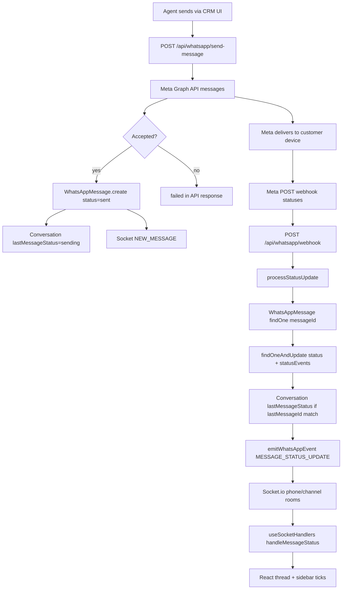

# WhatsApp Webhook Delivery Status Audit

Investigation tooling for messages stuck at **sent** (single tick) while later messages to the same customer deliver normally.

**Production logic is unchanged.** This document describes the existing pipeline and the temporary **Webhook Inspector** added for observability.

---

## Phase 1 — Complete Webhook Flow



### Step-by-step reference

| Step | File | Function | Purpose | Received | Written | Failure points |
|------|------|----------|---------|----------|---------|----------------|
| CRM send | `src/app/whatsapp/components/*` | UI handlers | User triggers send | message body, conversationId | — | Wrong conversation, validation |
| API route | `src/app/api/whatsapp/send-message/route.ts` | `POST` | Auth, template/session checks, Meta call | JSON body | — | 4xx/5xx before Meta |
| Meta Send API | same | `axios.post` to Graph | Deliver to WhatsApp | wamid in response | — | Rate limit, template rejection |
| DB create | same | `WhatsAppMessage.create` | Persist outbound | wamid, content | `status: "sent"`, `statusEvents: [{sent}]` | Create fails after Meta accept → webhook race |
| Conversation | same | `findByIdAndUpdate` | Sidebar preview | — | `lastMessageStatus: "sending"` | Overwritten by later message |
| Socket (new) | `src/lib/pusher.ts` | `emitWhatsAppEvent` NEW_MESSAGE | Real-time thread | message payload | — | io unavailable, wrong room |
| Meta webhook | Meta infrastructure | — | Status callbacks | `statuses[]` | — | **Meta never sends delivered** |
| Webhook POST | `src/app/api/whatsapp/webhook/route.ts` | `POST` | Verify HMAC, dispatch | full JSON body | — | Invalid signature, parse error |
| Status loop | same | `for (status of value.statuses)` | Per-status handling | `id`, `status`, `timestamp`, `recipient_id` | — | Unhandled exception in loop |
| Process status | same | `processStatusUpdate` | Idempotent update | Meta status object | message + conversation | See Phase 2 |
| Socket (status) | `src/lib/pusher.ts` | `emitWhatsAppEvent` MESSAGE_STATUS_UPDATE | Tick updates | conversationId, messageId, status | — | No userId → phone room only |
| UI handler | `src/app/whatsapp/modules/useSocketHandlers.ts` | `handleMessageStatus` | Update ticks | socket payload | local message state | **Only open thread updated**; sidebar only if `lastMessageId` matches |

---

## Phase 2 — Status Webhook Audit

All **message** delivery statuses flow through a single function:

**`processStatusUpdate`** in `src/app/api/whatsapp/webhook/route.ts`

> Call statuses use a separate path in `processCallEvent` (`statuses` for calls) — not covered here.

### Parsing

| Field | Source | Usage |
|-------|--------|-------|
| `status.id` | Meta | wamid → `messageId` lookup |
| `status.status` | Meta | `sent`, `delivered`, `read`, `failed`, `deleted`, etc. |
| `status.timestamp` | Meta | Unix seconds → `Date` (×1000) |
| `status.recipient_id` | Meta | Customer phone (for errors / initiation limit) |
| `status.errors[0]` | Meta | `failed` + error codes 131049, 131026, etc. |

### Message lookup

```typescript
WhatsAppMessage.findOne({ messageId })
```

- **No `businessPhoneId` filter** — relies on wamid uniqueness.
- Unique index: `{ messageId, businessPhoneId }` on model.

### Mongo update

1. Skip if `existingMessage.status === newStatus` (duplicate webhook).
2. `findOneAndUpdate({ messageId, status: { $ne: newStatus } }, { status, $push: statusEvents })`.
3. If `conversation.lastMessageId === messageId` → update `lastMessageStatus`.

### Socket emit

Only after successful DB update:

```typescript
emitWhatsAppEvent(WHATSAPP_EVENTS.MESSAGE_STATUS_UPDATE, {
  conversationId, messageId, status, previousStatus, timestamp, recipientId
});
```

Routes to `whatsapp-phone-{businessPhoneId}` (and channel room if migrated). **No `userId`** on status events.

### When message cannot be found

```typescript
console.log("status for unknown messageId (not in DB)");
return; // silent drop
```

**Likely race:** `sent` webhook arrives before `WhatsAppMessage.create` completes. Later `delivered` may still work if message exists by then.

### Per-status behavior

| Status | Parsed as | DB | Socket | Notes |
|--------|-------------|-----|--------|-------|
| `sent` | `newStatus` | Updates if not already `sent` | Yes | Often redundant with API create |
| `delivered` | `newStatus` | Push to statusEvents | Yes | Triggers initiation limit recording |
| `read` | `newStatus` | Push to statusEvents | Yes | |
| `failed` | `newStatus` + `failureReason` | Push + error in statusEvents | Yes | `handleWhatsAppErrorCode` for lead blocking |
| `deleted` | `newStatus` | Same pipeline | Yes | Rare for outbound |
| `warning` | `newStatus` | Same if Meta sends | Yes | Uncommon |

---

## Phase 3 — Webhook Inspector

Temporary debugging system. **Does not alter webhook decisions.**

### Enable

```env
WEBHOOK_INSPECTOR_ENABLED=true
WEBHOOK_INSPECTOR_FILTER_PHONE=306XXXXXXXX
# optional additional filters:
# WEBHOOK_INSPECTOR_FILTER_MESSAGE_ID=wamid...
# WEBHOOK_INSPECTOR_FILTER_BUSINESS_PHONE_ID=...
# WEBHOOK_INSPECTOR_FILTER_CONVERSATION_ID=...
```

Or at runtime (SuperAdmin, no restart):

```bash
curl -X POST /api/admin/webhook-inspector/config \
  -H "Cookie: ..." \
  -d '{"enabled":true,"customerPhone":"306XXXXXXXX"}'
```

**Requires at least one filter** — logs only matching customers/messages.

### What is recorded

| Field | Source |
|-------|--------|
| Timestamp | Server time |
| Webhook Type | `messages.statuses` / socket event name |
| Status | Meta status string |
| Message ID | wamid |
| Business Phone ID | `metadata.phone_number_id` |
| WABA ID | `entry.id` |
| Customer Phone | `recipient_id` |
| Conversation Found? | From message document |
| Message Found? | lookup result |
| Mongo Message ID | `_id` |
| Database Updated? | `db_updated` vs skip outcomes |
| Socket Emitted? | `socket_emitted` events |
| Errors | processing errors |

### Storage

- Collection: `WebhookInspectorEvent` (7-day TTL)
- Console: `[webhook-inspector]` lines when filter matches

### Code locations

| Component | Path |
|-----------|------|
| Config / filter | `src/lib/whatsapp/webhookInspector/` |
| Model | `src/models/webhookInspectorEvent.ts` |
| Webhook hooks | `src/app/api/whatsapp/webhook/route.ts` (instrumentation only) |
| Socket hook | `src/lib/pusher.ts` |
| Send API hook | `src/app/api/whatsapp/send-message/route.ts` |

---

## Phase 4 — Timeline Builder

```bash
# Per customer (inspector events)
GET /api/admin/webhook-inspector/timeline?phone=306XXXXXXXX

# Per message (full chain)
GET /api/admin/webhook-inspector/report?messageId=wamid.HBg...
```

Example timeline stages:

1. `send_api` — CRM created Mongo row
2. `status_received` — raw Meta webhook
3. `status_processed` — outcome (`db_updated`, `message_not_found`, etc.)
4. `socket_emitted` — MESSAGE_STATUS_UPDATE fired
5. `Mongo statusEvents` — from report builder (historical)

Missing stages are listed in `report.gaps`.

---

## Phase 5 — Meta vs Mongo Comparison

`buildMessageDeliveryReport()` compares:

- **Meta (inspector):** `status_received` events
- **Mongo:** `statusEvents[]` on `WhatsAppMessage`

Reports mismatches:

- Webhook `delivered` received but not in `statusEvents`
- `sent` in Mongo but no `delivered` in either source

---

## Phase 6 — Failure Detection

| Pattern | Detection | Likely cause |
|---------|-----------|--------------|
| sent, no delivered webhook | No `status_received` with `delivered` | **Meta** or network |
| delivered webhook, Mongo unchanged | `status_received` + no mongo `delivered` | **CRM DB** / race |
| Mongo delivered, no socket record | mongo has delivered, no `socket_emitted` | **Socket** / room mismatch |
| Socket emitted, UI stale | inspector OK, user reports old tick | **UI** (thread not open, cache) |
| message_not_found | inspector outcome | **Race** — webhook before create |
| duplicate_status | inspector outcome | Benign — idempotency |
| Stuck sent + later delivered msgs | `stuck-sent` API / script | Symptom — use report for root cause |

### Admin endpoints

| Endpoint | Purpose |
|----------|---------|
| `GET /api/admin/webhook-inspector/config` | Current filter |
| `POST /api/admin/webhook-inspector/config` | Runtime filter |
| `GET /api/admin/webhook-inspector/events` | Raw event log |
| `GET /api/admin/webhook-inspector/timeline?phone=` | Customer timeline |
| `GET /api/admin/webhook-inspector/report?messageId=` | Single message report |
| `GET /api/admin/webhook-inspector/stuck-sent?reports=1` | Symptomatic messages |

All require **SuperAdmin** role.

### Production script

```bash
npm run analyze:whatsapp-delivery -- --days=7 --limit=30 --phone=306XXXXXXXX
```

---

## Phase 7 — Verification Procedure

1. Enable inspector for affected customer phone.
2. Send a test template/message.
3. Watch `[webhook-inspector]` logs or `GET .../events`.
4. If issue reproduces, run `GET .../report?messageId=wamid...`.
5. Classify using `report.conclusion`:

| Conclusion | Meaning |
|------------|---------|
| `working` | Full chain OK |
| `meta_never_delivered` | No delivered webhook ever recorded |
| `crm_message_not_found` | Webhook arrived before Mongo row |
| `crm_db_not_updated` | Webhook received, DB not updated |
| `crm_socket_gap` | DB updated, no socket record |
| `ui_stale_possible` | DB has delivered but `status` field still `sent` |
| `inconclusive` | No inspector data (run live capture) |

### Example reports

**Working**

```
Customer: 306XXXXXXXX
Message:  wamid.HBg...
09:10 send_api → Mongo created
09:10 status_received sent
09:10 status_processed db_updated
09:10 socket_emitted sent
09:11 status_received delivered
09:11 status_processed db_updated
09:11 socket_emitted delivered
Result: working
```

**Meta gap**

```
09:10 send_api
09:10 status_received sent
(no delivered status_received ever)
Mongo statusEvents: sent only
Result: meta_never_delivered
```

**CRM race**

```
09:10 status_received sent → message_not_found
09:10 send_api
(no further delivered webhooks)
Result: crm_message_not_found (investigate timing)
```

---

## Conclusion Framework

Use inspector evidence — not assumptions:

1. **Meta** — `status_received` never includes `delivered` for that wamid.
2. **Webhook receive** — Meta Dashboard shows delivery callback; no `status_received` in inspector → infra/signature/routing.
3. **Backend processing** — `status_received` present but `status_processed` shows `message_not_found` or `processing_error`.
4. **Mongo** — `db_updated` false or `statusEvents` missing despite webhook.
5. **Socket** — `db_updated` true but no `socket_emitted`; check phone room membership.
6. **UI** — Full backend chain OK but agent sees stale tick → open-thread-only updates in `handleMessageStatus`.

---

## Disable Inspector

```env
WEBHOOK_INSPECTOR_ENABLED=false
```

Or:

```bash
POST /api/admin/webhook-inspector/config -d '{"clear":true}'
```

Inspector hooks are no-ops when disabled or when no filter is set.
